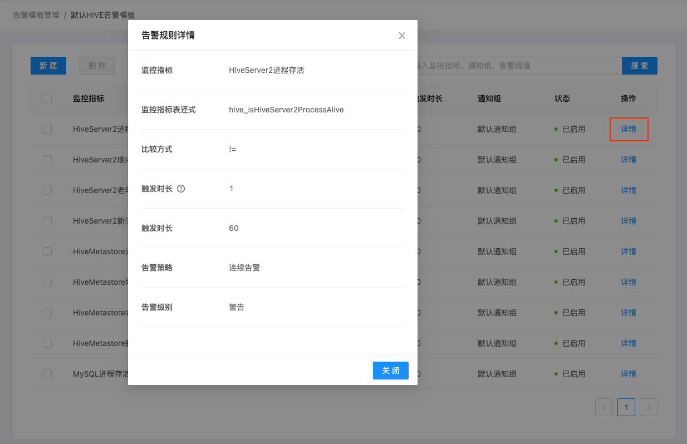
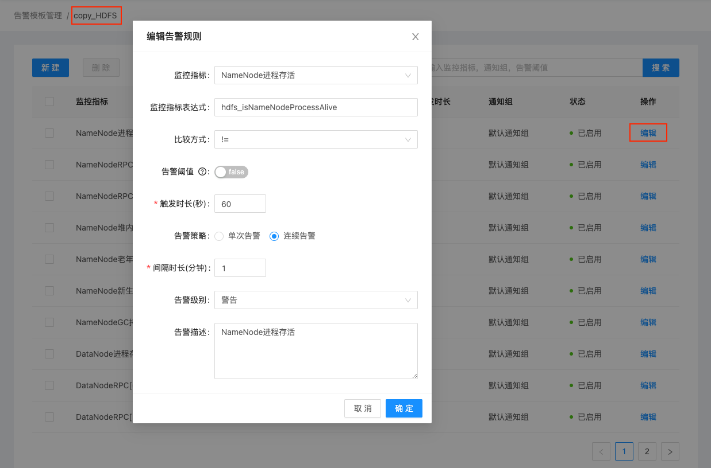
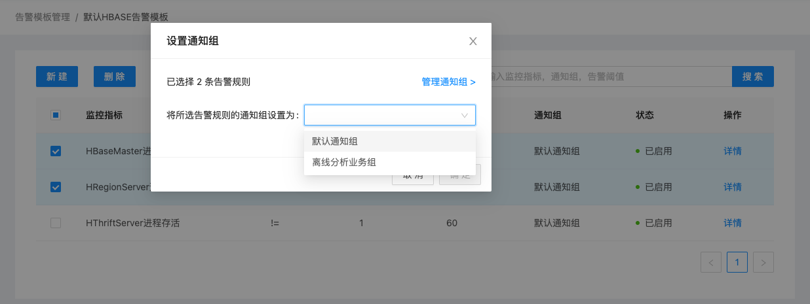
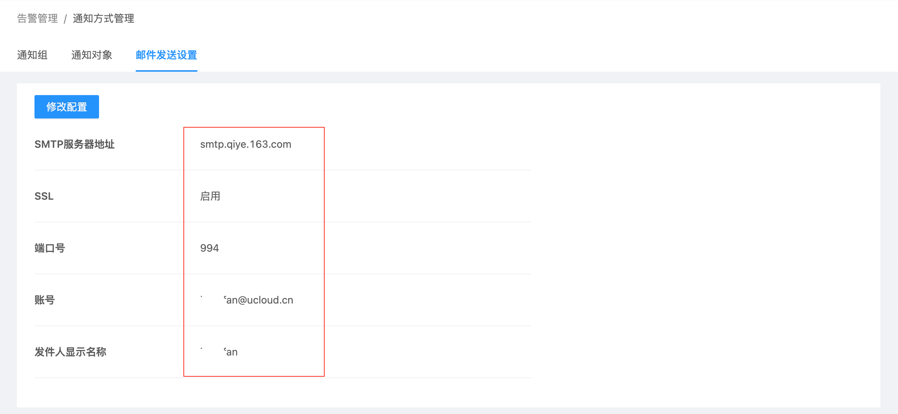
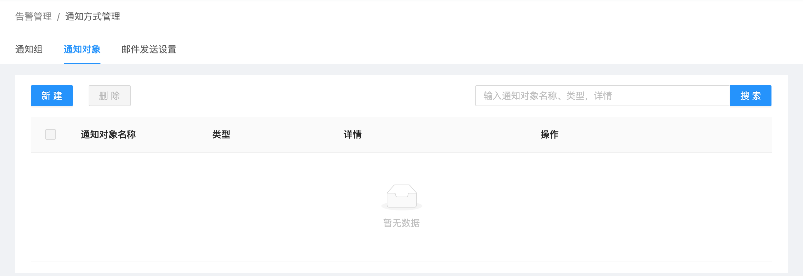
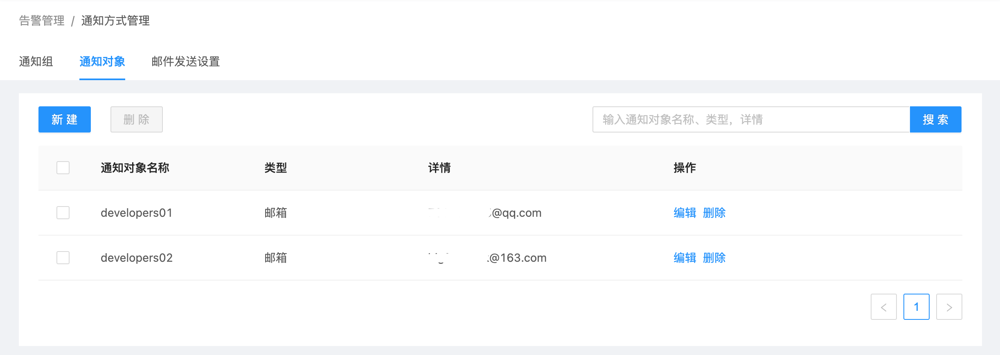
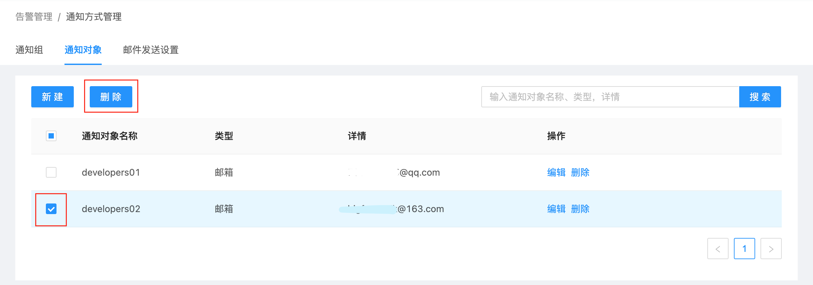
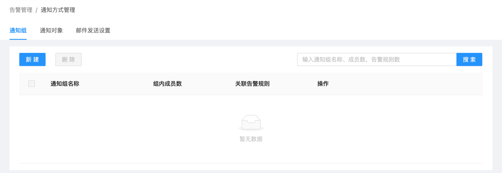
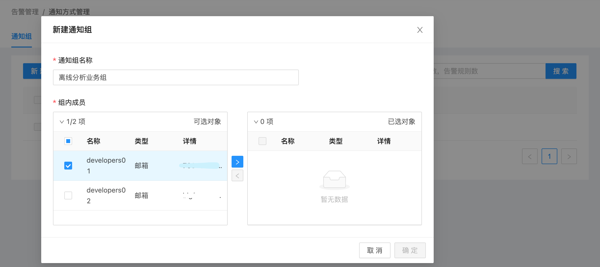

# 集群告警管理

在智能大数据平台USDP中，为便于用户快速获知集群相关健康状态，USDP提供较为友好的告警管理功能，譬如集群节点的系统级告警、大数据服务的基本告警配置、以及USDP提供的统一的告警模板管理等，辅助用户更好的管理和使用USDP。

## 1. 浏览器访问USDP管理控制台

在浏览器中打开 USDP Web Console：
~~~URL
http://<your_host_ip>
~~~
如下所示：

## 2. 告警模板管理

告警模板，即为一组监控指标的集合，由告警模板来限制该模板中的所有监控指标的作用域，即“监控类型”。

监控指标，即为一组监控规则的集合，由监控指标来控制是否启用及通知组的绑定。

告警模板与USDP集群绑定，及可对该集群实施监控，当触发监控规则是，即及时向 通知组（参考本篇指南第5章节） 中的各个 通知对象（参考本篇指南第4章节） 发送告警信息。

在USDP-1.0.0.0版本中，已默认提供了丰富的集群的服务告警模板，诸如计算类、存储类、监控类、调度类、可视化类、安全类等在内的6大类服务及组件的告警模板。用户亦可自定义设置告警模板、监控指标、监控规则等。

### 2.1 告警模板管理

在USDP控制台首页，点击/鼠标滑至左上交 “橙色警报器” 图表位置，会自动展开下拉菜单项目，点击 <kbd>告警模板管理</kbd> 菜单项，进入 告警模板管理 页面，如下图所示：

USDP已预置了如AIRFLOW、ALERTMANAGER、ELASTICSEARCH、FLINK、GRAFANA、HBASE、HDFS、HIVE、HUE、IMPALA、INFLUXDB、KAFKAEAGLE、KIBANA、KUDU、KYLIN、LIVY、NODEEXPORTER、OOZIE、PRESTO、PROMETHEUS、RANGER、SPARK、TEZ、UDS、USDPMONITOR、YARN、ZEPPELIN、ZKUI、ZOOKEEPER、NODE等30组告警模板。

#### 2.1.1 模板监控指标管理

对于每一组告警模板的详细告警监控指标项，可点击告警模板条目右侧的 <kbd>设置规则</kbd> 按钮进入查看。此处以 “默认HIVE告警模板” 为例，如下图所示：

> USDP提供的 默认告警模板 不允许修改告警项。如需调整，可复制默认告警模板来调整具体告警指标，参见 本篇指南-“2.3 新建告警模板”。

上图以Hive服务的告警模板为例，该模板包含9项具体监控指标。

#### 2.1.2 监控指标详情查看/编辑

例如针对 “HiveServer2进程存活” 的告警规则，点击右侧 <kbd>详情</kbd> 按钮，在弹出的对话框中显示，如下图所示：

若用户是在自定义的告警模板查看 “监控指标” 具体的 “监控规则”，此时应该点击右侧的 <kbd>编辑</kbd> 按钮，会在弹出的编辑对话框中显示该指标的详细监控规则，用户亦可在此完成修改监控规则的操作。如下图所示：

关于自定义告警模板，参见 本篇指南-“2.3 新建告警模板”。

#### 2.1.3 删除监控指标

在告警模板中，用户可根据实际需求来调整各监控指标，对于不合理的监控指标执行删除操作。如下图所示：

> USDP预置的 “监控指标” 不允许用户自行删除，用户可选择将相应的 “监控指标” 设为不启用，参考 本篇指南-“2.1.5 给监控指标设置启停” 即可。

#### 2.1.4 给监控指标设置通知组

无论是USDP系统预置的告警模板，还是用户自定义的告警模板，用户均可对每一条监控指标独立规划告警 通知组 （参考本篇指南第5章节），以便于用户根据其组织架构及大数据环境使用人员的不同来灵活配置告警内容。如下图所示：

#### 2.1.5 给监控指标设置启停

无论是USDP系统预置的告警模板，还是用户自定义的告警模板，用户均可对每一条监控指标独立设置 “启用/停用”状态控制。

> 对于USDP预置的监控指标，若用户认为其触发规则设置不合理，用户可以自行添加相同的监控指标，并将对应的默认监控指标置为 “停用”状态均可。

### 2.2 告警模板快速绑定集群并生效

默认告警模板内容，是UCloud依据多年大数据产品维护经验的沉淀，用户可以快速使用默认告警模板对欲监控告警的集群生效使用。

点击 “告警模板管理” 页面用户指定的模板条目右侧的 <kbd>修改绑定</kbd> 按钮，这里以 “默认AIRFLOW告警模板” 为例，如下图所示：

在弹出的 “修改绑定” 对话框中 “设置绑定” 处左侧 “可选集群” 部分，列出来可以绑定该模板的集群信息，用户仅需勾选对应的集群复选框，点击 <kbd>></kbd> 按钮，即可将已选集群添加到右侧 “已选集群” 栏，此后，点击对话框 <kbd>确定</kbd> 按钮，即可完成当前告警模板与所选集群的绑定操作。

用户亦可在您自己的集群上来设置绑定哪些告警模板，相关操作请参考 本篇指南-“6. 告警设置” 章节。

> 为告警模板绑定集群后，即代表此集群已使用该模板中的所有监控指标，对该集群中的相应服务实施监控，当集群一但发生相关告警规则设置的条件时，即会触发告警，USDP将会通过该模板中事先设置好的 通知组（参考本篇指南第5章节） 来发送告警详细信息。

### 2.3 新建告警模板

当用户在熟悉USDP预置的众多告警模板后，仍然可能无法满足需求时，此时，可自定义新建告警模板，点击 “告警模板管理” 页面左上角 <kbd>新建</kbd> 按钮，弹出 “新增告警模板” 对话框，如下图所示：

USDP允许用户创建全新的空白模板，亦可通过复制现有的模板进行更改，如下图所示：

新增告警模板，模板需指定其可运用的 “监控类别”，下拉选择相应的监控类别即可。

若是从其他已有的告警模板复制，在 “复制于” 下拉框中选择选择相应的模板（支持选择 “默认告警模板” 及 “自定义告警模板”）即可。

输入模板名称后点击 <kbd>确定</kbd> 按钮保存即可。

### 2.4 删除告警模板

勾选 欲删除的告警模板左侧的复选框，之后点击左上角 <kbd>删除</kbd> 按钮即可。

> USDP不允许用户 “勾选” 及 “删除” 系统预置的所有默认告警模板。

## 3. 设置告警邮件发送服务

USDP管理服务是每个用户独享的，因此在使用邮件接收集群相关监控告警信息前，用户需要为USDP管理服务配置邮件发送服务器及账号等操作，通过本指南的内容，指引用户完成相关配置。

### 3.1 开始配置邮件发送服务

- 登陆USDP控制台后，点击/鼠标滑至左上交 “橙色警报器” 图表位置，会自动展开下拉菜单项目，点击 <kbd>通知方式管理</kbd> 菜单项，进入 通知方式管理 页面，如下图所示：

- 进入 “通知方式管理” 页面时，点击 “邮件发送设置” 选项卡，系统提示 “尚未配置邮件发送服务器及账号”，如下图所示：

> USDP管理服务即为用户独享，且USDP管理服务默认是部署在集群Master1节点上，因此，需要为该集群Master1节点配置互联网公网静态IP，否则将无法配置邮件发送服务器及发送告警邮件。

- 点击 <kbd>立即配置</kbd> 按钮，在弹出的 “配置邮件发送服务器” 对话框中来配置，如下图所示：

此时，用户可参考如下列表内容，选择合适的 “邮箱类型”、“SMTP服务器地址”、“是否开启SSL”、端口，来完成对话框配置填写：

- 验证通过后，显示如下（这里是以UCloud邮箱服务器配置为示例）：

若需变更，可参考上图，点击 <kbd>修改配置</kbd> 按钮，在对话框中完成邮箱服务器及账号的变更操作。

至此，告警邮件发送服务的配置即已完成。

## 4. 通知对象管理

通知对象，是USDP系统中，告警信息发送的目标用户，通知对象是由 通知组（参考本篇指南第5章节） 进行管理的；通知组再与 告警模板（参考本篇指南第2章节） 中的监控指标关联。

USDP支持多种通知对象类型，提供对各类通知对象的管理和维护方法。

> 当前，USDP支持的通知对象类型有： 邮箱 钉钉 企业微信 回调接口

### 4.1 进入通知对象管理页面

登陆USDP控制台后，点击/鼠标滑至左上交 “橙色警报器” 图表位置，会自动展开下拉菜单项目，点击 <kbd>通知方式管理</kbd> 菜单项，进入 通知方式管理 页面，如下图所示：

进入 “通知方式管理” 页面时，点击 “通知对象” 选项卡，如下图所示：

### 4.2 添加通知对象

新建 “通知对象” 时，选择相应的 “通知对象类型”，并按要求填入其余信息，即可完成 “通知对象” 添加的操作。

#### 4.2.1 新建邮箱类型的通知对象

在 “通知对象” 标签页，点击左上角 <kbd>新建</kbd> 按钮，在弹出的 “新建通知对象” 对方框中 “通知对象类型” 处，选择 “邮箱”，如下图所示：

“通知对象名称”，填写该对象的名称等信息；并输入此人 “邮箱地址” 后，点击 <kbd>获取验证码</kbd> 按钮，此时该邮箱即收到一条验证邮件，内容中包含“验证码” 等信息，索要 “验证码” 后填入，点击 <kbd>确定</kbd> 按钮完成添加操作。

#### 4.2.2 新建钉钉类型的通知对象

在 “通知对象” 标签页，点击左上角 <kbd>新建</kbd> 按钮，在弹出的 “新建通知对象” 对方框中 “通知对象类型” 处，选择 “钉钉”，如下图所示：

通知对象名称，填写该对象的名称等信息；并输入钉钉的 “Webhook地址”，及 “自定义关键字” 后，点击 <kbd>获取验证码</kbd> 按钮，此时该钉钉即收到一条验证信息，内容中包含“验证码” 等信息，索要 “验证码” 后填入，点击 <kbd>确定</kbd> 按钮完成添加操作。

#### 4.2.3 新建企业微信类型的通知对象

在 “通知对象” 标签页，点击左上角 <kbd>新建</kbd> 按钮，在弹出的 “新建通知对象” 对方框中 “通知对象类型” 处，选择 “企业微信”，如下图所示：

通知对象名称，填写该对象的名称等信息；并输入企业微信的 “Webhook地址” 后，点击 <kbd>获取验证码</kbd> 按钮，此时该企业微信即收到一条验证信息，内容中包含“验证码” 等信息，索要 “验证码” 后填入，点击 <kbd>确定</kbd> 按钮完成添加操作。

#### 4.2.4 新建回调接口类型的通知对象

在 “通知对象” 标签页，点击左上角 <kbd>新建</kbd> 按钮，在弹出的 “新建通知对象” 对方框中 “通知对象类型” 处，选择 “回调接口”，如下图所示：

通知对象名称，填写该对象的名称等信息；并输入 “自定义接口的地址”，点击 <kbd>确定</kbd> 按钮完成添加操作。

### 4.3 管理已有通知对象

完成新建通知对象后，页面显示已添加后的所有 “通知对象”，如下图所示：

若因某通知对象工作变动原因，管理员可能需要删除该通知对象是；此时，勾选该对象左侧的复选框，并点击 <kbd>删除</kbd> 按钮完成，并确认后，完成删除操作，如下图所示：

## 5. 通知组管理

USDP支持通知组管理的能力，结合 通知组 与 告警模板（参考本篇指南第2章节）  “监控指标”的绑定，实现监控规则触发时，即使将告警信息发送给绑定的通知组中的 通知对象（参考本篇指南第4章节）。

这里将介绍通知组的的管理和维护的方法。

### 5.1 进入通知组管理页面

登陆USDP控制台后，点击/鼠标滑至左上交 “橙色警报器” 图表位置，会自动展开下拉菜单项目，点击 通知方式管理 菜单项，进入 通知方式管理 页面，如下图所示：

进入 “通知方式管理” 页面时，点击 “通知组” 选项卡，如下图所示：

### 5.2 添加通知组

默认情况下，当第一次执行 “通知组”-“新建” 时，USDP要求必须先添加 “默认通知组”，通知组名称不可更改，勾选 “通知对象” 并点击 <kbd>></kbd> 按钮，再在对话框右下角点击 <kbd>确定</kbd> 按钮，即可完成。如下图所示：

> “默认通知组”，一经创建，不得删除。 “默认通知组” 中的 “通知对象”，可以灵活调整，但不得少于一个 “通知对象”。 每个“通知组”（含默认通知组）中，至少需要保留一个 “通知对象”。

再次操作 “通知组”-“新建” 时，用户可灵活定义 “通知组名称”，勾选 “通知对象” 并点击 <kbd>></kbd> 按钮，再在对话框右下角点击 <kbd>确定</kbd> 按钮，即可完成。如下图所示：

添加好 “通知组” 后，如下图所示：

在此，用户可对已添加的通知组实行管理操作，例如 “删除” 某个通知组，“编辑”通知组等。

## 6. 告警设置

通过本篇指南，即可完成将已有的 告警模板（参考本篇指南第2章节） 应用至当前 集群 并开始按 “告警模板” 中的 “监控指标” 及 “监控规则” 实施监控并生效。当集群出现被检测的某种异常时，USDP会主动通过 “监控指标” 绑定的 通知组（参考本篇指南第5章节）为组内的各个 通知对象（参考本篇指南第4章节） 发送告警信息。

### 6.1 开始给集群设置告警

登陆USDP控制台后，点击左侧导航栏 “监控管理” - “告警设置”，进入开始为集群配置 告警设置 的页面，如下图所示：

> 初始状态下，新创建的集群并未绑定任何告警模板。

点击 <kbd>绑定告警模板</kbd> 按钮，在弹出的 “绑定告警模板” 对话框中进行绑定操作，如下图所示：

对话框中 “设置绑定” 处左侧 “可选模板” 部分，列出来可以绑定到当前集群的所有模板列表，用户仅需 “勾选” 对应的 告警模板左侧的复选框，点击 <kbd>></kbd> 按钮，即可将已选 告警模板 添加到右侧 “已选模板” 栏，此后，点击对话框 <kbd>确定</kbd> 按钮，即可完成当前告警模板与所选集群的绑定操作。

> 为集群绑定告警模板后，即代表此集群已使用这些模板中的所有监控指标，对该集群中的相应服务实施监控，当集群一但发生相关告警规则设置的条件时，即会触发告警，USDP将会通过这些模板中事先设置好的 通知组（参考本篇指南第5章节）来发送告警详细信息。

完成绑定操作后，如下图所示：

此时，已将上图中的六项告警模板应用于当前集群。若需调整，再次点击左上角的 <kbd>绑定告警模板</kbd> 按钮即开始调整即可。