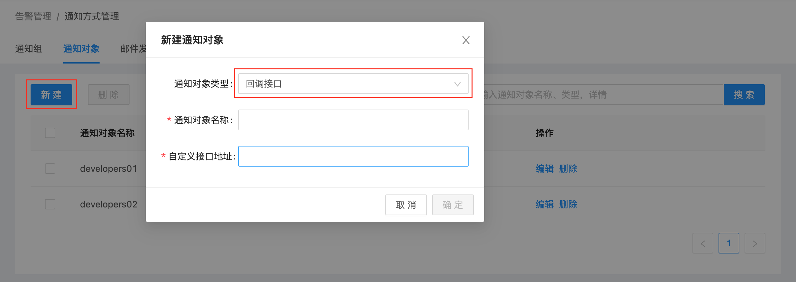
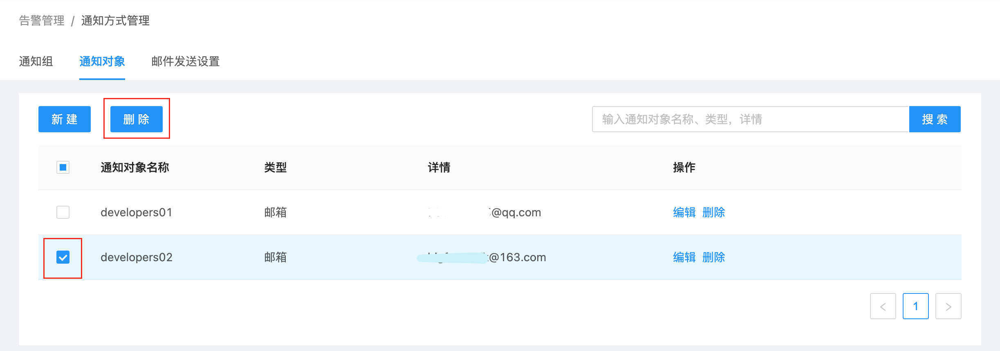

# 通知对象管理

通知对象，是USDP系统中，告警信息发送的目标用户，通知对象是由 [通知组](usdpdc/guide_v2/alarmInform_group)  进行管理的；通知组再与 [告警模板](usdpdc/guide_v2/alarmTemplate) 中的监控指标关联。

USDP支持多种通知对象类型，提供对各类通知对象的管理和维护方法。

?> 当前，USDP支持的通知对象类型有：</br>- 邮箱</br>- 钉钉</br>- 企业微信</br>- 回调接口


#### 本篇将涉及到：

- [添加通知对象](usdpdc/guide_v2/alarmInform_object?id=_1-添加通知对象)
- [管理通知对象](usdpdc/guide_v2/alarmInform_object?id=_2-管理通知对象)


在浏览器中打开 USDP Web Console：

~~~URL
http://<your_host_ip>
~~~

登陆USDP控制台后，点击/鼠标滑至左上交 “橙色警报器” 图表位置，会自动展开下拉菜单项目，点击 <kbd>通知方式管理</kbd> 菜单项，进入 通知方式管理 页面，如下图所示：


进入 “通知方式管理” 页面时，点击 “通知对象” 选项卡，如下图所示：


## 1. 添加通知对象

新建 “通知对象” 时，选择相应的 “通知对象类型”，并按要求填入其余信息，即可完成 “通知对象” 添加的操作。


### 1.1 新建邮箱类型的通知对象

在 “通知对象” 标签页，点击左上角 <kbd>新建</kbd> 按钮，在弹出的 “新建通知对象” 对方框中 “通知对象类型” 处，选择 “邮箱”，如下图所示：


“通知对象名称”，填写该对象的名称等信息；并输入此人 “邮箱地址” 后，点击 <kbd>获取验证码</kbd> 按钮，此时该邮箱即收到一条验证邮件，内容中包含“验证码” 等信息，索要 “验证码” 后填入，点击 <kbd>确定</kbd> 按钮完成添加操作。


### 1.2 新建钉钉类型的通知对象

在 “通知对象” 标签页，点击左上角 <kbd>新建</kbd> 按钮，在弹出的 “新建通知对象” 对方框中 “通知对象类型” 处，选择 “钉钉”，如下图所示：


通知对象名称，填写该对象的名称等信息；并输入钉钉的 “Webhook地址”，及 “自定义关键字” 后，点击 <kbd>获取验证码</kbd> 按钮，此时该钉钉即收到一条验证信息，内容中包含“验证码” 等信息，索要 “验证码” 后填入，点击 <kbd>确定</kbd> 按钮完成添加操作。


### 1.3 新建企业微信类型的通知对象

在 “通知对象” 标签页，点击左上角 <kbd>新建</kbd> 按钮，在弹出的 “新建通知对象” 对方框中 “通知对象类型” 处，选择 “企业微信”，如下图所示：


通知对象名称，填写该对象的名称等信息；并输入企业微信的 “Webhook地址” 后，点击 <kbd>获取验证码</kbd> 按钮，此时该企业微信即收到一条验证信息，内容中包含“验证码” 等信息，索要 “验证码” 后填入，点击 <kbd>确定</kbd> 按钮完成添加操作。


### 1.4 新建回调接口类型的通知对象

在 “通知对象” 标签页，点击左上角 <kbd>新建</kbd> 按钮，在弹出的 “新建通知对象” 对方框中 “通知对象类型” 处，选择 “回调接口”，如下图所示：



通知对象名称，填写该对象的名称等信息；并输入 “自定义接口的地址”，点击 <kbd>确定</kbd> 按钮完成添加操作。

?> 参数及使用说明：</br> - 自定义接口地址：请填写用于接收告警信息的http服务地址，或集群网络可达的服务器"ip:port"；</br> - 当集群出现某种异常时，USDP会主动调用该接口地址，并发送告警json信息。</br> - 用户需自行对接口接收到的告警json信息字符串进行解析及判断如何运用。

告警json信息格式示例：

```
向回调接口推送的post json (告警):
{
    "text": {
        "content": "【告警】【级别：警告】集群：cluster；服务：NEO4J；所在节点：xxx-unode04；时间：2021-06-01 15:54；Neo4j进程存活!=1，当前值：[0]"
    },
    "msgtype": "text"
}

向回调接口推送的post json (告警解除):
{
    "text": {
        "content": "【告警解除】集群：cluster；服务：NEO4J；所在节点：xxx-unode04；时间：2021-06-01 15:56；Neo4j进程存活!=1"
    }
    "msgtype": "text"
}
```


## 2. 管理通知对象

完成新建通知对象后，页面显示已添加后的所有 “通知对象”，如下图所示：


若因某通知对象工作变动原因，管理员可能需要删除该通知对象是；此时，勾选该对象左侧的复选框，并点击 <kbd>删除</kbd> 按钮完成，并确认后，完成删除操作，如下图所示：


