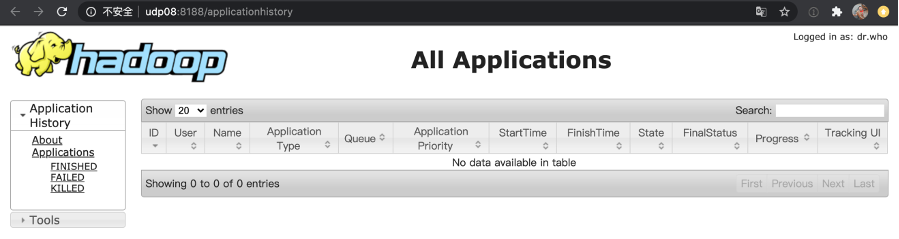

# 服务组件Web UIs访问

在智能大数据平台USDP中，为使用户对集群提供的各个大数据服务的高效便捷使用，USDP已主动集成并支持了各个服务默认自带的所有Web UI的快捷打开方式。

#### 以YARN服务为例

鼠标悬停/点击Yarn服务管理页面中“Web UIs”选项卡时，自动下拉展开Yarn相关的页面选项链接，如下图所示：

点击“[udp08] ResourceManager1 Web UI”，会自动在浏览器中打开新的标签页，并显示udp08节点上的ResourceManager管理页面，如下图所示：

点击“[udp08] HistoryServer Web UI”，会自动在浏览器中打开新的标签页，并显示udp08节点上的HistoryServer管理页面，如下图所示：

点击“[udp08] TimelineServer Web UI”，会自动在浏览器中打开新的标签页，并显示udp08节点上的TimelineServer管理页面，如下图所示：

#### 以Grafana的Web UI为例

?> - 部分大数据服务Web UI方式时，需要输入口令，默认口令可参见 **各服务WebUIs登录账号**。 - USDP默认使用服务所在节点“完全限定域名”（主机名）+端口的方式访问服务的Web UI，若浏览器无法加载，请检查浏览器所在Client端与集群间的网络互通问题，以及Client端本地的hosts文件中IP与主机名是否配置。