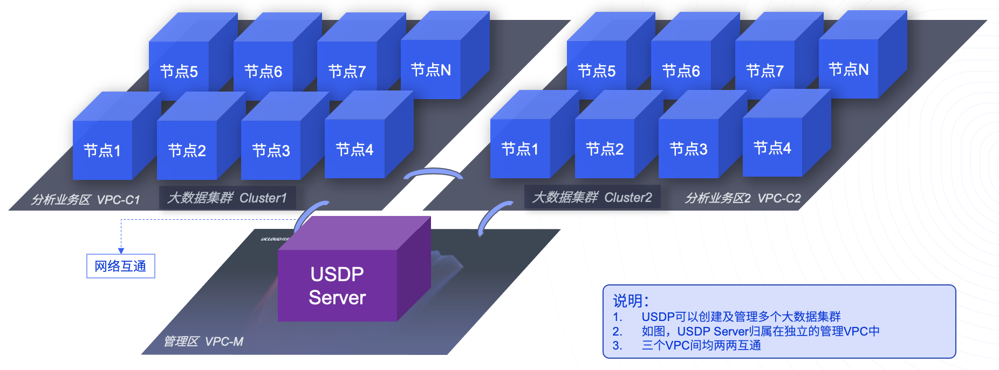

# 资源规划参考

本篇参考指南，旨在说明通过USDP私有化部署服务，协助用户来规划大数据服务的部署。用户可参考下文中的部署规模，来规划在您的基础资源及需求场景下，如何规划和利用基础资源，合理规划部署，使整体大数据服务更合理，更好的满足业务需要。

#### 说明：

USDP开始安装前，需用户根据目标集群的规模大小做参考，合理规划好USDP所管理的所有资源节点，并通过USDP提供的初始化工具，对首次安装的所有机型进行初始化操作，当安装USDP服务并启动其Web管理控制台后，需要导入相应的License文件，并通过向导的形式，创建好第一个集群后，即可完整使用USDP管理控制台中全部的功能。

> **名词解释：**
>
> 1. **USDP Server：**是用户独享的整个大数据系统的管理服务，提供一键安装包、修复工具、可视化的控制台。安装完成后，用户可通过USDP Server提供的控制台管理整个大数据系统，包括对多个大数据集群的管理。
> 2. **MySQL：**是USDP Server依赖的管理元数据存储数据库。
> 3. **Hadoop Cluster：**是通过USDP控制台创建并管理的1-N个独立的大数据集群。
> 4. **大数据服务：**是Hadoop集群中各个服务软件，例如：HDFS、Hive、Spark、HUE、Atlas等。
> 5. **服务组件：**是各个大数据服务自带的服务构成的模块。如DataNode、NameNode是HDFS服务的两类重要的附件。

**用户可根据自身需求，选择参考以下三类部署方案：**

- [最小规模部署](usdpdc/1.0.x/plan&create/deploy_plan?id=_1-最小规模部署)
- [单集群多节点规划](usdpdc/1.0.x/plan&create/deploy_plan?id=_2-单集群多节点规划)
- [多集群多节点规划（集群间网络互通可独立控制）](usdpdc/1.0.x/plan&create/deploy_plan?id=_3-多集群多节点规划)

## 1. 最小规模部署

本规划方案适用于：当业务量较小、资源较为紧俏时，以及您希望搭建一个最小规模的环境时。参考本章节内容，来协助实现智能大数据服务的部署参考。

因为USDP V1.0.0是基于Apache Hadoop 2.8.5，因此，HDFS数据存储副本为3，因此最小部署规模为3个节点。

| 节点/服务           | 最低配置                   | USDP Server | MySQL | NTP  | Hadoop Cluster | 大数据集群内各服务部署规划 |
| ------------------- | -------------------------- | ----------- | ----- | ---- | -------------- | -------------------------- |
| 节点1 (host01) | 8C 32G sys 60GB data 300GB | Y           | Y     | Y    | Cluster1-节点1 | 自行规划                   |
| 节点2 (host02) | 4C16G sys 60GB data 200GB  | -           | -     | -    | Cluster1-节点2 | 自行规划                   |
| 节点3 (host03) | 4C16G sys 60GB data 200GB  | -           | -     | -    | Cluster1-节点3 | 自行规划                   |

**注意：**您亦可将USDP Server、MySQL、NTP可以分散到上述host[01-03] 共三个节点上。

## 2. 单集群多节点规划

本规划方案适用于：当业务量较小、资源较为紧俏时，以及您希望搭建一个最小规模的环境，但USDP server、NTP服务器、MySQL服务器能与大数据集群相对独立的场景。参考本章节内容，来协助实现智能大数据服务的部署参考。

| 节点/服务                 | 最低配置                   | USDP Server | MySQL | NTP  | Hadoop Cluster  | 大数据集群内各服务部署规划 |
| ------------------------- | -------------------------- | ----------- | ----- | ---- | --------------- | -------------------------- |
| USDP Server (host01) | 8C 32G sys 60GB data 300GB | Y           | Y     | Y    | USDP Server节点 | 自行规划                   |
| 节点1 (host02)       | 4C16G sys 60GB data 200GB  | -           | -     | -    | Cluster1-节点1  | 自行规划                   |
| 节点2 (host03)       | 4C16G sys 60GB data 200GB  | -           | -     | -    | Cluster1-节点2  | 自行规划                   |
| 节点3 (host04)       | 4C16G sys 60GB data 200GB  | -           | -     | -    | Cluster1-节点3  | 自行规划                   |

### 2.1 若需要将MySQL与USDP Server分开部署，参考如下：

本规划方案适用于：当业务量较小、资源较为紧俏时，以及您希望搭建一个最小规模的环境，但USDP server、NTP服务器、MySQL服务器能与大数据集群相对独立，且MySQL服务器完全独立的场景。参考本章节内容，来协助实现智能大数据服务的部署参考。

| 节点/服务                 | 最低配置                   | USDP Server | MySQL | NTP  | Hadoop Cluster  | 大数据集群内各服务部署规划 |
| ------------------------- | -------------------------- | ----------- | ----- | ---- | --------------- | -------------------------- |
| USDP Server (host01) | 8C 32G sys 60GB data 300GB | Y           | -     | Y    | USDP Server节点 | 自行规划                   |
| MySQL (host02)       | 4C16G sys 60GB data 200GB  | -           | Y     | -    | MySQL节点       | 自行规划                   |
| 节点1 (host03)       | 4C16G sys 60GB data 200GB  | -           | -     | -    | Cluster1-节点1  | 自行规划                   |
| 节点2 (host04)       | 4C16G sys 60GB data 200GB  | -           | -     | -    | Cluster1-节点2  | 自行规划                   |
| 节点3 (host05)       | 4C16G sys 60GB data 200GB  | -           | -     | -    | Cluster1-节点3  | 自行规划                   |

**注意：**您亦可将USDP Server、MySQL、NTP中的其中1到2个，分散部署到上述host[01-04] 共四个节点之外的节点去，例如MySQL可服用您现有其他业务系统的MySQL数据库。

## 3. 多集群多节点规划

本规划方案适用于：当业务较复杂、大数据分析业务在不同业务领域有独立隔离的诉求，资源相对较为充裕时，您希望通过USDP创建并管理多个大数据集群环境，并且USDP server、NTP服务器、MySQL服务器能与大数据集群相对独立的场景。参考本章节内容，来协助实现智能大数据服务的部署参考。

#### Step1. 网络规划

规划至少三个VPC，示例如下：

| VPC规划               | 用途        | 与VPC-C1互通 | 与VPC-C2互通 |
| --------------------- | ----------- | ------------ | ------------ |
| VPC-M(192.168.0.0/27) | 管理区      | Yes          | Yes          |
| VPC-C1(10.0.0.0/16)   | 分析业务区1 | -            | Yes          |
| VPC-C2(172.20.0.0/16) | 分析业务区1 | Yes          | -            |

?>**提示：** 1. 若用户网络环境是除VPC以外的其他方式，如Vlan，则Vlan间的划分和互通性配置，与上述VPC同理。 2. 规划网络时，`建议各VPC的IP地址段均不重叠`，避免日后业务需求调整时，VPC打通导致出现网络异常。 3. VPC数量可根据需求灵活调整。 4. VPC间互通控制，在USDP操控范围之外独立控制。

#### Step2. 准备服务器节点

参考如下表格示例规划：

| 节点/服务                 | 最低配置                   | VPC/Vlan | USDP Server | MySQL | NTP  | Hadoop Cluster  | 大数据集群内各服务部署规划 |
| ------------------------- | -------------------------- | -------- | ----------- | ----- | ---- | --------------- | -------------------------- |
| USDP Server (host01) | 8C 32G sys 60GB data 300GB | VPC-M    | Y           | Y     | Y    | USDP Server节点 | 自行规划                   |
| 节点1 (host02)       | 4C16G sys 60GB data 200GB  | VPC-C1   | -           | -     | -    | Cluster1        | 自行规划                   |
| 节点2 (host03)       | 4C16G sys 60GB data 200GB  | VPC-C1   | -           | -     | -    | Cluster1        | 自行规划                   |
| 节点3 (host04)       | 4C16G sys 60GB data 200GB  | VPC-C1   | -           | -     | -    | Cluster1        | 自行规划                   |
| 节点1 (host05)       | 4C16G sys 60GB data 200GB  | VPC-C2   | -           | -     | -    | Cluster2        | 自行规划                   |
| 节点2 (host06)       | 4C16G sys 60GB data 200GB  | VPC-C2   | -           | -     | -    | Cluster2        | 自行规划                   |
| 节点3 (host07)       | 4C16G sys 60GB data 200GB  | VPC-C2   | -           | -     | -    | Cluster2        | 自行规划                   |

##### 效果示意图：

 

说明：因三个VPC均两两互通，因此，“大数据集群Cluster1”集群与“大数据集群Cluster2之间”集群可进行跨集群复制数据等操作。

#### Step3. 网络调整

若将“Step1. 网络规划”进行调整，如下表所示：

| VPC规划               | 用途        | 与VPC-C1互通 | 与VPC-C2互通 |
| --------------------- | ----------- | ------------ | ------------ |
| VPC-M(192.168.0.0/27) | 管理区      | Yes          | Yes          |
| VPC-C1(10.0.0.0/16)   | 分析业务区1 | -            | No           |
| VPC-C2(172.20.0.0/16) | 分析业务区1 | No           | -            |

##### 效果示意图：

说明：因VPC-M与VPC-C1互通、VPC-M与VPC-C2互通，而VPC-C1与VPC-C2不互通，因此，“大数据集群Cluster1”集群与“大数据集群Cluster2之间”集群无通讯网络条件；此模式，适合在多个分析系统业务，需要灵活控制、且需要分类管理的场景中，以满足控制需求，达到提供数据分析业务安全性的目的；

当您已完成资源规划后，接下来就开始安装USDP吧。请前往 [USDP私有化部署流程](/usdpdc/1.0.x/plan&create/install)。

