# 通过USDP创建第一个大数据集群

参考本篇指南，快速规划并创建一个USDP智能大数据集群及管理服务。

## 通过向导创建大数据集群

首先，在浏览器中打开USDP管理控制台；

为了便于用户快速创建大数据集群，USDP管理服务已将大数据集群创建过程中的众多服务、配置整合成向导的形式，用户可通过向导，快速搭建每个集群。点击 <kbd>新建集群向导</kbd> 按钮，开始创建集群吧，如下图所示：

### 1 向导-选择软件版本

进入向导第一步，此时用户需要定义欲创建的新集群的基本信息，主要包括 “集群名称”、集群创建需要依赖的USDP “软件版本”。

这里已 “usdp-cluster” 为例来命名新集群，并选择软件版本 “USDP-1.0.0” ，如下图所示，USDP会展示出 “USDP-1.0.0” 中都包含哪些服务及对应的版本号信息供用户参考。

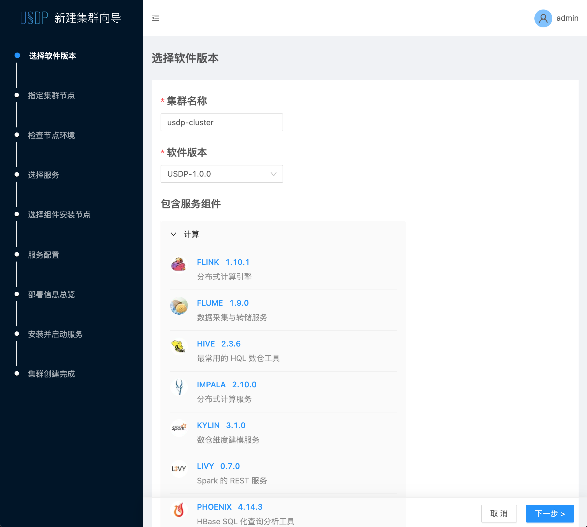

### 2 向导-指定集群节点

USDP支持在网络已互通的任意类型的服务器上进行安装，用户仅需输入这些服务器的主机名即可。

为了方便录入，USDP支持用户按照表达的方式录入，如下图所示：

> *提示：节点的完全限定域名及对应的ip信息，需添加到Master1节点的hosts文件中*

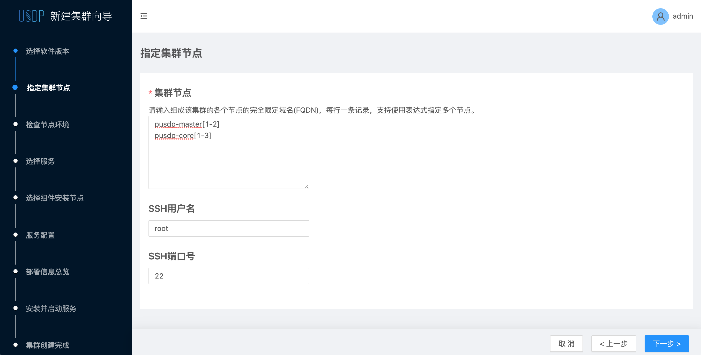

> 节点的完全限定域名填写规则说明：
>
> 1. 可单行输入每一个节点的完全限定域名；
> 2. 可通过“[]”辅助输入有数字规律的节点完全限定域名；例如pusdp-core[1-3]表示包含“pusdp-core1”、“pusdp-core2”、“pusdp-core3”共三个节点。

补充好表单信息后，点击右下角的向导 <kbd>下一步</kbd> 按钮继续。

USDP会对用户指定的节点进行环境检查，例如节点间的网络互通性；所有节点检查通过的状态，如下图所示：

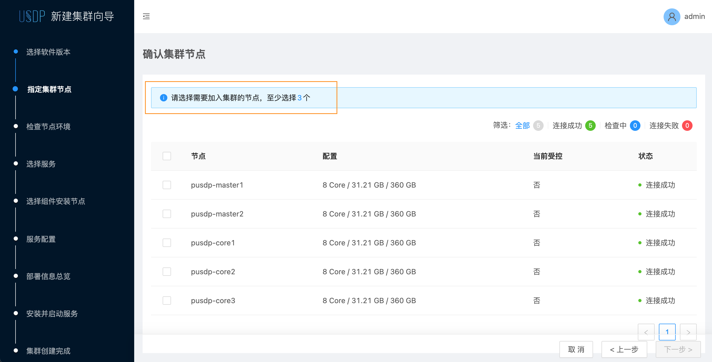

此时，用户需要勾选一些已规划的节点，并在这些节点上安装第一个智能大数据集群。如下图所示：

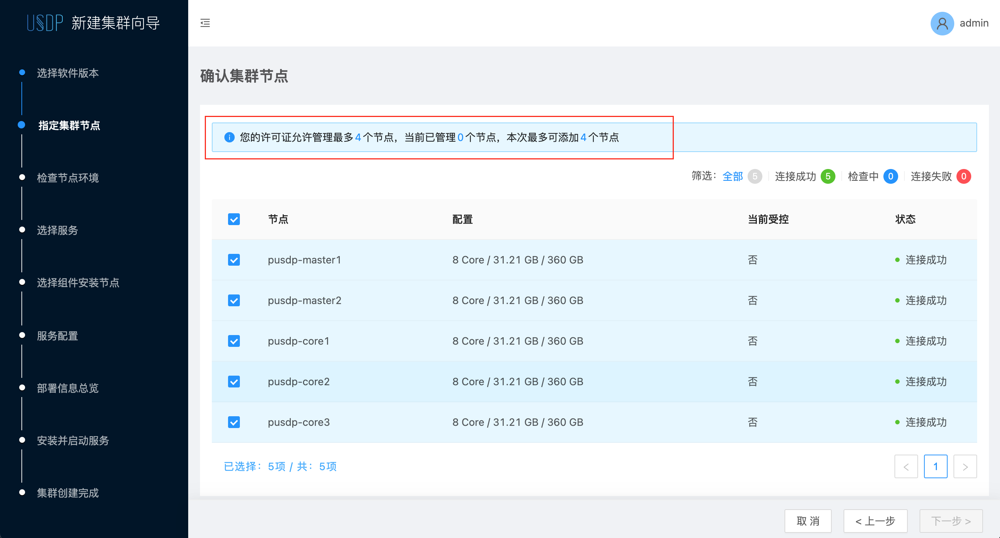

USDP会在用户每次增加节点时，来比对已交给USDP管理的总节点数量是否超过License许可的数量，如上图所示，仅许可管理4个节点，用户勾选5个节点，即已超出许可最大管理数量范围，因此USDP会提醒用户本次最多可添加的节点数量。

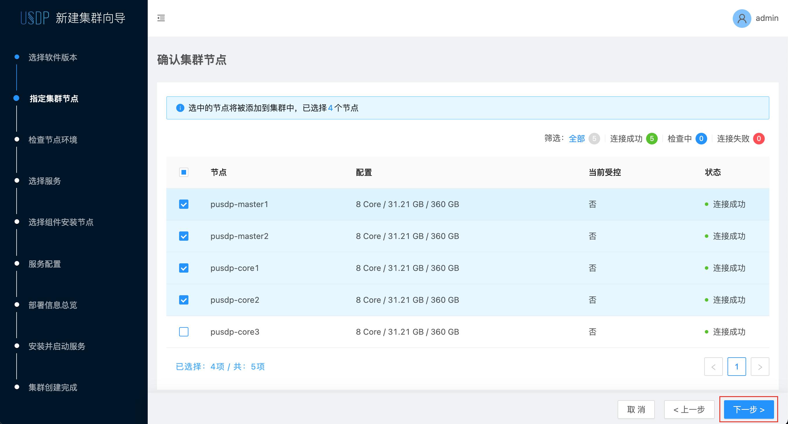

调整节点勾选数量后，点击右下角的向导 <kbd>下一步</kbd> 按钮继续。

### 3 向导-检查节点环境

USDP会进一步复查并开始做好安装前的准备工作，比如JDK、MySQL、时间服务器、安装包的分发等。如下图所示：

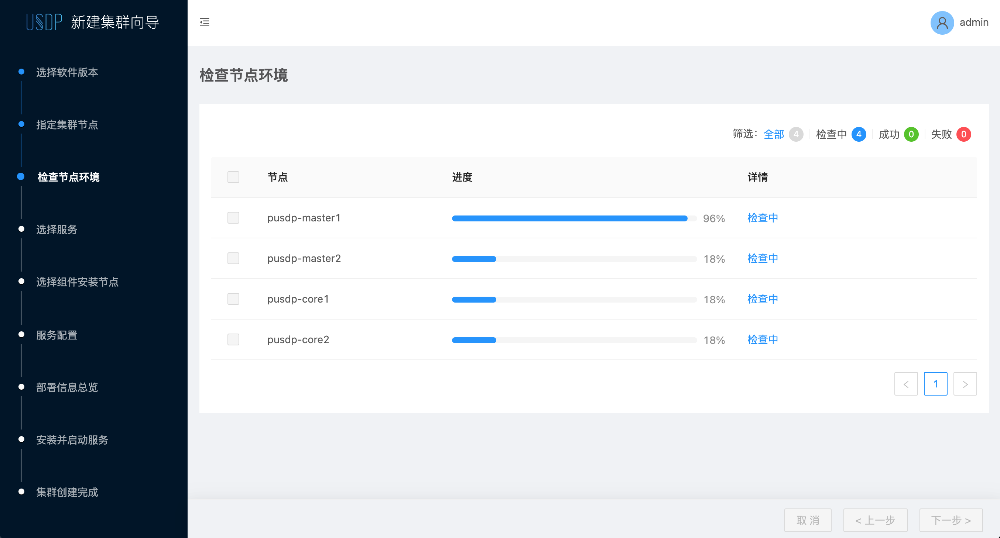

检查过程共，可点击列表 “详情” 栏的 “检查中” 按钮，来查看USDP在各个节点上在做哪些事情，如下图所示：

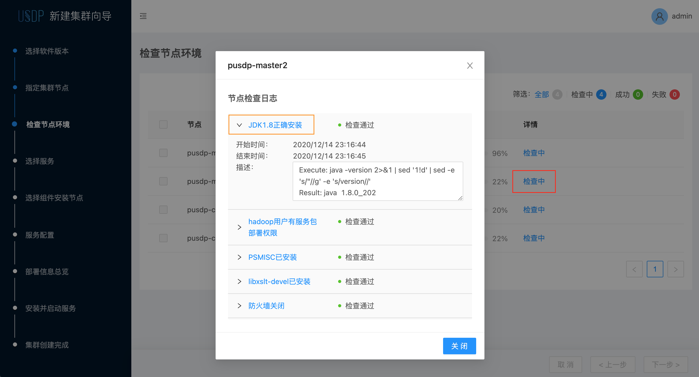

用户甚至可点击如上图中的蓝色超链接，来查看每一步检查项的具体执行过程和日志。

待所有检查工作完成后，点击右下角的向导 <kbd>下一步</kbd> 按钮继续。

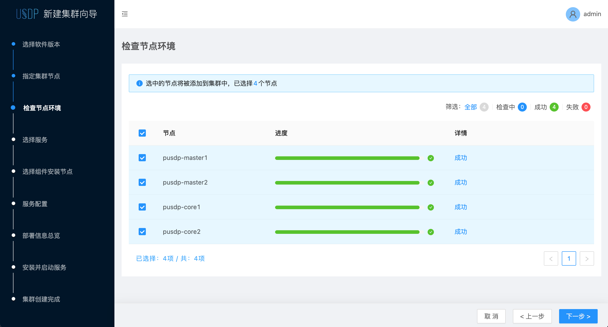

### 4 向导-选择服务

USDP支持大数据生态服务较多，在集群安装时，用户根据业务需要，灵活选择所需安装的组件。如下图所示：

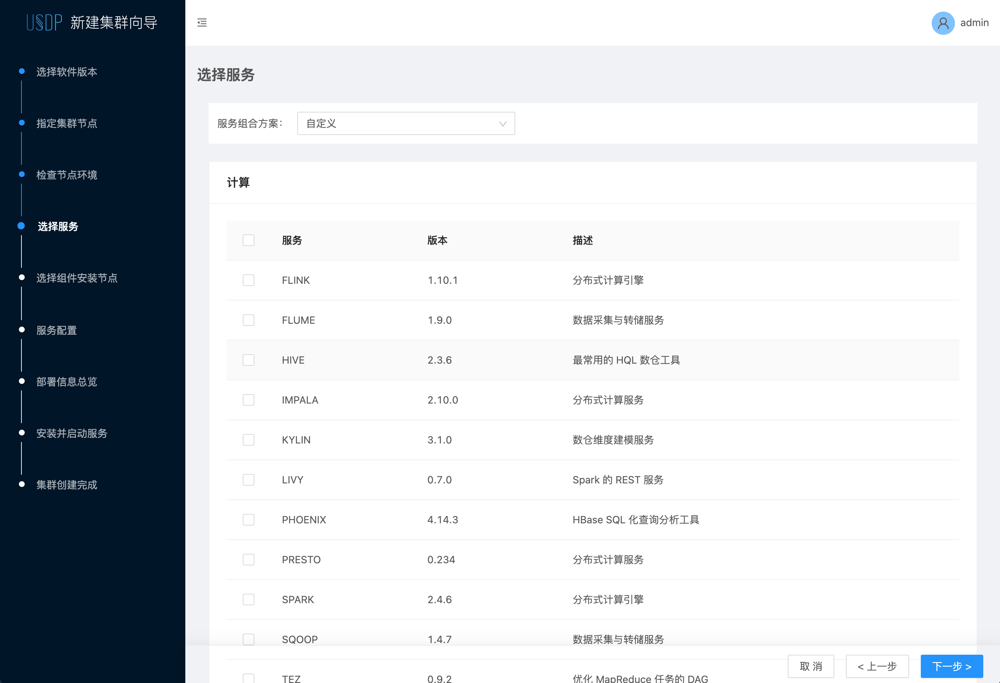

其中 “监控” 服务是默认必须选择的，用户无法取消选择。

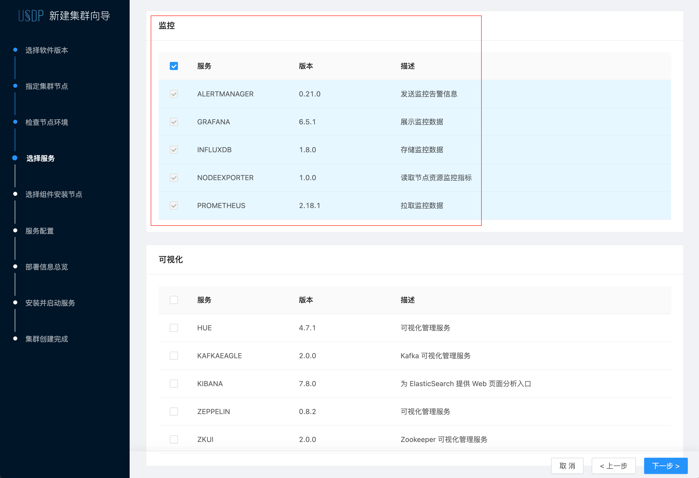

您可以在“服务组合方案”出从推荐方案A\B\C中进行选择，或“自定义”您需要的服务。如下图所示：

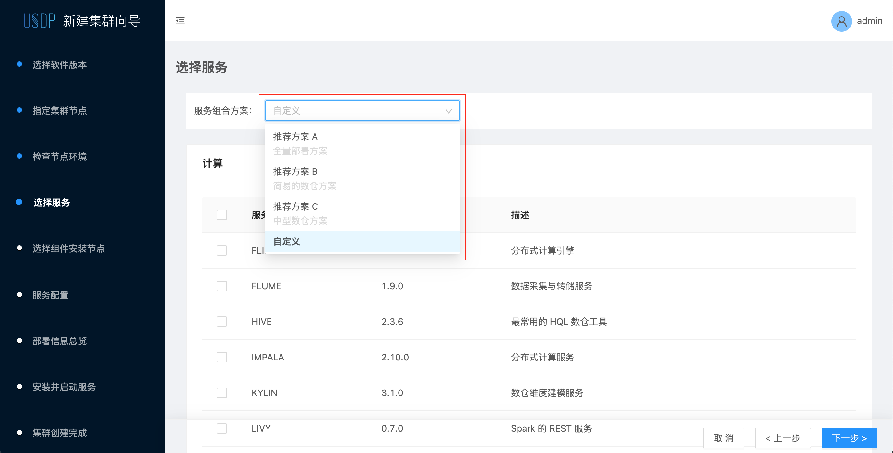

### 5 向导-选择组件安装节点

大数据生态各服务，均由不同的组件构成，安装集群时，用户可根据业务需求规划，将不同的服务及组件分别都安装到集群的那些节点上。

若用户选择安装的服务较多或如上图中用户选择推荐方案A（全量部署方案），由于组件选项非常多，建议采用“智能推荐”的方式进行选择，或者在“智能推荐”的基础上进行修改。如下图所示：

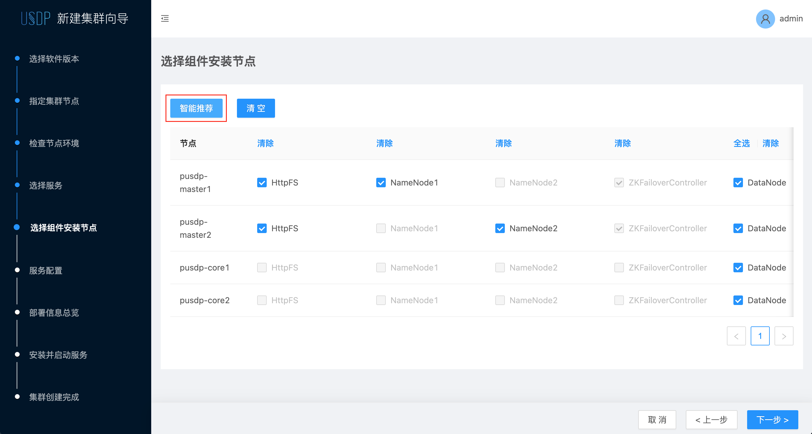

> USDP有以下建议，用户可参考： 
>
> - NameNode建议安装在usdp-xxx-masster的节点上，否则NameNode出现异常时，主从切换会失败。
> - 节点名称为usdp-xxx-masster的节点，建议用于部署zookeeper、Journalnode、NameNode、Resourcemanager、Hmaster、Hive等服务和组件的master节点，可视化和调度组件如Hue、oozie、kibana、zkui也建议部署在Master节点上。
> - 节点名称usdp-xxx-core核心节点，建议用于存储数据（HDFS）与运行任务。建议部署datanode、nodemanager、regionserver、presto work、impala。
> - 节点名称usdp-xxx-task的节点，建议用于部署计算资源，建议用来部署Nodemanager、Client。
> - 节点名称usdp-xxx-monitor的节点，建议用于部署AlterManager、Grafana、InfluxDB、NodeExporter、Prometheus、USDPMonitor等监控服务。

### 6 向导-服务配置

USDP默认将自身管理元信息、集群中大数据服务的相关元信息，统一配置至Master1节点的MySQL数据库中，默认开启“元信息数据库统一配置”、默认填充该MySQL的相关连接信息，点击 <kbd>测试连接</kbd> 按钮即可测试是否正常，如下图所示：

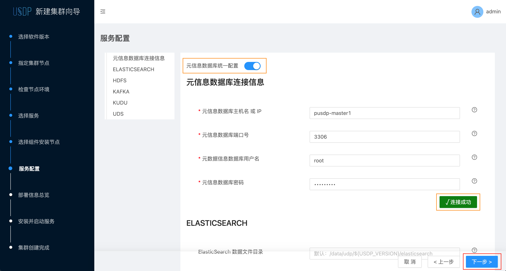

> 元信息数据库配置涉及的服务有：
>
> - HIVE、HUE、OOZIE、RANGER、UDS等五个服务。
> - MySQL版本：5.7.30

在此，请填写其他相关服务的配置信息，其中“ELASTICSEARCH”、“HDFS”、“KAFKA”、“KUDU”等相关数据存储目录信息。如下图所示：

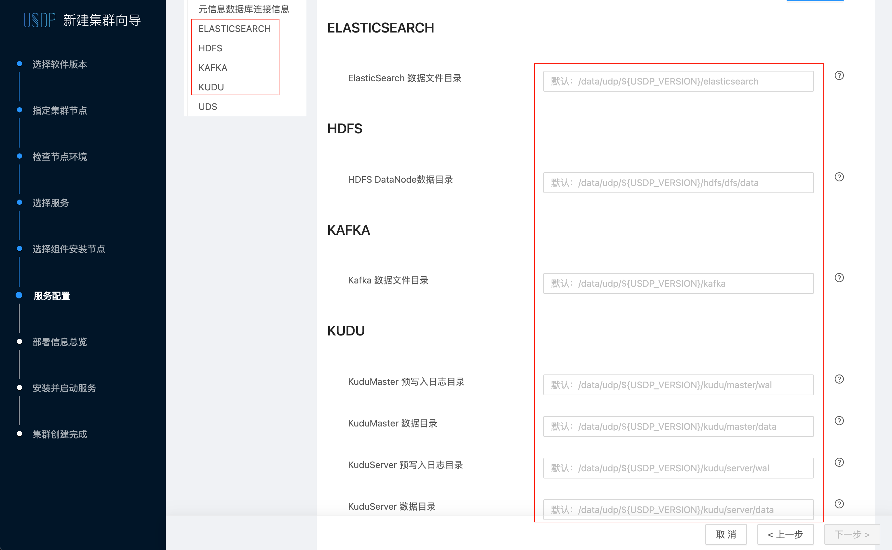

“UDS”邮件服务器配置信息，可默认不填，并在集群安装完成后进入USDP控制台后，即可进入向导“下一步”。

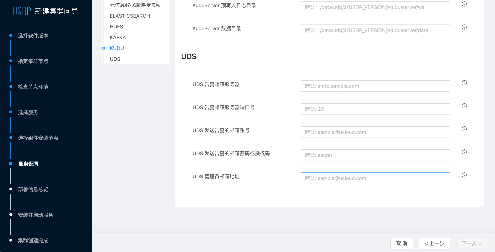

##### 元信息数据库独立配置

若用户计划将“AIRFLOW”、“HIVE”、“HUE”、“OOZIE”、“RANGER”、“UDS”等服务的元信息数据库独立管理，此时，可点击取消 “元信息数据库统一配置” 右侧的滑块，同时，下方页面即会显示这些服务所需的数据库连接填写的表单，按要求填写，并分别点击下方的 <kbd>测试连接</kbd> 按钮，按钮变为绿色，即为测试连接成功。此后，即可进入向导下一步中。如下图所示：

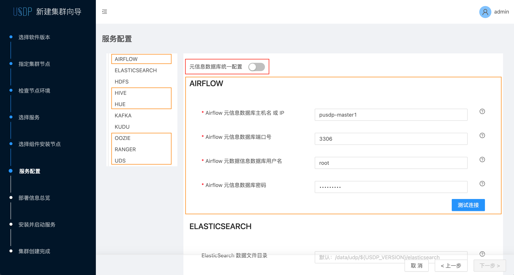

完成上述向导步骤中的信息补充后，USDP会将所有选择及配置信息汇总展示，如下图所示：

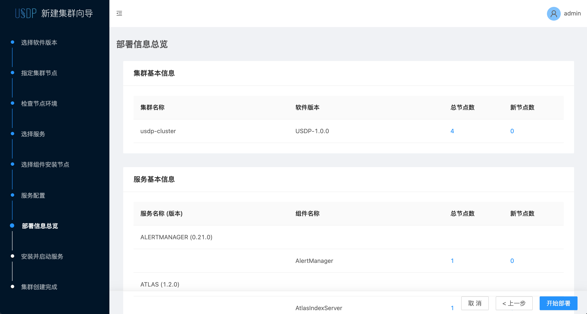

继续点击向导 <kbd>下一步</kbd> 按钮即可。

### 7 向导-安装并启动服务

按照前面输入及补充的信息，USDP开始服务安装工作。

当服务安装发生错误时，您可以点击查看报错节点“失败”详情，参考详情提示信息，进行手动修复错误操作，之后点击“全部重试”按钮，重新进行服务组件部署工作。

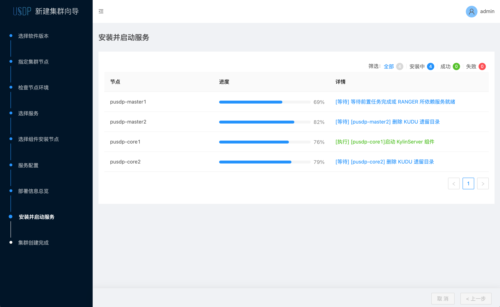

部署过程中，各个节点正在进行的部署进展，均可通过进度条实时展示，可点击 “详情” 栏中的各个链接，查看当前进展详情，如下图所示：

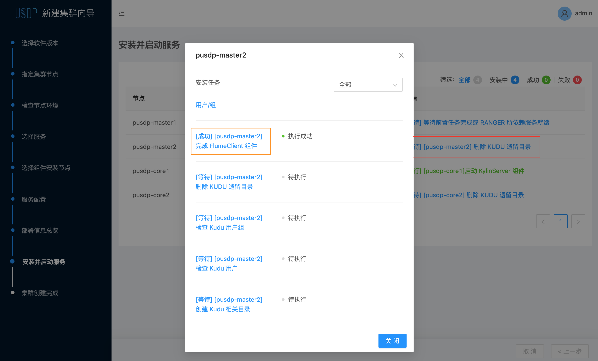

点击对话框 - “安装任务” 栏的各个链接，几个查看其单个安装任务的执行日志，这将在安装过程中出错时变得很有用。如下图所示：

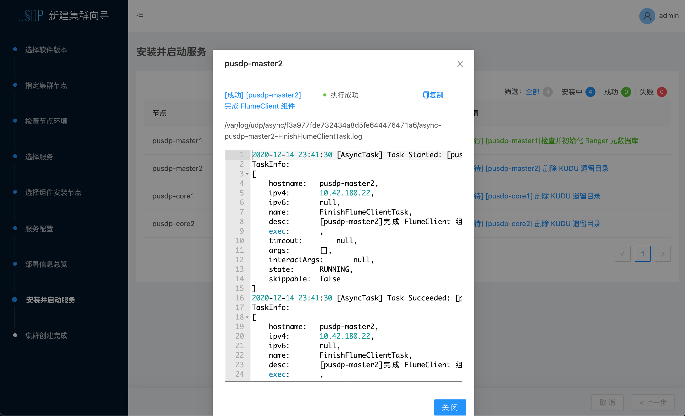

当安装过程中出现任务失败的情况，USDP会在左上角显示 <kbd>全部重试</kbd> 按钮，可点击重试安装。

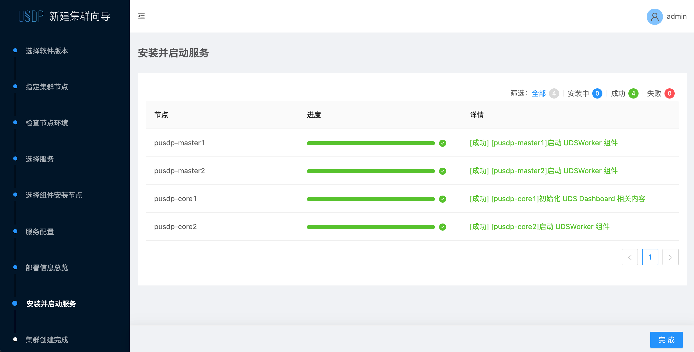

待所有节点正常安装成功后，即可点击向导 <kbd>完成</kbd> 按钮。

### 8 向导-集群创建完成

此时，USDP提醒用户 “已成功创建了一个集群”。

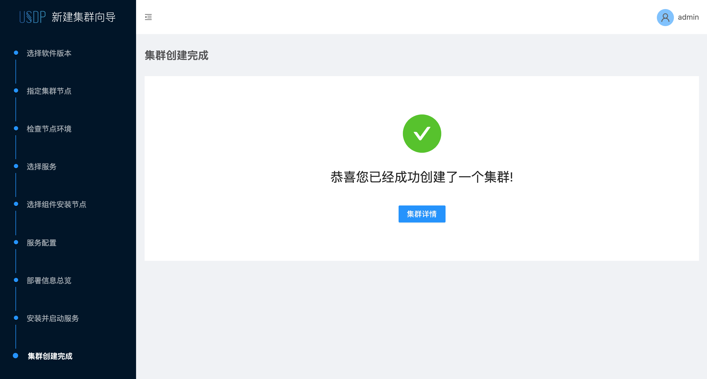

点击 <kbd>集群详情</kbd> 按钮，进入USDP Console首页，如下图所示：

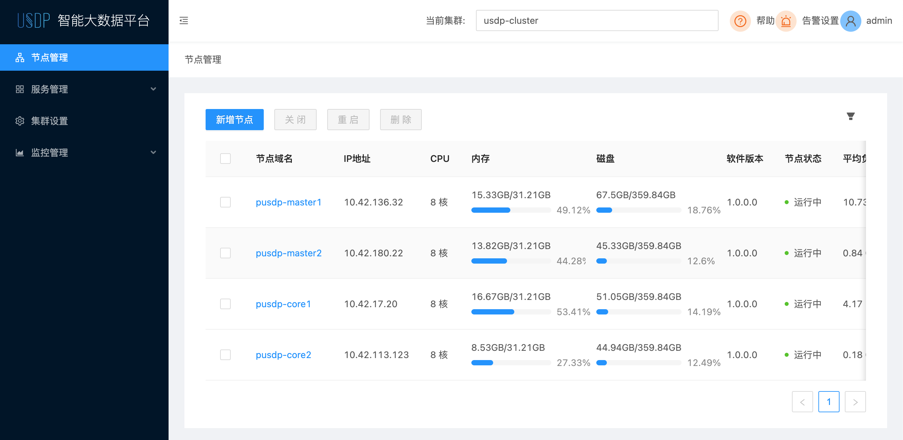

至此，一个可以构建大数据业务的集群就创建好了。

?> 提示： 若您是集群管理员用户，关于集群的管理，可参考其他《控制台操作》文档； 若您是大数据的开发人员，关于大数据服务的使用，可参考相关《开发指南》文档。

