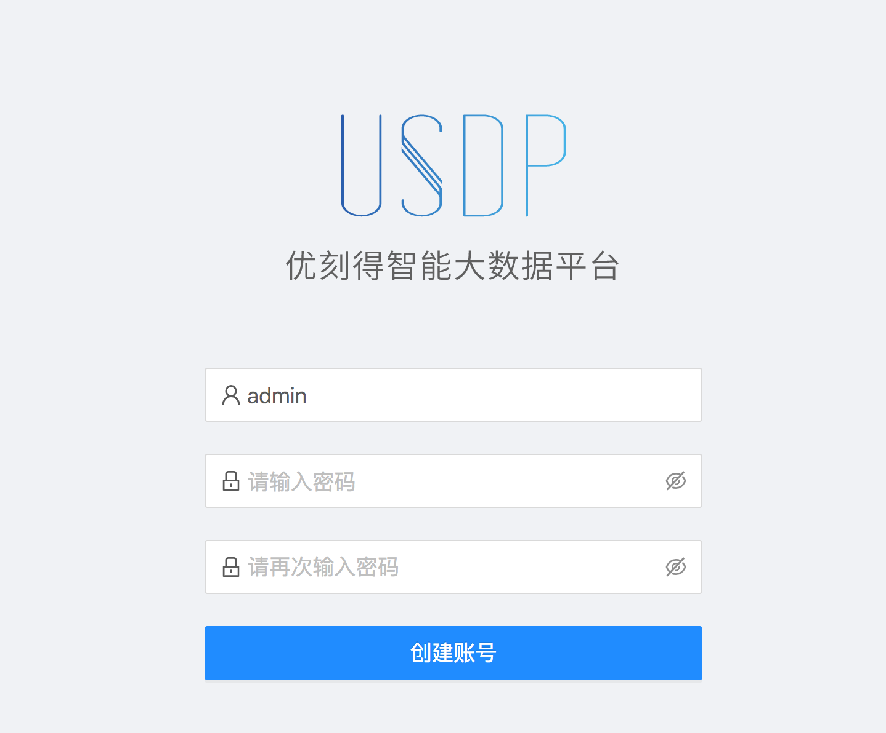
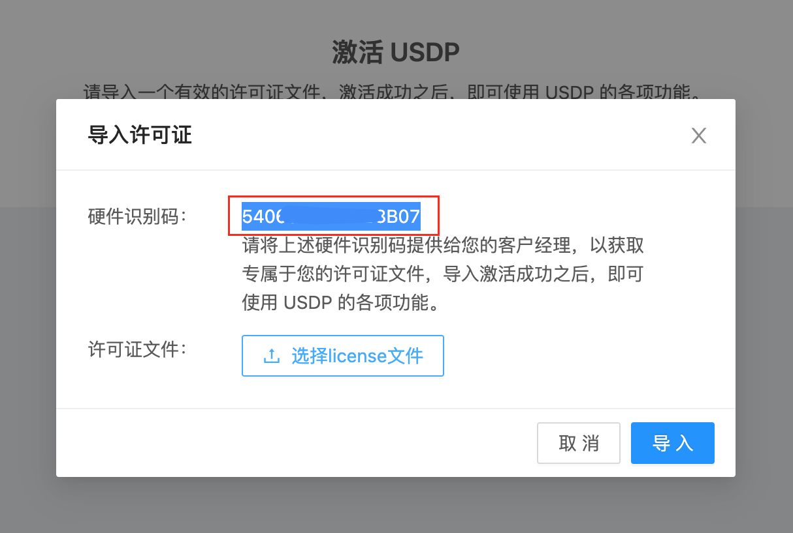

# USDP私有化部署流程

欢迎使用 USDP 构建大数据平台，接下来，我们将通过几个简单的步骤，完成 USDP 管理服务的部署流程，从而能够通过 Web 页面的方式，快速部署各类大数据服务与组件。

在开始安装之前，请至少准备如下节点资源，以供后续创建大数据集群。

!> 私有化部署 USDP 需满足如下环境：</br>- **节点数量**：3 台及以上；</br>- **网络**：集群节点间内网通畅；建议节点间网络10Gbps及以上；</br>- **节点内存**：推荐 32G 以上；</br>- **节点CPU**：推荐 8 核以上；</br>- **节点磁盘**：系统盘 60G 以上，数据盘根据业务需要调整；</br>- **操作系统**：CentOS 7.6(推荐)，或其他 CentOS 7 系列版本； </br>- **数据库**：MySQL 5.7；

下面的部署安装流程以 USDP-Privatization-1.0.0.0 版本为例进行说明。


## 1. 创建安装目录

创建 `/opt/usdp-srv/` 目录，并将压缩包解压至该目录下。


## 2. 下载安装包

通过给定地址，下载 USDP 离线安装包，得到 ``usdp-01-master-privatization-1.0.0.0.tar.gz`` 文件；

?> **提示：**</br>- USDP 离线安装包文件，大约 17 GB；</br>- 建议将该安装包存储至数据盘中，避免该安装包占用过多系统盘空间；</br>- 使用tar指令解压时，可使用"-C"指定解压到 `/opt/usdp-srv/` 目录；


## 3. 目录结构说明

解压后的子目录（`/opt/usdp-srv/usdp/`）说明信息，如下所示：

| 子目录       | 说明                                                         |
| ------------ | ------------------------------------------------------------ |
| agent        | USDP Agent 程序所在目录，为每个节点的作业端，无需手动启动、无需手动管理，无需手动管理； |
| bin          | 启动 udp-server 与 udp-agent 程序的脚本目录，无需手动管理；  |
| config       | 配置文件目录，主要用于配置 MySQL 的地址，其他无需修改；      |
| jmx_exporter | 监控的相关插件，无需手动管理；                               |
| recommend    | 部署服务时的默认勾选清单，无需修改；                         |
| repair       | 一键修复脚本；                                               |
| repository   | 服务组件资源目录，无需手动管理；                             |
| scripts      | 工具脚本目录，无需手动管理；                                 |
| server       | USDP Server 程序所在目录，无需手动管理；                     |
| sql          | 初始化 SQL 所在目录，无需手动管理；                          |
| templated    | 服务组件配置文件模板目录，无需手动管理；                     |
| verify       | USDP 私有化证书存储目录，无需手动管理；                      |
| versions     | USDP 版本目录，无需手动管理；                                |


## 4. 执行环境初始化

在运行 USDP 之前，需要对所有节点进行必要的配置，为了简化用户操作，USDP 提供一键环境初始化脚本，包括自动安装 JDK，自动安装 MySQL，并初始化 USDP 数据，以及初始化系统软件环境等。

### 4.1 配置修复

在开始运行一键修复脚本之前，您需要提前配置 `/opt/usdp-srv/usdp/repair` 目录下的相关文件如下：

* **host_all_info.txt**

  示例如下：

  ~~~shell
  127.0.0.1 your-node-root-password 22 udp01
  127.0.0.1 your-node-root-password 22 udp02
  127.0.0.1 your-node-root-password 22 udp03
  ~~~

  文件中每行为一个节点信息，从左至右依次为：“内网IP”、“节点root用户密码”、“SSH端口号”、节点“完全限定域名”（主机名）。

  > **完全限定域名-命名规则：**
  >
  > 1、主机名只允许包含ascii字符里的数字0-9、字母a-zA-Z、连字符-、其他都不允许。例如，不允许出现其他标点符号，不允许空格，不允许下划线，不允许中文字符。
  >
  > 2、主机名的开头和结尾字符不允许是连字符。
  >
  > 3、主机名命名不允许出现 “数字-数字” 这种模式

  ?> **提示：**</br>- 当执行完4.2步骤后，节点“完全限定域名”（主机名）将被生效，无需再手动为每个节点配置主机名；</br>- 在全量初始化部署过程中，host_single_info.txt 暂无须修改；

* **your.properties**

  示例如下：

  ~~~shell
   # Repair all host in this cluster.
  
   host.all.info.Path=/opt/usdp-srv/usdp/repair/host_all_info.txt
   namp.server.ip=10.9.25.16
   namp.server.port=22
   namp.server.password=###qcbxzg521
   ntp.master.ip=10.9.25.16
   mysql.ip=10.9.25.16
   mysql.host.ssh.port=22
   mysql.host.ssh.password=###qcbxzg521
   mysql.password=1qaz!QAZ
  
   # Repair single host in this cluster.
  
   host.single.info.Path=/opt/usdp-srv/usdp/repair/host_single_info.txt
  
   # Common Settings.
  
   repair.log.dir=./logs
  ~~~

  > 上述代码解释如下：
  >
  > - 第 1 行：`host_all_info.txt` 文件绝对路径；
  > - 第 2 行：填写未来即将部署 USDP-Server 的节点的内网 IP；
  > - 第 3 行：SSH 端口号，默认22；
  > - 第 4 行：填写未来即将部署 USDP-Server 的节点的密码；
  > - 第 5 行：选择某个节点作为 NTP 时间服务器；
  > - 第 6 行：选择某个节点作为 MySQL 服务器；
  > - 第 7 行：设置 MySQL 所在节点的 SSH 端口号，默认 22；
  > - 第 8 行：设置 MySQL 的 所在节点的密码；
  > - 第 9 行：`host_single_info.txt` 文件绝对路径； 
  > - 第 10 行：修复过程中的日志输出目录；

?> **提示：**</br>- 对your.properties 文件中各IP地址的填写，建议参考 [资源规划](usdpdc/1.0.x/plan&create/deploy_plan) 说明后，按实际需求规划进行填写。

### 4.2 执行修复

完成上述步骤后，执行如下命令即可开始一键修复任务：
~~~shell
cd /opt/usdp-srv/usdp/repair
sh repair.sh initAll <your.properties 文件的绝对路径>
~~~

修复过程为完全离线的方式，需等待一段时间后，即可将所有对应节点的环境准备完毕。

执行如下命令，使环境配置生效：

~~~shell
source /etc/profile
~~~


## 5. 启动 USDP

### 5.1 为USDP配置MySQL数据库

修改`/opt/usdp-srv/usdp/config/application-server.yml`文件，找到 `datasource` 配置片段。

修改前默认显示如下内容：

```shell
datasource:
    type: com.zaxxer.hikari.HikariDataSource
    #    driver-class-name: org.gjt.mm.mysql.Driver
    driver-class-name: com.p6spy.engine.spy.P6SpyDriver
    url: jdbc:p6spy:mysql://udp01:3306/db_udp?useUnicode=true&characterEncoding=utf-8&useSSL=false
    username: root
    password: 1qaz!QAZ
```

参考配置文件host_all_info.txt及your.properties中的配置信息，修改“**url：**”中的 `udp01` 字符串，及 “**password：**” 的值。

修改后，如下方示例所示：

```shell
datasource:
    type: com.zaxxer.hikari.HikariDataSource
    #    driver-class-name: org.gjt.mm.mysql.Driver
    driver-class-name: com.p6spy.engine.spy.P6SpyDriver
    url: jdbc:p6spy:mysql://usdp-01:3306/db_udp?useUnicode=true&characterEncoding=utf-8&useSSL=false
    username: root
    password: uc1qaz!QAZ0
```

?> **提示：**</br>- 将“**url：**”中的默认值 `udp01` 替换为your.properties中的 “mysql.ip”的值(IP地址)，或者是该IP对应的主机名（host_all_info.txt中的“完全限定域名”）；</br>- 将“**password：**”默认值 `1qaz!QAZ` 替换为your.properties中的 “mysql.password”的值；

### 5.2 启动 USDP

此时，进入 ``/opt/usdp-srv/usdp`` 目录后，执行如下命令，即可启动 USDP-Server：

~~~shell
bin/start-udp-server.sh 
~~~

执行该启动命令后，大约需等待 10 秒左右时间。

### 5.3 使用crontab定时检测USDP服务

为crontab添加start-udp-server.sh 每分钟定时检测，参考如下：

~~~shell
*/1 * * * *  source /etc/profile;sh /opt/usdp-srv/usdp/bin/start-udp-server.sh >/dev/null 2>&1
~~~

### 5.4 访问USDP管理控制台

浏览器中访问 USDP控制台：

~~~shell
http://<your_host_ip>
~~~

?> **提示：**</br>- “your_host_ip” 为启动 USDP-Server 的节点 IP 地址，如果浏览器所在节点与USDP不在同一网络环境，则需要自行搭建 VPN，或通过与USDP部署节点网络互通的Windows机器的浏览器来访问该IP。

进入USDP管理控制台时，首次登录需要设置admin用户名的登录密码。如下图所示：



?> **提示：**</br>- 集群部署完成后，可在USDP控制台中，更改admin管理员的密码。

### 5.5 获取并导入LICENSE


点击 <kbd>导入许可证</kbd> 按钮，USDP将自动是被服务器的硬件识别码，并显示在弹出的对话框中，如下图所示：



请将对话框中的 `硬件识别码` 字符串，及您计划通过USDP管理的`服务器节点数量`，联系并告知UCloud客户经理，其会协助您获得License许可文件。

获得license文件后，点击 <kbd>选择license文件</kbd> 按钮，选择你们的license文件，点击对话框 <kbd>导入</kbd> 按钮，完成license验证。验证通过后，即可开始创建集群。

?> **提示：**</br>- License 是一个 `xxx.tar.gz` 的文件，无需解压，直接导入即可。</br></br>关于更多 “许可证” 的内容，请前往 [USDP许可证管理](usdpdc/1.0.x/webconsole/license) 查看。

若License文件有效，此时，USDP管理控制台中即会显示 ”新建集群“ 的向导入口，如下图所示：


至此，环境初始化及USDP管理服务的安装已完成，接下来将 [通过USDP创建第一个大数据集群](usdpdc/1.0.x/plan&create/first_create)。

