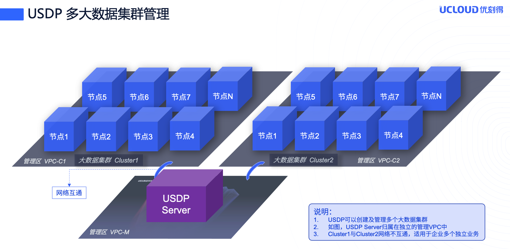

# 管理多个大数据集群

在使用USDP管理大数据业务系统时，用户可根据业务需求，来规划所需的大数据集群数量及单集群的规模和服务；根据业务形态，决策集群间的隔离性。

如上图所示，可结合网络VPC（vlan等）技术实现VPC间的互通管理，大数据集群Cluster1与Cluster2可能承载的是不同且不相关的大数据处理业务，因此无法互相访问和共享数据。

## 一、新增大数据集群

当用户搭建好USDP服务时，实际上已经在流程中创建了第一个大数据集群。本章节将从您创建其余的更多个大数据集群时给您参考。

登陆USDP控制台，点击顶部 <kbd>当前集群</kbd> 的集群名称，会弹出下拉列表，在列表中选择 <kbd>添加集群</kbd> 按钮。如下图所示：

此时，即可进入创建新集群的向导流程中，接下来，您可参考 [通过向导创建大数据集群](/usdpdc/1.0.x/plan&create/first_create?id=3.1向导-选择软件版本) 章节。

