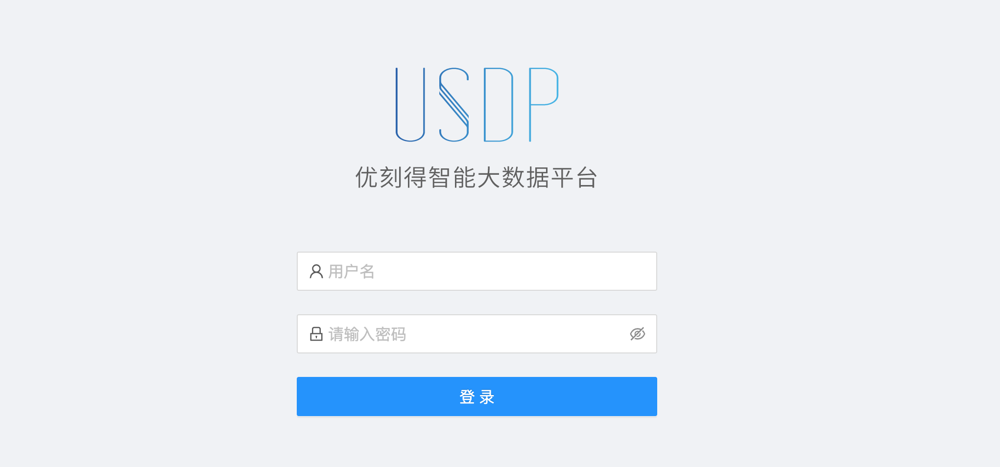
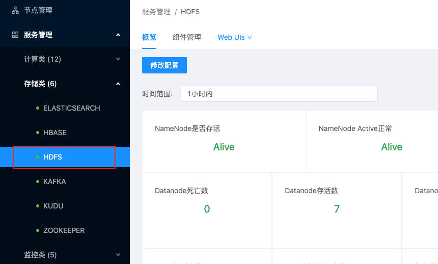
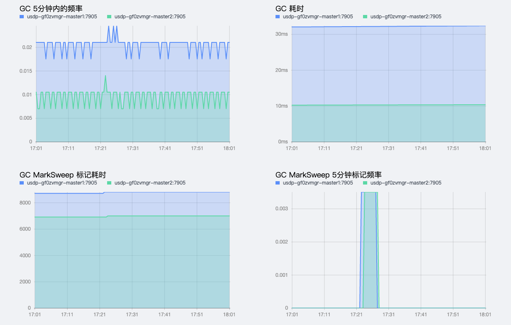
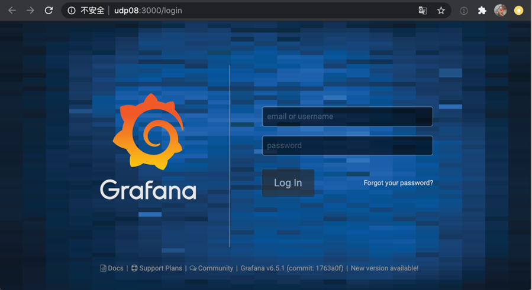

# 集群服务管理

在智能大数据平台USDP中，为便于用户对集群及相关服务的管理，USDP提供较为友好的服务管理功能，譬如集群服务管理中，有大数据服务的基本监控信息查看、服务配置文件修改、服务的组件启停及管理、服务的Web UIs便捷访问等功能，辅助用户更好的管理和使用USDP。

## 1. 浏览器访问USDP管理控制台

在浏览器中打开 USDP Web Console：
~~~URL
http://<your_master1_ip>
~~~
如下所示：

在USDP控制台左侧导航栏 “服务管理”，USDP已将该集群所部署使用的所有大数据服务组件分为7类统一归类。

## 2. 计算类服务管理

在USDP-1.0.0版本中，集群的计算类服务组件主要有Flink、Flume、Hive、Impala、Kylin、Livy、Phoenix、Presto、Spark、Sqoop、Tez、Yarn在内的11个服务组件，下面将以Yarn为代表，介绍计算类组件的管理操作方式。

### 2.1 YARN服务管理

点击选择左边菜单导航栏-“服务管理”-“计算类”，在展开的子类中点击“YARN”，即可在右侧窗口打开Yarn的管理页面，如下图所示：

#### 2.1.1 YARN 服务详情概览

Yarn服务管理首页展示了Yarn服务的监控指标（ResourceManager活跃状态、JobHistoryServer存活状态、JobHistoryServer健康状态、虚拟核心数VCores、总节点数、集群节点存活数量、重启过的节点数量、非健康节点数量、已退役节点数量、丢失节点数量，以及各个节点的监控状态等）如下图所示：

#### 2.1.2 YARN 服务相关组件管理

参考 “本篇指南-3.1.2节” 的方式。

#### 2.1.3 YARN 服务Web UIs便捷访问

鼠标悬停/点击Yarn服务管理页面中“Web UIs”选项卡时，自动下拉展开Yarn相关的页面选项链接，如下图所示：

点击“[udp08] ResourceManager1 Web UI”，会自动在浏览器中打开新的标签页，并显示udp08节点上的ResourceManager管理页面，如下图所示：

点击“[udp08] HistoryServer Web UI”，会自动在浏览器中打开新的标签页，并显示udp08节点上的HistoryServer管理页面，如下图所示：

点击“[udp08] TimelineServer Web UI”，会自动在浏览器中打开新的标签页，并显示udp08节点上的TimelineServer管理页面，如下图所示：

#### 2.1.4 YARN服务配置文件修改

参考 “本篇第6节-服务配置文件管理” 的方式。

### 2.2 其他计算类服务管理

其他计算类服务还包括Flink、Flume、Hive、Impala、Kylin、Livy、Phoenix、Presto、Spark、Sqoop、Tez等，对这些计算服务的管理方式，均与本篇指南中 Yarn服务管理 的管理方式类似，此处不再过多赘述。

## 3. 存储类服务管理

在USDP1.0.0.0版本中，集群存储类服务组件主要有Elasticsearch、HBase、HDFS、Kafka、KUDU、Zookeeper在内的6个服务组件，下面将以Zookeeper及HDFS为代表展示存储类组件的管理操作方式。

### 3.1 Zookeeper服务管理

点击选择左边菜单导航栏-“服务管理”-“存储类”，在展开的子类中点击“ZOOKEEPER”，即可在右侧窗口打开Zookeeper的管理页面，如下图：

#### 3.1.1 Zookeeper 服务详情概览

USDP会对支持的单个组件服务实现监控，并在USDP控制台进行相关监控指标的可视化展示。

Zookeeper服务管理首页展示了Zookeeper服务的监控指标（Leader数量、Followers数量、未同步的Followers数量、等待同步的数量、临时节点数、数据大小、Znode数量，以及该服务不同角色对应的一些更细致的指标情况）如下图所示：

控制台监控指标可视化支持按时间进行查看，USDP预置了一些时间周期（默认为“1小时内”，还有“6小时内”、“12小时内”、“1天内”、“7天内”、“15天内”、“30天内”），也支持时间周期“自定义”，如下图所示：

#### 3.1.2 Zookeeper服务相关组件管理

在Zookeeper组件管理页面种，点击“组件管理”选项卡，打开Zookeeper相关组件管理列表，如下图所示：

在该管理页面中，支持对Zookeeper分布的多台节点上的QuarumPeermain组件进行单一/批量节点操作（服务的启动、停止、重启、删除等），如下图所示：

例如，对所有节点上的QuarumPeermain组件进行“停止”运行状态操作时，管理平台将自动检测所选组件当前的工作状态，如下图所示：

例如，对所有节点上的QuarumPeermain组件进行“删除”操作时，管理平台将给您做出警示提醒，请您仔细阅读提示信息，确保此次操作不是误操作。如下图所示：

点击“确认”删除按钮，管理平台将自动检测所选组件当前的工作状态，QuarumPeermain组件正在运行（“已启动”状态）时，是不允许直接删除的。如下图所示：

若确认需要删除所选QuarumPeermain组件，请先“停止”运行，并再次执行“删除”操作。

#### 3.1.3 Zookeeper 服务组件扩展

USDP管理控制台支持对当前Zookeeper服务扩展更多节点。如下图所示：

点击“新增组件”按钮，进入“新增组件或服务”向导，如下图所示：

选择QuarumPeermain组件需要扩展的节点主机，如下对话框截图所示：

管理平台检测出，已加入该平台的所有节点主机中，udp02节点上暂未运行QuarumPeermain组件，“勾选”udp02左侧的复选框，点击“确定”按钮，进入“部署信息总览”向导页，如下图所示：

经浏览确认无误，点击“开始部署”按钮，管理平台将为udp02节点安全QuarumPeermain组件，安装无误，将显示安装成功状态，平台会自动启动该组件，如下图所示：

安装进度完成后，点击“完成”按钮。如下图所示：

此时，可根据向导中表单要求，选择需要扩展的新集群节点及服务预览等，最后点击“开始部署”即可完成服务扩展操作。

#### 3.1.4 Zookeeper服务配置文件修改

参考 “本篇第6节-服务配置文件管理” 的方式。

### 3.2 HDFS服务管理

点击选择左边菜单导航栏-“服务管理”-“存储类”，在展开的子类中点击“HDFS”，即可在右侧窗口打开Hdfs的管理页面，如下图：

#### 3.2.1 HDFS 服务详情概览

HDFS服务管理首页展示了HDFS服务的监控指标（NameNode是否存活、NameNode Active正常、JournalNode是否存活、ZKFC是否存活、Datanode死亡数、Datanode存活数、Datanode心跳超时数、HDFS空间使用率、HDFS块丢失数、Block副本损坏个数、坏盘数量、Block个数、HDFS文件及目录个数、HDFS已用容量、HDFS副本不足的Block数、未分配给HDFS的磁盘大小、可用堆内存、初始堆内存、最大堆内存）如下图所示：

对HDFS GC相关监控（GC5分钟内的频率、GC耗时、GC MarkSweep标记耗时、GC MarkSweep 5分钟标记频率）如下图所示：

对HDFS “堆内存使用大小”的监控，如下图所示：

#### 3.2.2 HDFS 服务相关组件管理

参考 “本篇指南-3.1.2节” 的方式。

#### 3.2.3 HDFS 服务Web UIs便捷访问

USDP管理系统，根据HDFS 自身支持相关Web UI的特性，在集群管理页面提供快速打开其相关的UI的能力。

鼠标悬停/点击HDFS 服务管理页面中“Web UIs”选项卡时，自动下拉展开HDFS 相关的页面选项链接，如下图所示：

点击“[udp08] NameNode1 Web UI”/“[udp09] NameNode2 Web UI”，会自动在浏览器中打开新的标签页，并显示udp08/udp09节点上的HDFS管理页面，如下图所示：

#### 3.2.4 HDFS 服务配置文件修改

参考 “本篇第6节-服务配置文件管理” 的方式。

### 3.3 其他存储类服务管理

其他存储服务还有HBase、Kafka、Elasticsearch、KUDU等，对这些存储服务的管理方式，均与本篇指南中 Zookeeper、HDFS 服务管理 的管理方式类似，此处不再过多赘述。

## 4. 监控类服务管理

在USDP1.0.0.0版本中，集群监控类服务组件主要有AlterManager、Grafana、InfluxDB、NodeExporter、Prometheus在内的5个服务组件，下面，将以Prometheus及Grafana为代表展示监控类组件的管理操作，其他组件的管理方式均类似。

### 4.1 Prometheus服务管理

点击选择左边菜单导航栏-“服务管理”-“监控类”，在展开的子类中点击“Prometheus”，即可在右侧窗口打开Prometheus的管理页面，如下图：

#### 4.1.1 Prometheus 服务详情概览

Prometheus服务管理首页展示了Prometheus服务的监控指标（WAL Corruptions、Samples Appended、Scrape Duration、Memory Profile、Active Appenders、Blocks Loaded、Head Chunks、Compaction Activity、Reload Count、Query Durations、Rule Group Eval Duration、Rule Group Eval Activity）如下图所示：

#### 4.1.2 Prometheus 服务相关组件管理

参考 “本篇指南-3.1.2节” 的方式。

#### 4.1.3 Prometheus 服务Web UIs便捷访问

鼠标悬停/点击Prometheus服务管理页面中“Web UIs”选项卡时，自动下拉展开Prometheus相关的页面选项链接，如下图所示：

点击“[udp08] Prometheus Graph Web UI”，会自动在浏览器中打开新的标签页，并显示udp08节点上的Prometheus Graph管理页面，如下图所示：

点击“[udp08] Prometheus Targets Web UI”，会自动在浏览器中打开新的标签页，并显示udp08节点上的Prometheus Targets管理页面，如下图所示：

#### 4.1.4 Prometheus 服务配置文件修改

参考 “本篇第6节-服务配置文件管理” 的方式。

### 4.2 Grafana服务管理

点击选择左边菜单导航栏-“服务管理”-“监控类”，在展开的子类中点击“Grafana”，即可在右侧窗口打开Grafana的管理页面，如下图：

#### 4.2.1 Grafana 服务详情概览

Grafana服务管理首页展示了Grafana“服务是否存活”的状态监控。如下图所示：

#### 4.2.2 Grafana 服务相关组件管理

参考 “本篇指南-3.1.2节” 的方式。

#### 4.2.3 Grafana 服务Web UIs便捷访问

鼠标悬停/点击Grafana服务管理页面中“Web UIs”选项卡时，自动下拉展开Grafana相关的页面选项链接，如下图所示：

点击“[udp08] Grafana Web UI”，会自动在浏览器中打开新的标签页，并显示udp08节点上的Grafana管理页面，如下图所示：

> 默认登陆口令如下，请登陆后及时修改密码！
>
> - 用户名：当前集群名称
> - 密码：0okm9ijn)OKM(IJN

#### 4.2.4 Grafana 服务配置文件修改

参考 “本篇第6节-服务配置文件管理” 的方式。

### 4.3 其他监控类服务管理

其他监控类服务还包括AlterManager、InfluxDB、NodeExporter等，对这些监控服务的管理方式，均与本篇指南中 Prometheus、Grafana服务管理 的管理方式类似，此处不再过多赘述。

### 5. 可视化类服务管理

在USDP1.0.0.0版本中，集群可视化类服务组件主要有Hue、Kafkaeagle、Kibana、Zeppelin、ZKUI在内的5个服务组件，下面将以ZKUI为代表展示可视化类组件的管理操作，其他组件的管理方式均类似。

### 5.1 ZKUI服务管理

点击选择左边菜单导航栏-“服务管理”-“可视化类”，在展开的子类中点击“ZKUI”，即可在右侧窗口打开ZKUI的管理页面，如下图：

#### 5.1.1 ZKUI 服务详情概览

ZKUI服务管理首页展示了ZKUI“服务是否存活”的监控指标，如下图所示：

#### 5.1.2 ZKUI 服务相关组件管理

参考 “本篇指南-3.1.2节” 的方式。

#### 5.1.3 ZKUI 服务Web UIs便捷访问

鼠标悬停/点击ZKUI服务管理页面中“Web UIs”选项卡时，自动下拉展开ZKUI相关的页面选项链接，如下图所示：

点击“[udp08] ZKUI Web UI”，会自动在浏览器中打开新的标签页，并显示udp08节点上的ZKUI登陆管理页面，如下图所示：

#### 5.1.4 ZKUI 服务配置文件修改

参考 “本篇第6节-服务配置文件管理” 的方式。

#### 5.2 其他可视化类服务管理

其他可视化服务还包括Hue、Kafkaeagle、Kibana、Zeppelin等，对这些可视化服务的管理方式，均与本篇指南中 ZKUI服务管理 的管理方式类似，此处不再过多赘述。

## 6. 服务配置文件管理

在USDP中，无论USDP提供的那种集群组件服务，对于这些服务的配置文件修改，均可采用以下两种方式：

- 在USDP控制台中更改服务配置文件，这是我们强烈推荐方式
- 逐一登陆服务分布式节点并更改其配置文件

下文以Zookeeper的配置文件修改为示例，介绍上述两种修改方式。

### 6.1 在USDP控制台中更改服务配置文件

为简化维护人员操作复杂度，USDP支持对同一服务的多个节点配置文件同时进行配置文件修改，亦可对该组件服务的单个节点配置文件进行修改，方法如下：

- 点击Zookeeper服务的 <kbd>概览</kbd> 标签页- <kbd>修改配置</kbd> 按钮，选择需要修改配置文件的节点。如下图所示：

- 在选择节点对话框中勾选好节点后，点击 <kbd>修改配置</kbd> 按钮进入配置修改页面，如下图所示：

USDP会将Zookeeper的所有配置文件内容加载到该页面的编辑框内，您可以翻阅查找需要修改的配置项后进行修改及参数调优。更改好配置文件后，即可点击“确定”按钮保存即可完成修改。

> 注意：以上图示例，一般情况下，Zookeeper对配置文件“Log4j.properties”内容要求在各个节点是一致的，因此，当您选择对Master1、Master2个节点的Log4j.properties文件进行配置修改并确定修改后，此次修改仅对Master1、Master2两个节点同时生效（因为Master1、Master2属于同一个分组，但Master3节点未勾选，则需要单独再给Master3节点的Log4j.properties配置文件另行修改操作。

#### 6.1.1 配置文件默认分组

USDP支持对同一服务的同一配置文件进行比对和自动分组，避免混乱，遵循以下分组原则：

> 原则1：该服务的多个节点上的同一配置文件内容一致，则默认分配到同一组；
>
> 原则2：该服务的多个节点上的同一配置文件内容部分不一致的，则按相同的分配一个组，不同的另行分组；
>
> 原则3：该服务的多个节点上的同一配置文件内容全部不一致的，则每个配置文件单独分配一个组；

分组的意义，是对您在配置文件修改操作时能更好的结合您的调整计划，便于区分某些配置项作用域为局部，而非全局，哪些是全局，而非局部；而且，USDP的分组，是无状态的，即仅对本次配置文件修改时生效，USDP并不记录分组的状态；保存配置文件的修改时，USDP将根据配置文件所在分组，仅在同属该分组的节点上生效更改。

不好理解的话，还是以举例来辅助理解吧~

> 原则1举例：如本篇上文所述，同时对Zookeeper的Master1、Master2节点上的“Log4j.properties”配置文件做修改时，因修改前，这两个配置文件内容一致，因此在进入编辑配置文件页面时，这两个节点自动分配到同一个组(分组1)中（如上图）；对该配置文件的任何修改，保存配置时会自动对该分组中的每个节点按更改后的内容保存。
>
> 原则2举例：当完成原则1举例的场景后，此时，Zookeeper的三个节点的“Log4j.properties”文件出现部分不一致情况，即Master1、Master2的“Log4j.properties”文件内容一致，而Master3的与另外两个的“Log4j.properties”文件内容不一致；在这种情况下，再次同时在USDP控制台中对Master1、Master2、Master3的“Log4j.properties”更改时，此时您会发现，出现了两个分组，即Master1、Master2分配一组，Master3独自属于另一组。
>
> 原则3举例：譬如Zookeeper的“myid”配置文件，Zookeeper要求各个节点上该配置文件的值均不同，因此，当您修改“myid”配置文件时，您会发现，每个节点均各自归属独立的一个分组。如下图所示：

#### 6.1.2 配置文件分组手动调整

当集群节点较少是，对分布式服务的某一配置文件的修改，相对并不复杂；但当集群规模随业务的增长扩容，节点数增至几十、几百时，对部分服务的配置文件统一更改将带来很大不便利，虽然有很多方法，但均容易出错，即使写个脚本批量操作，也将在各种大小BUG中煎熬，而且灵活性不佳。因此，配置文件的默认分组及手动调整分组，就变成一个很灵活很高效好用的实用工具了。

调整分组的方法如下：

- 将当前分组下的一个/多个节点，通过“创建新的分组”、“移至其他分组”的方式，调整原有的分组逻辑，如下图所示：

图解：将“Log4j.properties”的四个节点的其中两个单独创建一个新分组。

- 此时，分组变为两个，且分组2中包含的节点即为上一步操作选择的两个节点，如下图所示：

#### 6.1.3 服务组件重启提示

如下图所示，这里对YARN服务的“yarn-env.sh”进行修改（在文件末尾加了一行备注文字），<kbd>确认</kbd> 保存更改后。

此时，左侧导航菜单处“YARN”服务后侧出现橙色叹号警示，提醒您执行服务重启生效。且YARN服务“组件管理”中亦有详细提示，如下图所示：

> 可根据您当前业务的重要性情况，在分析业务低峰期勾选提示项组件，执行滚动重启/批量重启。 部分服务配置文件修改，与其关联性比较强的其他服务可能需要进行重启生效，其他的并非必须重启。

### 6.2 逐一登陆服务分布式节点并更改其配置文件

SSH登陆至服务所在节点，参考《USDP 操作手册-各组件服务部署规则》- “组件服务配置文件目录” 章节的描述，前往修改相应的配置文件。

譬如Zookeeper的“Log4j.properties”配置文件所在位置参考如下：

~~~shell
[root@usdp-********-master2 conf]# pwd
/etc/udp/1.0.0.0/zookeeper/conf
[root@usdp-********-master2 conf]# ls
configuration.xsl  log4j.properties  zoo.cfg  zoo_sample.cfg
[root@usdp-********-master2 conf]#
~~~

