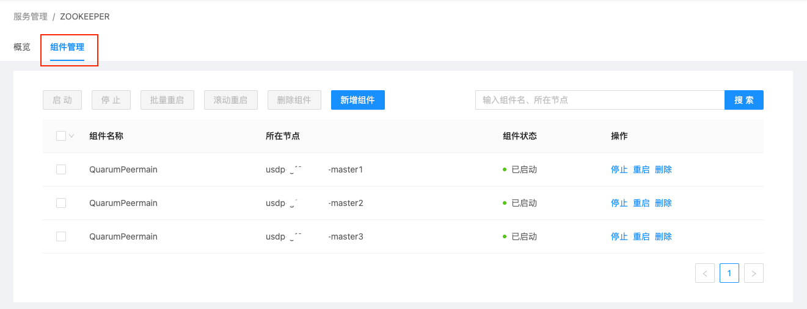
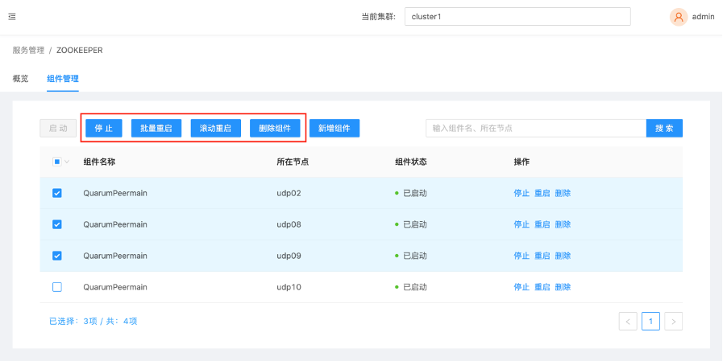
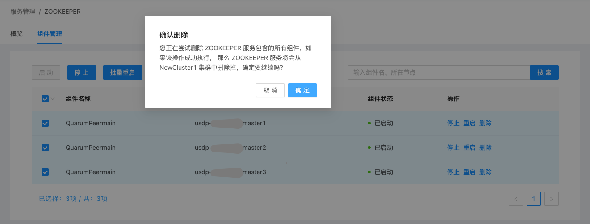

# 集群服务管理

在智能大数据平台USDP中，为便于用户对集群及相关服务的管理，USDP提供较为友好的服务管理功能，譬如集群服务管理中，有大数据服务的基本监控信息查看、服务配置文件修改、服务的组件启停及管理、服务的Web UIs便捷访问等功能，辅助用户更好的管理和使用USDP。

#### 3.1.2 Zookeeper服务相关组件管理

在Zookeeper组件管理页面种，点击“组件管理”选项卡，打开Zookeeper相关组件管理列表，如下图所示：

在该管理页面中，支持对Zookeeper分布的多台节点上的QuarumPeermain组件进行单一/批量节点操作（服务的启动、停止、重启、删除等），如下图所示：

例如，对所有节点上的QuarumPeermain组件进行“停止”运行状态操作时，管理平台将自动检测所选组件当前的工作状态，如下图所示：

例如，对所有节点上的QuarumPeermain组件进行“删除”操作时，管理平台将给您做出警示提醒，请您仔细阅读提示信息，确保此次操作不是误操作。如下图所示：

点击“确认”删除按钮，管理平台将自动检测所选组件当前的工作状态，QuarumPeermain组件正在运行（“已启动”状态）时，是不允许直接删除的。如下图所示：

若确认需要删除所选QuarumPeermain组件，请先“停止”运行，并再次执行“删除”操作。

#### 3.1.3 Zookeeper 服务组件扩展

USDP管理控制台支持对当前Zookeeper服务扩展更多节点。如下图所示：

点击“新增组件”按钮，进入“新增组件或服务”向导，如下图所示：

选择QuarumPeermain组件需要扩展的节点主机，如下对话框截图所示：

管理平台检测出，已加入该平台的所有节点主机中，udp02节点上暂未运行QuarumPeermain组件，“勾选”udp02左侧的复选框，点击“确定”按钮，进入“部署信息总览”向导页，如下图所示：

经浏览确认无误，点击“开始部署”按钮，管理平台将为udp02节点安全QuarumPeermain组件，安装无误，将显示安装成功状态，平台会自动启动该组件，如下图所示：

安装进度完成后，点击“完成”按钮。如下图所示：

此时，可根据向导中表单要求，选择需要扩展的新集群节点及服务预览等，最后点击“开始部署”即可完成服务扩展操作。

