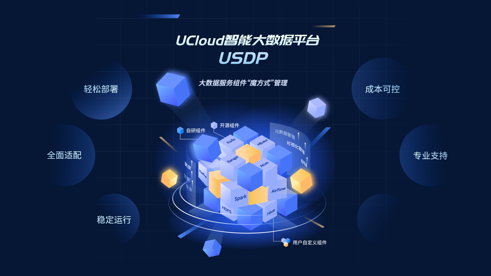
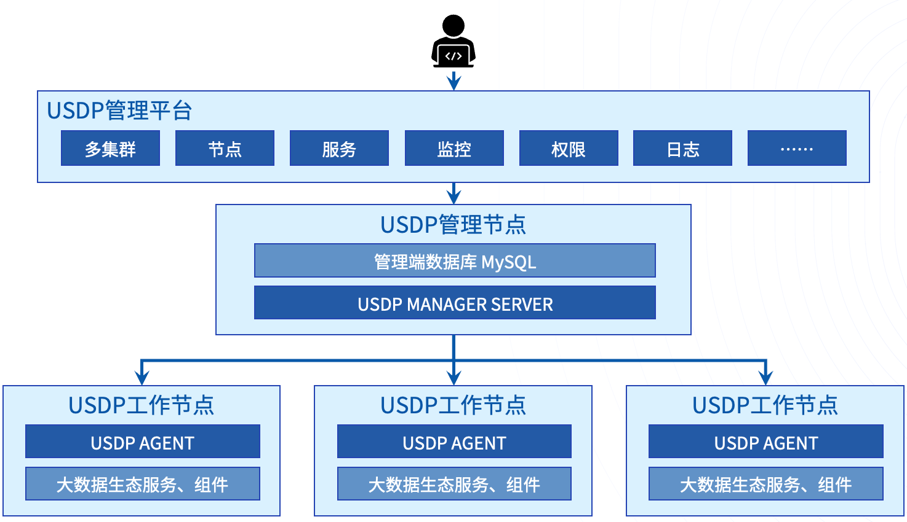

# USDP 标准版 V2.0.x 技术文档

#### 
[产品概述](usdpdc/2.0.x/README?id=产品概述)   |   [核心优势](usdpdc/2.0.x/README?id=USDP一站式智能大数据平台的核心优势)   |   [功能简介](usdpdc/2.0.x/README?id=三、功能简介)   |   [规划安装](usdpdc/2.0.x/README?id=四、规划及安装)   |   [操作指南](usdpdc/2.0.x/README?id=五、控制台操作指南)  |   [集群说明](usdpdc/2.0.x/README?id=六、集群信息说明)  |   [开发指南](usdpdc/2.0.x/README?id=七、开发指南)  |   [任务调度](usdpdc/2.0.x/README?id=八、任务调度)
  

## 一、产品概述

UCloud Smart Data Platform（简称 USDP）标准版，是 UCloud 推出的智能化、轻量级的大数据基础服务平台，能够帮您快速构建起大数据的分析处理能力。

UCloud基于多年大数据平台开发经验，发布了针对私有化部署场景下的一站式智能大数据平台USDP标准版。其具备构建于 IDC物理服务器、云 IaaS 虚拟服务器的能力，其通过自研的 USDP Manager 管理工具，支持管理多套大数据集群，您可创建资源独享的大数据集群。支持HDFS、Kudu、ES全生态，并在集群中管理Hive、HBase、Spark、Flink、Presto 等开源的大数据组件，如进行集群节点、服务配置、监控告警、故障诊断等智能化的运维管理操作，从而协助您轻松构建和管理大数据业务的分析处理能力。

### 自研管理组件，安全可靠性更高

USDP作为UCloud大数据团队自主研发的一站式智能大数据平台，其整体架构如下图所示：

Manager Server为USDP管理端服务，需配备一个MySQL实例存储集群相关的元数据信息。Agent为USDP从节点控制端服务，用于管理、操作所在节点以及所在节点上的大数据服务。其中BigData Service为各类大数据服务（例如：HDFS、YARN等）。

InfluxDB、Prometheus、Grafana作为监控服务，用于汇总并展示整个集群的监控数据。

USDP支持最少3个节点，最多上千节点的集群规模，同时，允许Manager Server与Agent等相关服务部署在相同的节点上，这样满足大型业务的同时，也尽可能帮助用户使用较小的成本满足小型业务对数据分析的诉求。

## 二、USDP一站式智能大数据平台的核心优势

### 1. 无需担心业务绑定

USDP中所包含的大数据服务、组件，均满足 Apache 2.0开源协议，UCloud大数据团队在做过大量兼容性测试后，积极回馈社区，并将编译后的兼容包全面公开发布。由于本身紧跟开源社区的步伐，用户可以随时进行自主替换、自主建设、自主数据迁移、集群迁移等，因此无需担心大数据业务与闭源服务绑定。

基于开放式的管理架构，USDP 集成并适配了 30 余款开源的大数据生态开发组件，涵盖数据集成、数据存储、计算引擎、任务调度、权限管理等大数据处理的各个环节。您可以根据自身业务特点和需求，从中选择相应的组件来搭建自己的大数据处理平台。

### 2. 轻松部署方式

为了能让用户体验到极简的大数据部署运维、管理方案，USDP提供了丰富详细的部署、一键式环境修复工具及安装部署，并且用户无需担心安装时准备众多内容，初始化环境只需要简单几步，即可自动完成配置。

USDP 管理服务中提供完善的集群控制及管理功能、提供向导式的操作流程、提供完善的场景创建案例推荐及组件分布推荐。

### 3. 全面丰富的监控指标

USDP预置的监控指标主要包含三部分内容：

• JMX全量指标采集

• Http常用指标采集

• 自定义指标采集

以上三部分监控数据最终将汇总于USDP的 Promethues中，并在每个服务的概览页面中，展示最常用的监控指标，同时，在Grafana中，通过 USDP官方预置的监控模板（Dashboard），用户可以查看最详细监控指标。如果USDP预置的监控图标无法满足业务需求，用户也可以自定义添加所需的监控图表。

### 4. 灵活便捷的告警服务

USDP提供预置的告警模板，用户只需要引导进行简单配置，即可实现向不同目标（微信、钉钉、邮件、接口调用等）发送集群指标告警的需求。与监控指标的设计相似，如果用户认为预置的告警模板无法满足业务需求，也可以自定义对告警模板进行修改，或添加新的告警规则。

### 5. 稳定运行

USDP 的底层资源为您所独享，大数据集群间可结合业务环境底层虚拟网络，实现了有效的安全隔离。USDP 集成的各个组件编译自 Apache 社区稳定版本，经过了严格的兼容性测试和压力测试，关键性组件都支持高可用特性，确保集群稳定可靠运行。

源自多年的大数据运维经验积淀，USDP 为每款组件预置了完善的监控和告警模板，丰富的监控指标和灵活的告警方式，帮助您及时掌握各个组件的运行状况，进行必要的维护和优化。与此同时，智能化的故障诊断工具和专业的技术支持团队，为您的集群稳定运行保驾护航。

### 6. 成本可控

UCloud提供了友好且易于部署的管理服务，用户可一键式操作，无额外的学习成本，大幅降低使用门槛，辅助用户轻松上手使用和维护大数据业务系统。

针对大数据应用私有化部署场景，支持大数据一体机解决方案，实现一站式交付，开箱即用；支持存算分离架构，易于实现成本优化。

### 7. 专业的技术支持

UCloud大数据团队积淀了多年公有云大数据运维和业务调优经验，为用户提供大数据专家级技术支持及定制化的解决方案能力，并将经验积累智库化，持续不断的更新并集成到产品中为用户提供自动化服务，解决用户构建大数据服务的后顾之忧。

## 三、功能简介

关于USDP平台的功能介绍，请点击前往 [功能介绍](usdpdc/2.0.x/release_notes) 查看。

## 四、规划及安装

通过本章节，我们将协助您完成初装前，对将要使用的服务器资源做出相应的合理规划，并提供安装部署、首个集群创建的参考文档，指导您快速部署。

* [资源规划](usdpdc/1.0.x/plan&create/deploy_plan)
* [部署流程](usdpdc/1.0.x/plan&create/install)
* [首次创建](usdpdc/1.0.x/plan&create/first_create)
* [扩展节点](usdpdc/1.0.x/plan&create/add_node)

## 五、控制台操作指南

大数据环境的管理员用户或开发者用户，可通过本章节了解到 USDP 各个模块的文档介绍，帮助您快速上手 USDP，了解如何在公有云环境中使用及管理 USDP 集群及服务的具体操作方法。

* 单集群管理
  * [集群节点管理](usdpdc/1.0.x/webconsole/node)
  * [集群服务管理](usdpdc/1.0.x/webconsole/service)
  * [集群监控管理](usdpdc/1.0.x/webconsole/monitor)
  * [集群告警管理](usdpdc/1.0.x/webconsole/alarm)
* [USDP 多集群管理](usdpdc/1.0.x/webconsole/clusters)
* [USDP License管理](usdpdc/1.0.x/webconsole/license)

## 六、集群信息说明

如USDP安装后，服务的安装目录、数据存储目录等信息，服务的WebUIs登陆口令等信息，可参考如下内容。

* [各服务WebUIs账号](usdpdc/2.0.x/cluster_notes/login)
* [各服务常用端口](usdpdc/2.0.x/cluster_notes/ports)
* [各组件服务部署规则说明](usdpdc/2.0.x/cluster_notes/rule)

## 七、开发指南

大数据业务的开发者用户在通过使用 USDP 智能大数据平台环境实现业务场景时，本章节内容为您介绍 USDP 所提供的各个开源大数据服务组件的部署及使用方式，帮助您快速开启数据分析业务开发之旅。

* [HDFS-开发指南](usdpdc/1.0.x/developer/hdfs)
* [Hive-开发指南](usdpdc/1.0.x/developer/hive)
* [HBase-开发指南](usdpdc/1.0.x/developer/hbase)
* [Ranger-开发指南](usdpdc/1.0.x/developer/ranger)
* [Atlas-开发指南](usdpdc/1.0.x/developer/atlas)

## 八、任务调度

大数据业务的开发者用户在通过使用 USDP 智能大数据平台环境，可借助 USDP 提供多种调度管理服务，协助用户完成高效管理任务的执行计划。

* [调度服务-Airflow](usdpdc/1.0.x/schedule/airflow)

## 九、常见问题

您可能在使用中会遇到一些问题。

- [常见问题](usdpdc/2.0.x/FAQ)

