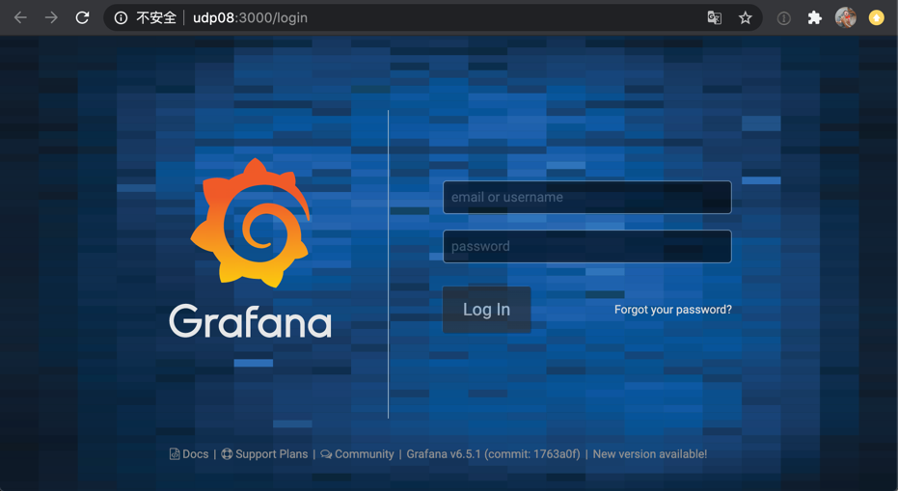
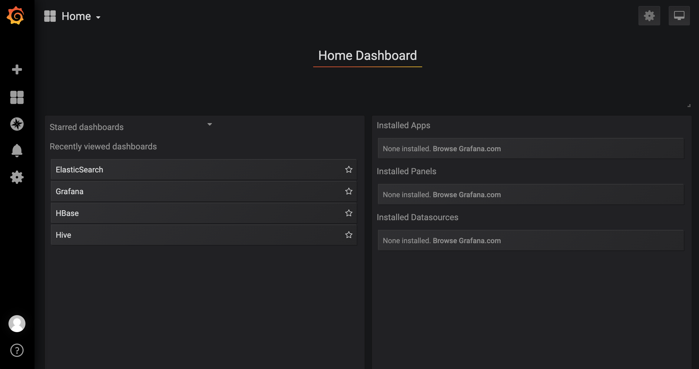
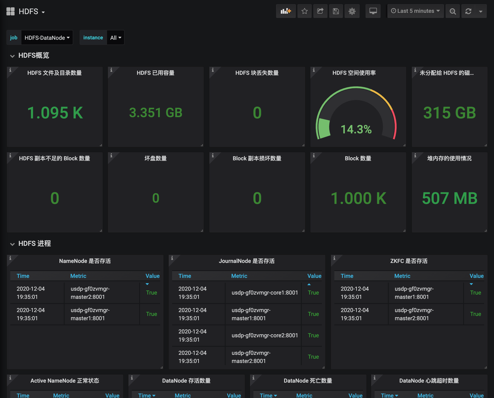
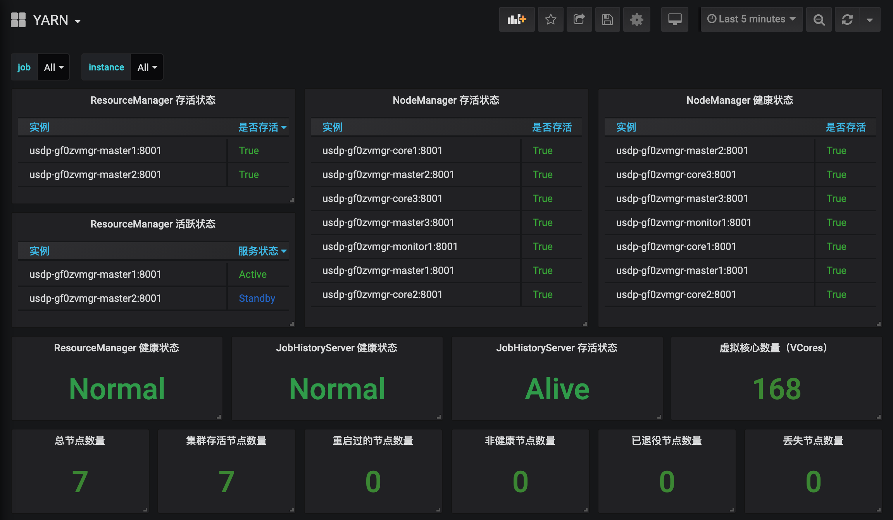
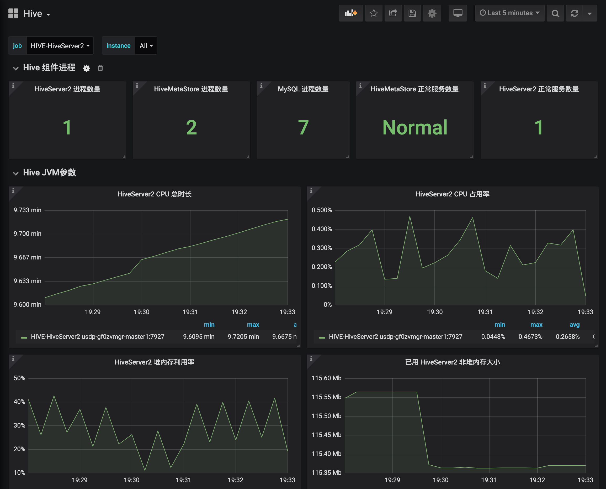
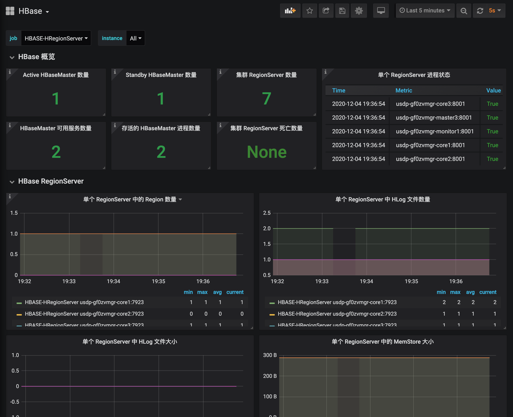
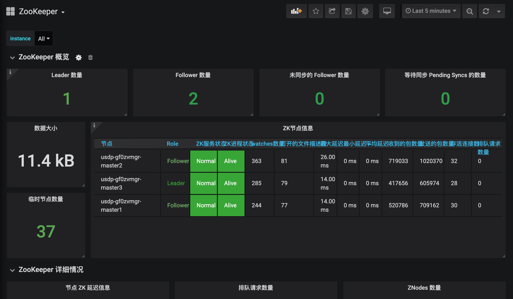
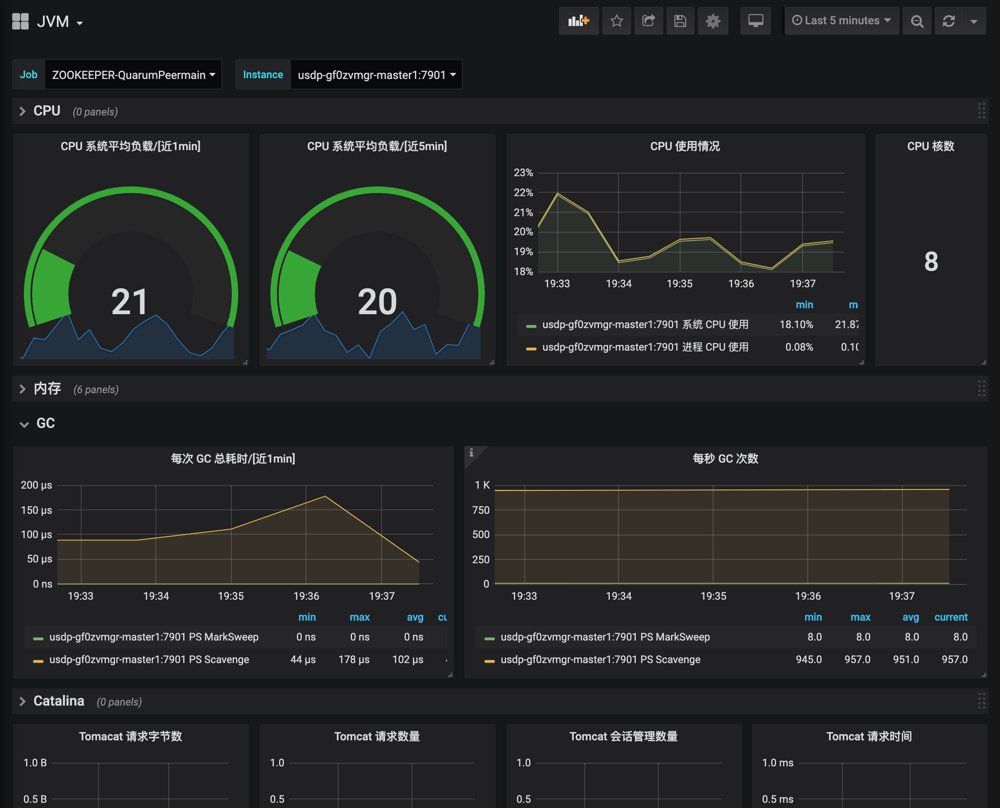
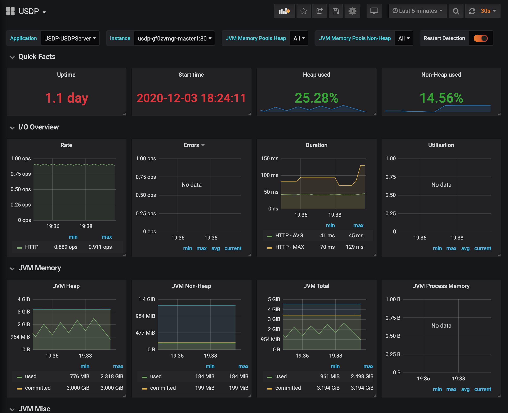

# 集群监控管理

在智能大数据平台USDP中，为便于用户对集群及相关服务的监控管理，USDP提供较为友好的监控管理功能，譬如集群资源节点的系统级监控、大数据服务的基本监控信息查看、以及USDP统一的监控服务查看，辅助用户更好的管理和使用USDP。

## 1. 浏览器访问USDP管理控制台

在浏览器中打开 USDP Web Console：
~~~URL
http://<your_master1_ip>
~~~
如下所示：

## 2. 集群服务监控-监控图表

在USDP控制台左侧导航栏 “监控管理” - “监控图表”，打开集群服务监控 Grafana 页面，并登陆。如下图所示：

> 默认登陆口令请参考 **各服务WebUIs账号**，请登陆后及时修改密码！
>

- 登陆后进入Grafana首页，如下图所示：

## 3. 查看各服务的监控图表

在Grafana首页，点击左上角 <kbd>Home</kbd> 菜单栏按钮，打开下来菜单，选择您需要查看的集群服务名称，即可查看USDP已预置的对该服务的监控指标图表信息信息。如下所示：

### 3.1 查看HDFS服务监控图表

### 3.2 查看YARN服务监控图表

### 3.3 查看HIVE服务监控图表

### 3.4 查看HBASE服务监控图表

### 3.5 查看ZOOKEEPER服务监控图表

### 3.6 查看集群节点JVM监控图表

### 3.7查看USDP管理服务监控图表

将USDP自身的集群管理服务也作为独立的监控图表，便于用户查看维护。

## 4. 查看更多其他服务监控图表

更多其他服务的监控图表，均可在Grafana首页点击左上角 <kbd>Home</kbd> 菜单栏按钮，打开下来菜单，选择您需要查看的集群服务名称，即可查看。