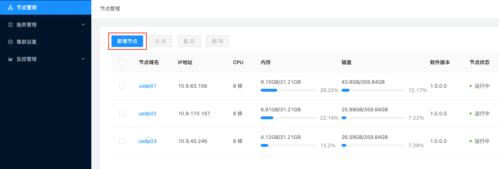

# 为USDP新增服务器节点

在使用USDP服务过程中，可能随着用户业务需求增长，或业务调整，现有的大数据集群资源已不足以满足需求时，可能需要为USDP服务扩展可管理的服务器节点，在准备好服务器并安装操作系统，仍需要通过USDP提供的一键初始化工具，对新增节点进行初始化，USDP支持批量节点扩展。

## 1. 新增服务器节点的初始化

参考 [部署流程-执行环境初始化](usdpdc/2.1.x/plan&create/install_v2?id=_4-执行环境初始化)

在 `work_node` 中添加新节点，后执行环境初始化命令

## 2. 用新增服务节点创建新集群

USDP支持多集群管理，可前往参考 [新增大数据集群](usdpdc/2.0.x/plan&create/first_create)。

## 3. 为已有集群添加节点

登陆USDP管理控制台，为当前集群添加新节点，需在控制台左侧导航菜单点击 <kbd>节点管理</kbd> 进入节点管理页面，点击左上角 <kbd>新增节点</kbd> 按钮，即可进入新增节点向导。如下图所示：

进入向导，用户可根据计划，将需要添加到当前集群的新节点的完全限定域名进行补充填写，并确认SSH的用户名及端口号。如下图所示：

> **节点的完全限定域名填写规则说明：**
>
> 1. 可单行输入每一个节点的完全限定域名；
> 2. 可通过“[]”辅助输入有数字规律的节点完全限定域名；例如pusdp-core[1-3]表示包含“pusdp-core1”、“pusdp-core2”、“pusdp-core3”共三个节点。

?> **提示：** - 节点的完全限定域名及对应的ip信息，需添加到Master1节点的hosts文件中。 - 可参考host_single_info.txt文件配置的节点完全限定域名名称来填写。

向导后续步骤，用户可按照向导指引来完成新增节点的检查，直至添加完成。

