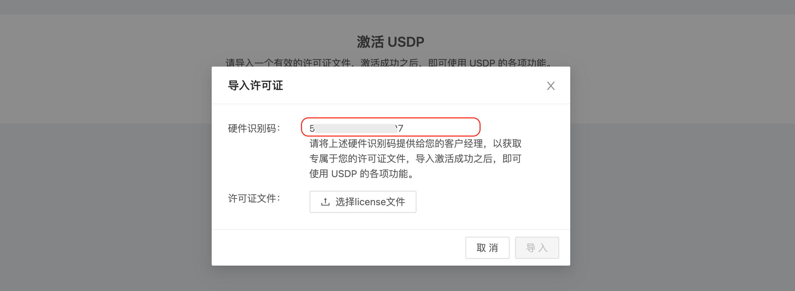

# USDP平台许可证管理

智能大数据平台USDP，目前已支持完善的 许可证 相关管理功能，每个USDP服务均需要使用专享的 许可证 文件进行激活。否则将会无法正常使用 USDP Web Console。在本篇指南中，用户将会了解到在正常使用过程中有关 许可证 的相关问题和处理方法。

?>USDP 许可证是对整个 USDP 服务进行生效，来控制通过 USDP 可管理的总节点数量、Web Console的有效使用时长等。

#### 本篇将涉及到：

- [首次获取许可证](usdpdc/license?id=_1-首次获取许可证)
- [许可证过期](usdpdc/license?id=_2-许可证过期)
- [许可证有效期内管理](usdpdc/license?id=_3-许可证有效期内管理)

## 1. 首次获取许可证

但USDP服务安装成功并且周次打开USDP Web Console时，系统会提示用户，需要导入新的许可证后，方可正常使用USDP Web Console。如下图所示：

### 1.1 获取许可证

当点击上图 <kbd>导入许可证</kbd> 按钮，即会弹出 “导入许可证” 对话框，USDP系统会自动识别您集群的服务器节点硬件信息，如下图所示，用户可复制该 “硬件识别码” 字符串后联系客户经理来获取 许可证。

!> 许可证 文件是一个压缩包，无需解压。

获取后，在对话框中进行上传许可证文件并完成导入，USDP系统验证license文件有效后，用户可进行后续操作。

## 2. 许可证过期

USDP License是有有效期限制的，当有效期即将到期前，用户登录控制时，系统即会提醒用户联系客户经理更新License。如下图所示：

!> 当系统提示许可证有效期即将到期时，建议用户尽快联系客户经理获得新的许可证，避免到期后无法正常使用USDP Web Console的问题。

## 3. 许可证有效期内管理

在当前 许可证 还在有效期内是，用户可正常使用 USDP Web Console，用户亦可主动对USDP 许可证进行管理和查看。方法如下：

- 点击 USDP Web Console 页面右上角 用户名“admin”，在展开的下拉菜单中，选择 <kbd>系统设置</kbd> 。如下图所示：

- 点击左侧导航栏 <kbd>许可证管理</kbd> 页面右侧即会展示当前USDP的许可证相关的详细信息。如下图所示：

- 此时若需要更新许可证，点击右下角的 <kbd>更新许可证</kbd> 按钮，并在下图中 “导入许可证” 对话框中导入新的许可证文件即可。

