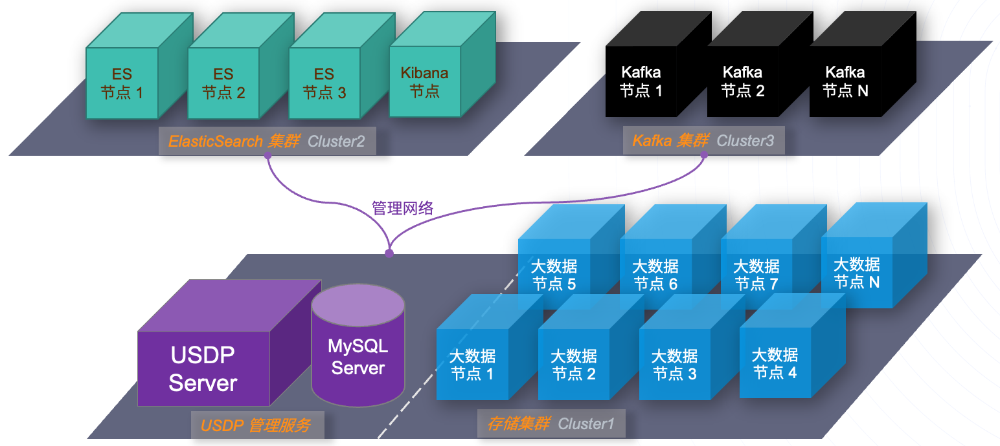

# 非Hadoop生态数据集群

USDP支持对非依赖Hadoop的部分其他数据处理集群的管理，例如Kafka集群、ES集群等。

## 适用场景：

- 统一一套大数据管理服务，即可管理Hadoop大数据集群，有可管理其他数据处理集群的场景；
- 统一的集群监控服务；
- 统一的集群服务异常告警服务；

?> **提示：** - USDP允许非依赖Hadoop相关服务的数据服务与Hadoop集群共享节点，但在用户的实际使用中，建议用户严格根据不同服务集群的不同使用场景和资源消耗，合理规划集群节点即配置，以达到最优的服务性能表现。

## 参考架构图

## 资源规划

可参考 资源规划-[多集群多节点规划](usdpdc/2.1.x/plan&create/deploy_plan?id=_3-多集群多节点规划) 的方案完成本次规划。

!>**提示：** 多个集群无法公用同一台设备，不可重复使用！请合理规划节点用途；

## 部署指南

### 1. 创建ElasticSearch / Kafka集群

登陆USDP控制台，点击顶部 <kbd>当前集群</kbd> 的集群名称，会弹出下拉列表，在列表中选择 <kbd>添加集群</kbd> 按钮。如下图所示：

此时，即可进入创建新集群的向导流程中后，请注意在 “集群框架” 表单处，勾选`Hadoop框架`单选框，并继续向导流程。如下图所示：

接下来，请注意在向导 “选择服务” 页面处，可仅选择ElasticSearch / Kafka相关服务即可，此处可严格参照您对这部分的规划。

其他向导内的操作步骤，您可参考 [通过向导创建大数据集群](usdpdc/2.1.x/plan&create/first_create?id=_1-向导-选择软件版本) 章节，流程一致，此处就不在赘述了。

