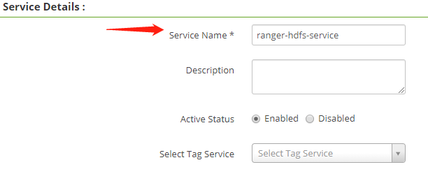
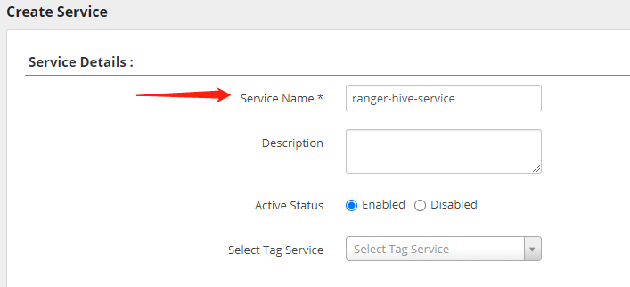

# USDP 开发指南-RANGER

RANGER 是 Hadoop 生态中的一种权限管理框架，通过其可以实现对 HDFS、Hive 等生态组件进行细粒度的权限访问控制，并且 集群管理员 可以通过 Ranger 组件自带的 WebUI 进行相关配置及授权管理操作，以达到集群安全性增强的目的。

在通过使用 USDP 服务创建的 Hadoop 集群中，我们通过本篇指南，以示例的形式带您了解 开发者 及 管理员 如何使用 Ranger ，了解 Ranger 的相关的一些操作方法。


## 1. 访问Ranger UI

目前，当需要访问USDP各组件的Web UIs时，出于安全性考虑，建议您先安全的进入云端内网环境，并使用浏览器访问各组件Web UIs。

### 1.1 方法一

1. 进入USDP控制台。

2. 左侧导航栏选择“服务管理”-“安全类”-“Ranger”进入 Ranger 服务管理页面。

3. 选择标签页“Web UIs”即可弹出 RangerAdmin Web UI的链接。

   

4. 点击此链接即可打开。

   

   > 注：默认登录的账号：admin，密码为：admin，建议您及时修改admin用户密码。

### 1.2 方法二

若您了解RangerAdmin部署的所在的集群节点，即可通过下述方式访问Ranger Web UI。

~~~URI
http://usdp-xxx-master1:6080/login.jsp
~~~

其中“usdp-xxx-master1”亦可替换成所在节点的内网ip。

> 注意：无论方法一/二，均需要您操作的浏览器所在节点与集群各节点可内网互通。


## 2. 各服务组件集成Ranger

> 注意：本篇指南是以USDP V1.0.0版本，涉及的集群组件的部署路径，参见 《操作指南-各服务部署规则》指南文档。

本篇指南，包含如下两章内容。


### 2.1 HDFS配置Ranger

HDFS 作为底层存储，本章节将以 HDFS 为例，进行说明。


#### 2.1.1 启用 HDFS-Ranger 插件

##### 2.1.1.1. 登陆NameNode所在集群节点并完成下述操作

首先需要分别在两台 NameNode 节点上开启 HDFS Ranger 插件，并重启集群，命令如下：

~~~shell
/srv/udp/1.0.0.0/hdfs/ranger-hdfs-plugin/enable-hdfs-plugin.sh 
~~~

> 注：可通过 USDP 控制台查看 HDFS 相关组件中，NameNode1、NameNode2 分别运行在集群的哪些节点上。

此时会在当前节点的如下目录自动生成相关权限配置：

~~~xml
/srv/udp/1.0.0.0/hdfs/etc/hadoop/hdfs-site.xml
<property>
    <name>dfs.permissions.enabled</name>
    <value>true</value>
</property>
<property>
    <name>dfs.permissions</name>
    <value>true</value>
</property>
<property>
    <name>dfs.namenode.inode.attributes.provider.class</name>
    <value>org.apache.ranger.authorization.hadoop.RangerHdfsAuthorizer</value>
</property>
~~~

并自动在该目录下生成软链接：

~~~shell
/srv/udp/1.0.0.0/hdfs/share/hadoop/hdfs/lib
ranger-hdfs-plugin-impl -> /srv/udp/1.0.0.0/hdfs/ranger-hdfs-plugin/lib/ranger-hdfs-plugin-impl
ranger-hdfs-plugin-shim-1.2.0.jar -> /srv/udp/1.0.0.0/hdfs/ranger-hdfs-plugin/lib/ranger-hdfs-plugin-shim-1.2.0.jar
ranger-plugin-classloader-1.2.0.jar -> /srv/udp/1.0.0.0/hdfs/ranger-hdfs-plugin/lib/ranger-plugin-classloader-1.2.0.jar
~~~

> 注意：此时，需要通过 USDP 控制台重启两个NameNode

##### 2.1.1.2. 在USDP控制台完成两个NameNode服务重启

进入左侧导航栏 “服务管理”-“存储类”-“HDFS” 中，点击 “组件管理”，寻找到 “NameNode1”、“NameNode2” 组件后，点击 “NameNode1”、“NameNode2” 组件对应的 “操作” 栏 <kbd>重启</kbd> 按钮。


#### 2.1.2 配置权限

##### 2.1.2.1. 访问 Ranger Web UI 页面

请在云端内网环境中使用浏览器访问 Ranger Web UI页面。

##### 2.1.2.2. 添加 HDFS-Service

在Service Manager页面的 HDFS 条目中，点击  <kbd>+</kbd> 按钮进行创建 Service，如下图所示：


进入Create Service服务配置页面，在 Service Name 输入框中填入如下值：

~~~shell
ranger-hdfs-service
~~~

> 注意: 此处必须填写此值！



##### 2.1.2.3. 配置 HDFS-Service 用户名密码

填入用户名密码为如下：

~~~shell
Username：hadoop
Password：hadoop
~~~

##### 2.1.2.4. 配置 NameNode HA 参数

在 NameNode URL 中填入如下配置：

~~~shell
hdfs://usdp-xxx-master1:8020,hdfs://usdp-xxx-master2:8020
~~~

> 注意：请替换示例中主机名字符串中的“xxx”为正确的主机名字符串。

填入规则如下图所示：


##### 2.1.2.5. 配置代理参数

在下方 Add New Configuration 中配置代理参数如下：

~~~shell
policy.download.auth.users: hadoop
~~~

配置完成后如下图所示：


然后点击 <kbd>Test Connection</kbd> 按钮，如果得到如下图所示样例，则表示成功。


最后，点击 <kbd>Add</kbd> 按钮，此时Ranger Web UI的Service Manager页面显示如下：


#### 2.1.3 添加测试用户

##### 2.1.3.1. 添加用户

在 Ranger Web UI 中，点击顶部导航栏 “Settings” 菜单，选择“Users”标签页，点击页面右侧的 <kbd>Add New User</kbd> 添加测试用户，如下图所示：


编辑内容，完成后点击 <kbd>Save</kbd> 按钮保存，如下图所示：


> 注：Select Role 中，选择 User 类型，而非 Admin 类型。

##### 2.1.3.2. 在 Linux 中添加用户

通过 ssh 在集群节点上，添加与上述配置相同的用户test1，命令如下：

~~~shell
useradd test1
~~~

##### 2.1.3.3.  验证用户当前权限

使用如下命令，验证刚添加的 test1 用户是否拥有对应权限：

~~~shell
su -s /bin/bash test1 -c "/srv/udp/1.0.0.0/hdfs/bin/hdfs dfs -ls /"
~~~

返回结果如下：

~~~shell
drwxrwxr-x   - hadoop supergroup          0 2020-11-06 11:28 /flink-completed-jobs
drwxr-xr-x   - hadoop supergroup          0 2020-11-06 11:30 /hbase
drwxr-xr-x   - hadoop supergroup          0 2020-11-06 11:29 /kylin
drwxrwxr-x   - hadoop supergroup          0 2020-11-06 11:28 /spark-logs
drwxr-xr-x   - hadoop supergroup          0 2020-11-06 11:27 /tez
drwxrwx---   - hadoop supergroup          0 2020-11-06 11:28 /tmp
drwxr-xr-x   - hadoop supergroup          0 2020-11-06 11:28 /user
~~~

此时证明 test1 用户对HDFS的根目录拥有访问权限。


#### 2.1.4 编辑权限

接下来，以配置拒绝 test1 用户访问 HDFS 为例，进行示例说明。

##### 2.1.4.1. 进入编辑页面

如下图所示，进入HDFS条目的 “ranger-hdfs-service” 策略编辑页面：


##### 2.1.4.2. 删除默认规则

首先，删除Ranger默认的权限策略，如下图所示：


##### 2.1.4.3. 添加自定义规则

点击右上角的 <kbd>Add New Policy</kbd> 即可添加自定义权限策略规则，如下图所示：


##### 2.1.4.4. 配置 Policy Details

在 Policy Name 属性中，建议键入比较有标识度的规则名称，例如：deny_test1_all，即，拒绝 test1 用户所有对 HDFS 的操作。

同时，在 Resource Path 中输入HDFS的根目录：/  并键入回车，同时，要确保 recursive 滑块处于开启状态。

最终配置信息，如下图所示：


##### 2.1.4.5. 配置权限类型

配置权限可以分为两种类别：允许的权限、拒绝的权限。

本例中，以配置拒绝的权限为例进行说明，即拒绝 test1 用户对 HDFS 根目录及其子目录下的所有操作。参考如下 “配置拒绝权限” 所示进行配置操作。

* 配置允许的权限，如下图所示：

  

* 配置拒绝的权限，如下图所示：

  

##### 2.1.4.6. 查看配置完成的权限

完成上述配置项填写后，点击 <kbd>Add</kbd> 按钮保存，即已完成添加自定义策略配置，并回到权限策略概览页面，如下图所示：


> 注：权限添加后，大约需要 1 分钟左右即会生效。


#### 2.1.5 验证权限配置

接下来，通过 ssh 访问集群中安装了 HDFS 服务组件的“任意”节点，进行 shell 操作来验证权限是否生效。

试验命令如下：

~~~shell
su -s /bin/bash test1 -c "/srv/udp/1.0.0.0/hdfs/bin/hdfs dfs -ls /"
~~~

若返回如下信息，说明当前节点本地无“test1”用户

```shell
su: user test2 does not exist
```

参见1.3.2节，执行 “useradd test1”添加test1用户后再重试上述命令，返回结果如下：

~~~shell
ls: Permission denied: user=test1, access=EXECUTE, inode="/"
~~~

此时证明权限配置已生效，test1用户已无权访问HDFS的任何目录了。


### 2.2 Hive配置Ranger

Hive 作为底层存储，本章节将以 Hive 为例，进行说明。


#### 2.2.1 启用 Hive-Ranger 插件

##### 2.2.1.1. 登陆 HiveServer2 所在集群节点并完成下述操作

首先需要在 HiveServer2 所在节点上开启 Hive Ranger 插件，并重启集群，命令如下：

~~~shell
/srv/udp/1.0.0.0/hive/ranger-hive-plugin/enable-hive-plugin.sh 
~~~

> 注：可通过 USDP 控制台查看 Hive 相关组件中，HiveServer2 运行在集群的哪个节点上。

此时会在当前节点的 Hive 配置文件目录中自动变更如下配置文件：

~~~shell
ll /srv/udp/1.0.0.0/hive/conf

hiveserver2-site.xml
ranger-hive-audit.xml
ranger-hive-security.xml
ranger-policymgr-ssl.xml
ranger-security.xml
~~~

> 注意：此时，需要通过 USDP 控制台重启 HiveServer2

##### 2.2.1.2. 在USDP控制台完成 HiveServer2 服务重启

进入左侧导航栏 “服务管理”-“计算类”-“HIVE” 中，点击 “组件管理”，寻找到 “HiveServer2” 组件后，点击 HiveServer2 组件对应的 “操作” 栏 <kbd>重启</kbd> 按钮。


#### 2.2.2 配置权限

##### 2.2.2.1. 访问 Ranger Web UI 页面

请在云端内网环境中使用浏览器访问 Ranger Web UI页面。

##### 2.2.2.2. 添加 Hive-Service

在 Hive 条目中，点击 <kbd>+</kbd> 按钮进行创建 Service，如下图所示：


并在 Service Name 输入框中填入如下值：（注意，此处必须为此值）

~~~shell
ranger-hive-service
~~~

> 注意: 此处必须填写此值！



##### 2.2.2.3. 设置 Hive-Service 用户名密码

设置用户名密码如下：

~~~shell
Username：hadoop
Password：hadoop
~~~

##### 2.2.2.4. 配置 JDBC 驱动类

设置 `jdbc.driverClassName` 属性值为：org.apache.hive.jdbc.HiveDriver

##### 2.2.2.5. 配置 JDBC URL

此处设置 HiveServer2 的连接即可，配置举例如下：

~~~shell
jdbc:hive2://10.9.136.30:10000
~~~

> 注意：该示例中的 IP 地址为 HiveServer2 所在节点的内网 IP。

##### 2.2.2.6. 配置代理参数

在下方 <kbd>Add New Configuration</kbd> 中配置代理参数如下：

~~~shell
policy.download.auth.users: hadoop
~~~

配置完成后如下图所示：


然后点击 <kbd>Test Connection</kbd> 按钮，如果得到如下图所示样例，则表示成功。


最后，点击 <kbd>Add</kbd> 按钮即可。


#### 2.2.3 添加测试用户

##### 2.2.3.1. 添加用户

在 Ranger Web UI 中，点击顶部导航栏 “Settings” 菜单，选择“Users”标签页，点击页面右侧的 <kbd>Add New User</kbd> 添加测试用户，如下图所示：


编辑内容如下图所示：


> 注：Select Role 中，选择 User 类型，而非 Admin 类型。

##### 2.2.3.2. 在 Linux 中添加用户

通过 ssh 在集群节点上，需要添加与上述配置相同的用户，命令如下：

~~~shell
useradd test1
~~~

##### 2.2.3.3. 验证用户当前权限

使用如下命令，验证 test1 用户拥有对应权限：

~~~shell
/srv/udp/1.0.0.0/hive/bin/beeline -u jdbc:hive2://10.9.136.30:10000 -n test1
~~~

然后再 beeline 命令行输入：

~~~shell
0: jdbc:hive2://10.9.136.30:10000> create table t_test(a string);
~~~

结果如下：

~~~shell
0: jdbc:hive2://10.9.136.30:10000> show tables;
+-----------+
| tab_name  |
+-----------+
| t_test    |
+-----------+
~~~

此时证明 test1 有对表操作的权限。


#### 2.2.4 编辑权限

##### 2.2.4.1. 进入编辑页面

如下图所示，即可进入编辑页面：


##### 2.2.4.2. 删除默认规则

如下图所示：


##### 2.2.4.3. 添加自定义规则

点击右上角的 <kbd>Add New Policy</kbd> 按钮添加默认规则，如下图所示：


##### 2.2.4.4. 配置 Policy Details

在 Policy Name 属性中，建议键入比较有标识度的规则名称，例如：deny_test1_all，即，拒绝 test1 用户所有对 HDFS 的操作。

同时，在 Resource Path 中输入：/，并键入回车，同时，要确保 recursive 开关开启。

最终配置如下图所示：


##### 2.2.4.5. 配置权限类型

配置权限可以分为两种类别：允许的权限、拒绝的权限。本例中，以配置拒绝的权限为例进行说明，即，拒绝 test1 用户对 HDFS 根目录及其子目录下的所有操作。如下 “配置拒绝权限” 所示。

* 配置允许的权限

  

* 配置拒绝的权限

  

##### 2.2.4.6. 查看配置完成的权限

上述配置完成后，点击 <kbd>Add</kbd> 按钮完成添加，并回到权限概览页面，如下图所示：


> 注：权限添加后，大约需要 1 分钟即可生效。


#### 2.2.5 验证权限配置

在 Linux 中，使用如下命令，验证 test1 用户拥有对应权限：

~~~shell
/srv/udp/1.0.0.0/hive/bin/beeline -u jdbc:hive2://10.9.136.30:10000 -n test1
~~~

然后再 beeline 命令行输入：

~~~shell
0: jdbc:hive2://10.9.136.30:10000> insert into t_test values('nick');
~~~

结果如下：

~~~shell
Error: Error while compiling statement: FAILED: HiveAccessControlException Permission denied: user [test1] does not have [UPDATE] privilege on [default/t_test] (state=42000,code=40000)
~~~

此时证明 test1 已经失去对 t_test 表的操作权限，更多细粒度的控制，可以在上述 2.4.5 中进行配置。
