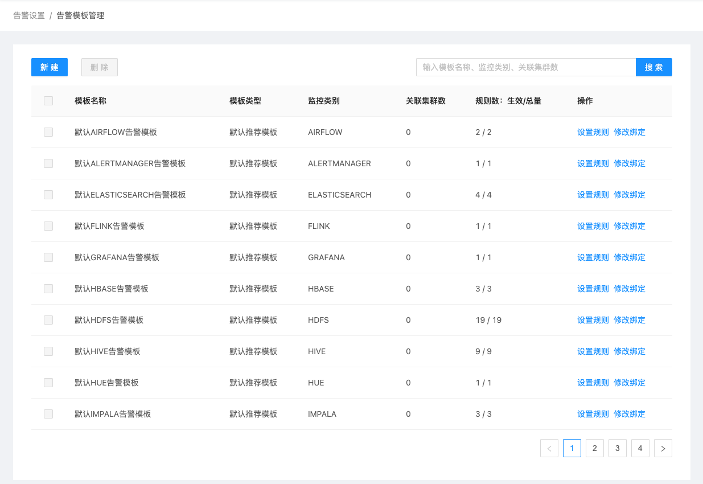
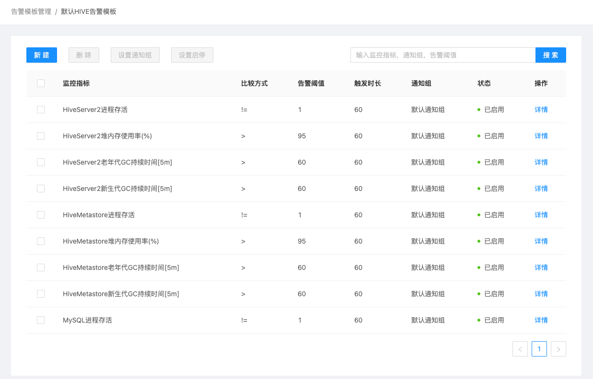
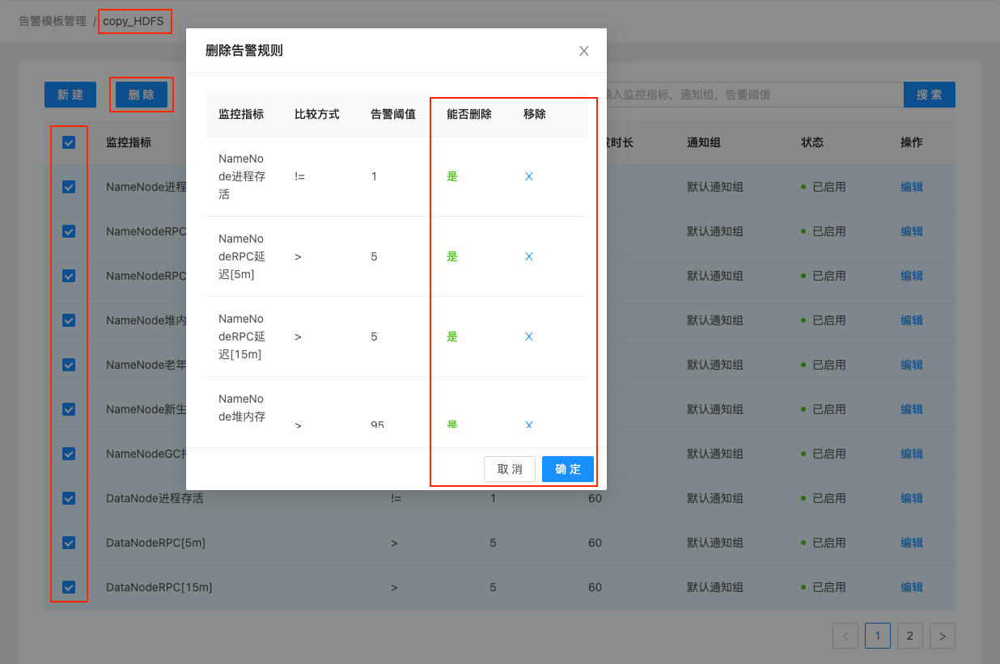
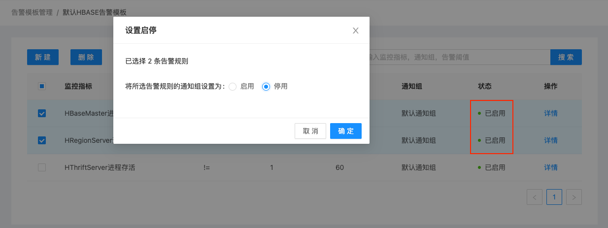
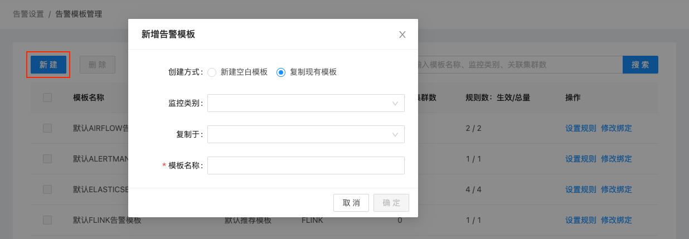

# 告警模板管理

告警模板与USDP集群绑定，及可对该集群实施监控，当触发监控规则是，即及时向 [通知组](usdpdc/2.1.x/guide/alarmInform_group) 中的各个 [通知对象](usdpdc/2.1.x/guide/alarmInform_object) 发送告警信息。

> **名词解释：**
>
> 1. **告警模板：**即为一组监控指标的集合，由告警模板来限制该模板中的所有监控指标的作用域，即“监控类型”。
> 2. **监控指标：**即为一组监控规则的集合，由监控指标来控制是否启用及通知组的绑定。

在智能大数据平台USDP中，已默认提供了丰富的集群的服务告警模板，诸如计算类、存储类、监控类、调度类、可视化类、安全类等在内的6大类服务及组件的告警模板。用户亦可自定义设置告警模板、监控指标、监控规则等。

在浏览器中打开 USDP Web Console：
~~~URL
http://<your_host_ip>
~~~
进入USDP控制台首页，点击/鼠标滑至左上交 “橙色警报器” 图表位置，会自动展开下拉菜单项目，点击 <kbd>告警模板管理</kbd> 菜单项，进入 告警模板管理 页面，如下图所示：

USDP已预置了如AIRFLOW、ALERTMANAGER、ELASTICSEARCH、FLINK、GRAFANA、HBASE、HDFS、HIVE、HUE、IMPALA、INFLUXDB、KAFKAEAGLE、KIBANA、KUDU、KYLIN、LIVY、NODEEXPORTER、OOZIE、PRESTO、PROMETHEUS、RANGER、SPARK、TEZ、UDS、USDPMONITOR、YARN、ZEPPELIN、ZKUI、ZOOKEEPER、NODE等30组告警模板。

## 1. 模板监控指标管理

对于每一组告警模板的详细告警监控指标项，可点击告警模板条目右侧的 <kbd>设置规则</kbd> 按钮进入查看。此处以 “默认HIVE告警模板” 为例，如下图所示：

!> USDP提供的 默认告警模板 不允许修改告警项。如需调整，可复制默认告警模板来调整具体告警指标，参见 [新建告警模板](usdpdc/2.1.x/guide/alarmTemplate?id=_3-新建告警模板) 。

上图以Hive服务的告警模板为例，该模板包含9项具体监控指标。

### 1.1 监控指标详情查看/编辑

例如针对 “HiveServer2进程存活” 的告警规则，点击右侧 <kbd>详情</kbd> 按钮，在弹出的对话框中显示，如下图所示：

若用户是在自定义的告警模板查看 “监控指标” 具体的 “监控规则”，此时应该点击右侧的 <kbd>编辑</kbd> 按钮，会在弹出的编辑对话框中显示该指标的详细监控规则，用户亦可在此完成修改监控规则的操作。如下图所示：

关于自定义告警模板，参见 [新建告警模板](usdpdc/2.1.x/guide/alarmTemplate?id=_3-新建告警模板) 。

### 1.2 删除监控指标

在告警模板中，用户可根据实际需求来调整各监控指标，对于不合理的监控指标执行删除操作。如下图所示：

!> USDP预置的 “监控指标” 不允许用户自行删除，用户可选择将相应的 “监控指标” 设为不启用，参考 [给监控指标设置启停](usdpdc/2.1.x/guide/alarmTemplate?id=_14-给监控指标设置启停) 即可。

### 1.3 给监控指标设置通知组

无论是USDP系统预置的告警模板，还是用户自定义的告警模板，用户均可对每一条监控指标独立规划告警 通知组 （参考本篇指南第5章节），以便于用户根据其组织架构及大数据环境使用人员的不同来灵活配置告警内容。如下图所示：

### 1.4 给监控指标设置启停

无论是USDP系统预置的告警模板，还是用户自定义的告警模板，用户均可对每一条监控指标独立设置 “启用/停用”状态控制。

?> 对于USDP预置的监控指标，若默认触发规则设置不合理，用户可以自行添加相同的监控指标，并将对应的默认监控指标置为 “停用”状态均可。

## 2. 告警模板快速绑定集群并生效

默认告警模板内容，是UCloud依据多年大数据产品维护经验的沉淀，用户可以快速使用默认告警模板对欲监控告警的集群生效使用。

点击 “告警模板管理” 页面用户指定的模板条目右侧的 <kbd>修改绑定</kbd> 按钮，这里以 “默认AIRFLOW告警模板” 为例，如下图所示：

在弹出的 “修改绑定” 对话框中 “设置绑定” 处左侧 “可选集群” 部分，列出来可以绑定该模板的集群信息，用户仅需勾选对应的集群复选框，点击 <kbd>></kbd> 按钮，即可将已选集群添加到右侧 “已选集群” 栏，此后，点击对话框 <kbd>确定</kbd> 按钮，即可完成当前告警模板与所选集群的绑定操作。

用户亦可在您自己的集群上来设置绑定哪些告警模板，相关操作请参考 [告警生效](usdpdc/2.1.x/guide/alarmTemplate_work?id=方式2-集群告警设置) 章节。

?> 为告警模板绑定集群后，即代表此集群已使用该模板中的所有监控指标，对该集群中的相应服务实施监控，当集群一但发生相关告警规则设置的条件时，即会触发告警，USDP将会通过该模板中事先设置好的 [通知组](usdpdc/2.1.x/guide/alarmInform_group) 来发送告警详细信息。

## 3. 新建告警模板

当用户在熟悉USDP预置的众多告警模板后，仍然可能无法满足需求时，此时，可自定义新建告警模板，点击 “告警模板管理” 页面左上角 <kbd>新建</kbd> 按钮，弹出 “新增告警模板” 对话框，如下图所示：

USDP允许用户创建全新的空白模板，亦可通过复制现有的模板进行更改，如下图所示：

新增告警模板，模板需指定其可运用的 “监控类别”，下拉选择相应的监控类别即可。

若是从其他已有的告警模板复制，在 “复制于” 下拉框中选择选择相应的模板（支持选择 “默认告警模板” 及 “自定义告警模板”）即可。

输入模板名称后点击 <kbd>确定</kbd> 按钮保存即可。

## 4. 删除告警模板

勾选 欲删除的告警模板左侧的复选框，之后点击左上角 <kbd>删除</kbd> 按钮即可。

!> USDP不允许用户 “勾选” 及 “删除” 系统预置的所有默认告警模板。