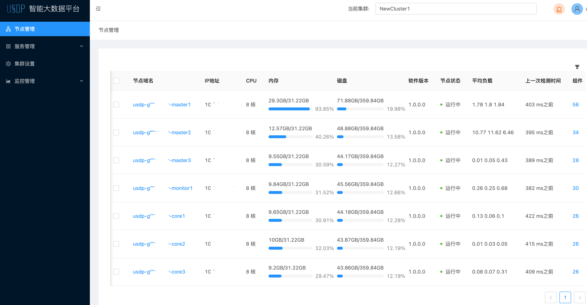
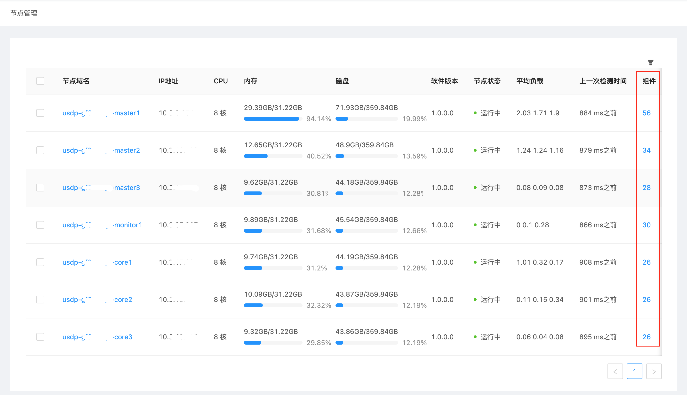
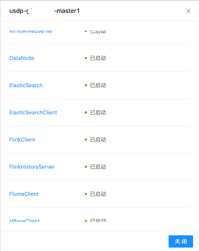
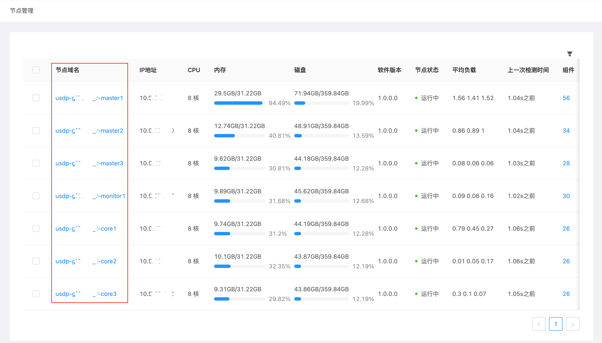
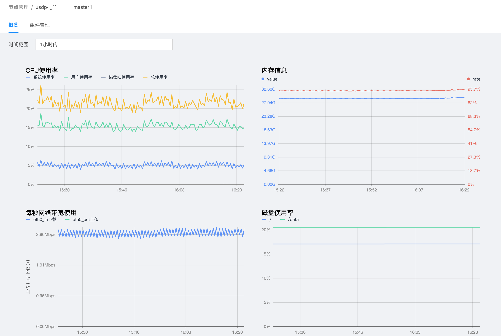
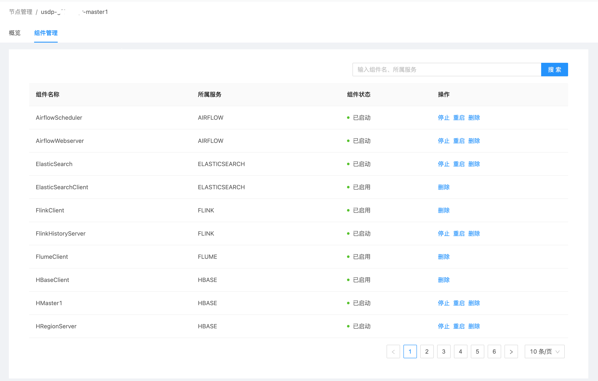

# 集群节点管理

在智能大数据平台USDP控制台的管理控制中，为便于用户对集群节点及节点上承载的服务组件的管理，USDP提供较为友好的节点管理功能，譬如集群节点增删、节点的资源监控、节点上承载的各大数据服务组件的管理等，辅助用户更好的管理和使用USDP。

#### 本篇将涉及到：

- [集群各节点运行的组件查看](usdpdc/guide_v2/node?id=_1-集群各节点运行的组件查看)
- [集群单节点管理](usdpdc/guide_v2/node?id=_2-集群单节点管理)
- [集群单节点上的组件管理](usdpdc/guide_v2/node?id=_3-集群单节点上的组件管理)

在浏览器中打开 USDP Web Console：
~~~URL
http://<your_master1_ip>
~~~
登陆USDP控制台后，点击USDP控制台左侧导航菜单 <kbd>节点管理</kbd> ，即可查看当前集群的所有节点列表信息。

在此，可针对该集群的所有节点实现管理操作，如各节点上组件部署情况查询和管理、节点资源监控、节点资源监控图表、节点运行查看等操作，点击下方链接前往查阅。

## 1. 集群各节点运行的组件查看

在当前集群的所有节点列表信息页面，已针对单个节点上部署的大数据服务组件进行统计，如下图所示：

点击统计数字，即可在弹出的对话框中查看到该接节点上所有已部署的组件及组件运行状态，方便集中的、滚动查看。如下图所示：

## 2. 集群单节点管理

在当前集群的所有节点列表信息页面，点击“节点域名”中单个节点域名快捷方式，进入该节点的详情概览页面。如下图所示：

在节点“概览”页面，已针对当前节点的系统监控指标实现图表展示，如下图所示：

> 概览页支持按既定的时间范围查看当前节点的性能表现，支持自定时间范围。可选的有：
>
> - 1小时内
> - 6小时内
> - 12小时内
> - 1天内
> - 7天内
> - 15天内
> - 30天内
> - 自定义

对当前节点更加丰富的监控指标维度图表信息查看，可参考《USDP 操作指南-监控管理》。

## 3. 集群单节点上的组件管理

点击切换至 <kbd>组件管理</kbd> 标签页，USDP已将该节点上所以已部署的组件列表展示出来，为便于查找组件，该页面支持按“组件名称”、“所属服务”进行搜索。在当前页面中，可查看已部署的各个组件的“组件名称”、“所属服务”、“组件状态”，亦可对单个组件进行操作“启动”、“停止”、“重启”、“删除”等控制，如下图所示：

