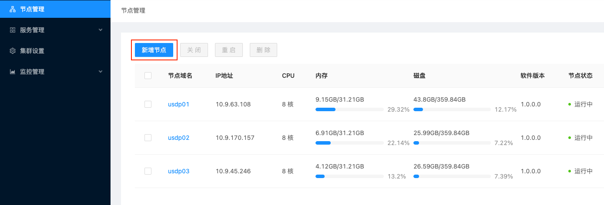
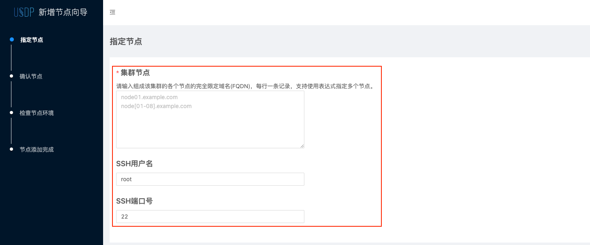

# 为USDP新增服务器节点

在使用USDP服务过程中，可能随着用户业务需求增长，或业务调整，现有的大数据集群资源已不足以满足需求时，可能需要为USDP服务扩展可管理的服务器节点，在准备好服务器并安装操作系统，仍需要通过USDP提供的一键初始化工具，对新增节点进行初始化，USDP支持批量节点扩展。

## 1. 新增服务器节点的初始化

?> **提示：** - 本节内容涉及到的配置文件“your.properties”、“host_single_info.txt”的位置为 `/opt/usdp-srv/usdp/repair`。

### 1.1 检查your.properties 配置的信息

检查 your.properties 文件的参数项 host.single.info.Path，即新增节点信息存放的绝对路径。对于该配置文件其他参数项无需改动。

     host.single.info.Path=/opt/usdp-srv/usdp/repair/host_single_info.txt

### 1.2 配置host_single_info.txt文件

在该文件中需配置每个新增节点的信息，从左至右依次为：内网IP，节点密码，SSH端口号，即将自动修改生效的完全限定域名（主机名）。具体示例如下：

~~~shell
      127.0.0.1 your-node-root-password 22 usdp01
      127.0.0.1 your-node-root-password 22 usdp02
      127.0.0.1 your-node-root-password 22 usdp03
~~~

修改完上述配置文件，即可进入 repair 目录执行如下初始化命令

      bash repair.sh  initSingle  /opt/usdp-srv/usdp/repair/your.properties

!> **注意：**  1. 在host_single_info.txt文件中，仅需配置每次新增的节点信息即可，若存在已初始化过的节点信息时，在下次运行“repair.sh  initSingle”指令前，请先**清除**掉。  2. host_single_info.txt中录入的新增节点**完全限定域名（主机名）不可**与USDP已管理的所有节点的任一完全限定域名**重复**。  3. jdk 安装在 /opt/module 目录，**不允许随意删除或更改位置**，否则 java 环境失效。

待初始化命令执行完成，后续操作均可在USDP管理控制台进行操作，用户可为已有集群添加新节点，亦可在USDP中创建新集群。

## 2. 用新增服务节点创建新集群

USDP支持多集群管理，可前往参考 [新增大数据集群](usdpdc/plan&create/first_create)。

## 3. 为已有集群添加节点

登陆USDP管理控制台，为当前集群添加新节点，需在控制台左侧导航菜单点击 <kbd>节点管理</kbd> 进入节点管理页面，点击左上角 <kbd>新增节点</kbd> 按钮，即可进入新增节点向导。如下图所示：

进入向导，用户可根据计划，将需要添加到当前集群的新节点的完全限定域名进行补充填写，并确认SSH的用户名及端口号。如下图所示：

> **节点的完全限定域名填写规则说明：**
>
> 1. 可单行输入每一个节点的完全限定域名；
> 2. 可通过“[]”辅助输入有数字规律的节点完全限定域名；例如pusdp-core[1-3]表示包含“pusdp-core1”、“pusdp-core2”、“pusdp-core3”共三个节点。

?> **提示：** - 节点的完全限定域名及对应的ip信息，需添加到Master1节点的hosts文件中。 - 可参考host_single_info.txt文件配置的节点完全限定域名名称来填写。

向导后续步骤，用户可按照向导指引来完成新增节点的检查，直至添加完成。

