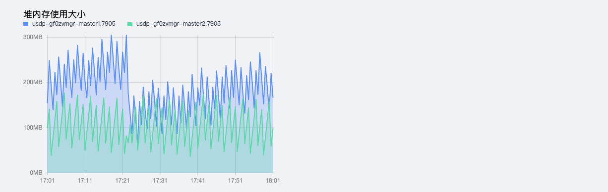

# 集群服务概况查看

在智能大数据平台USDP中，为便于用户对集群及相关服务的管理，USDP提供较为友好的服务管理功能，譬如集群服务管理中，有大数据服务的基本监控信息查看，辅助用户更好的管理和使用组件服务。

下文以HDFS的配置服务查看为示例，仅供用户参考。

## 1. 浏览器访问USDP管理控制台

在浏览器中打开 USDP Web Console：
~~~URL
http://<your_host_ip>
~~~
如下所示：

在USDP控制台左侧导航栏 “服务管理”，USDP已将该集群所部署使用的所有大数据服务组件分为7类统一归类。

### 2. HDFS服务管理

点击选择左边菜单导航栏-“服务管理”-“存储类”，在展开的子类中点击“HDFS”，即可在右侧窗口打开Hdfs的管理页面，如下图：

HDFS服务管理首页展示了HDFS服务的监控指标（NameNode是否存活、NameNode Active正常、JournalNode是否存活、ZKFC是否存活、Datanode死亡数、Datanode存活数、Datanode心跳超时数、HDFS空间使用率、HDFS块丢失数、Block副本损坏个数、坏盘数量、Block个数、HDFS文件及目录个数、HDFS已用容量、HDFS副本不足的Block数、未分配给HDFS的磁盘大小、可用堆内存、初始堆内存、最大堆内存）如下图所示：

对HDFS GC相关监控（GC5分钟内的频率、GC耗时、GC MarkSweep标记耗时、GC MarkSweep 5分钟标记频率）如下图所示：

对HDFS “堆内存使用大小”的监控，如下图所示：

