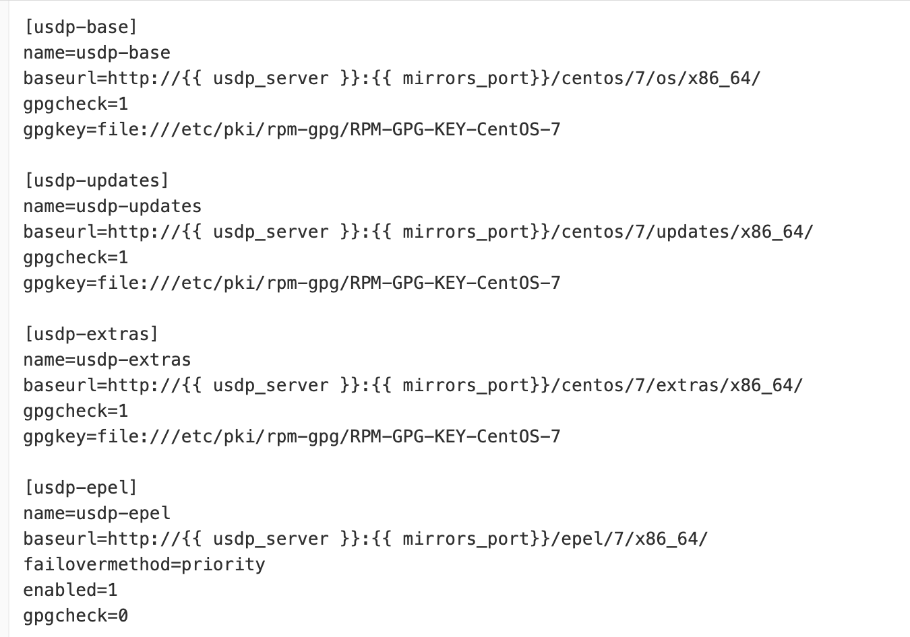
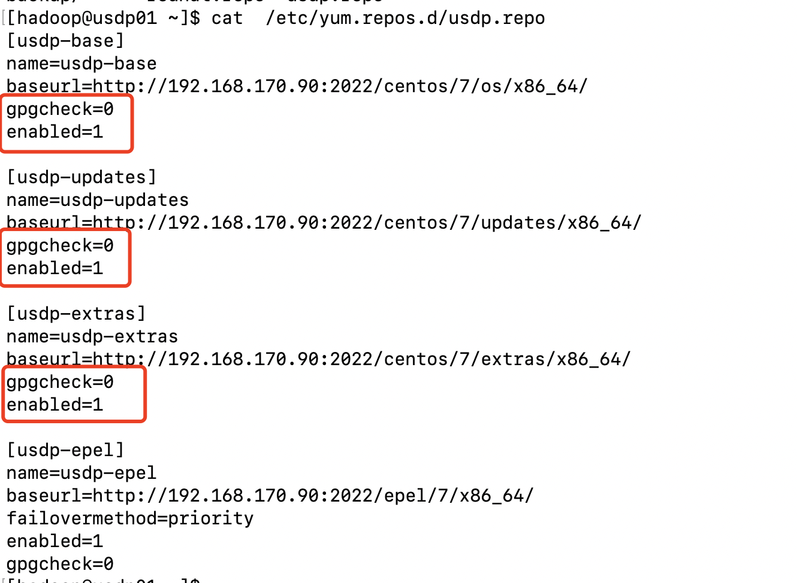

# redhat7.5部署USDP2.1.x补充操作

**补充操作说明：**

!> 以下操作步骤，请基于[USDP2.1.x部署流程文档](usdpdc/2.1.x/plan&create/install_v2) -> 4.1节之后开始操作，待所有步骤执行完成后，再执行 部署流程文档 -> [4.2章节](usdpdc/2.1.x/plan&create/install_v2?id=_42-执行环境初始化)。

### 1.install nginx （仅需在安装节点上执行）

```shell
cp /data/usdp-srv/usdp/env-prepare/roles/nginx/tasks/centos.yml /data/usdp-srv/usdp/env-prepare/roles/nginx/tasks/redhat.yml
```

### 2.install common rpm （仅需在安装节点上执行）

```shell
vim /data/usdp-srv/usdp/env-prepare/roles/common/templates/usdp.repo.j2
```

原文件



修改为如下：

IP:port 保持不变



### 3. install mariadb-client/mariadb （仅需在安装节点上执行）

```shell
cp /data/usdp-srv/usdp/env-prepare/roles/mariadb-client/tasks/centos.yml /data/usdp-srv/usdp/env-prepare/roles/mariadb-client/tasks/redhat.yml
cp /data/usdp-srv/usdp/env-prepare/roles/mariadb/tasks/centos.yml /data/usdp-srv/usdp/env-prepare/roles/mariadb/tasks/redhat.yml
```

### 4.install bc （需在所有节点上执行）

```shell
yum -y install bc
```

