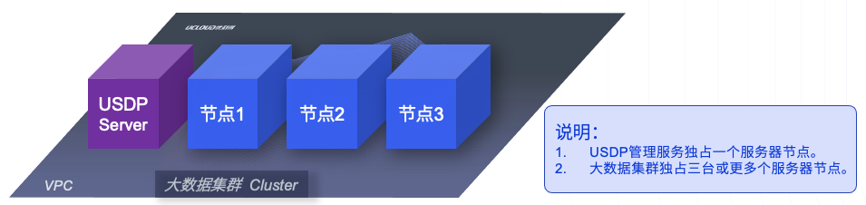
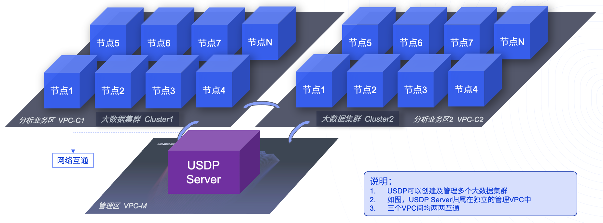
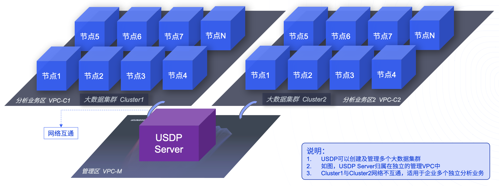

# 2 资源规划

本篇参考指南，旨在说明通过 USDP 私有化部署服务，协助用户来规划大数据服务的部署。用户可参考下文中的部署规模，来规划在用户的基础资源及需求场景下，如何规划和利用基础资源，合理规划部署，使整体大数据服务更合理，更好的满足业务需要。

**说明：**

USDP 开始安装前，需用户根据目标集群的规模大小做参考，合理规划好 USDP 所管理的所有资源节点，并通过 USDP 提供的初始化工具，对首次安装的所有机型进行初始化操作，当安装 USDP 服务并启动其 Web 管理控制台后，需要导入相应的 License 文件，并通过向导的形式，创建好第一个集群后，即可完整使用 USDP 管理控制台中全部的功能。

> **名词解释：**
>
> 1. USDP Server：是用户独享的整个大数据系统的管理服务，提供一键安装包、修复工具、可视化的控制台。安装完成后，用户可通过 USDP Server 提供的控制台管理整个大数据系统，包括对多个大数据集群的管理。
> 2. MySQL：是 USDP Server 依赖的管理元数据存储数据库。
> 3. Hadoop Cluster：是通过 USDP 控制台创建并管理的 1-N 个独立的大数据集群。
> 4. 大数据服务：是 Hadoop 集群中各个服务软件，例如：HDFS、Hive、Spark、Hue *等。*
> 5. 服务组件：是各个大数据服务自带的服务构成的模块。如 DataNode、NameNode *是* *HDFS* 服务的两类重要的附件。

**用户可根据自身需求，选择参考以下三类部署方案：**

- [最小规模部署](usdpdc/3.0.0-unopened/deployment/deploy_plan?id=_1-最小规模部署)
- [单集群多节点规划](usdpdc/3.0.0-unopened/deployment/deploy_plan?id=_2-单集群多节点规划)
- [多集群多节点规划（集群间网络互通可独立控制）](usdpdc/3.0.0-unopened/deployment/deploy_plan?id=_3-多集群多节点规划)

## 2.1 最小规模部署

**本规划方案适用于：**当业务量较小、资源较为紧俏时，以及用户希望搭建一个最小规模的环境时。参考本章节内容，来协助实现智能大数据服务的部署参考。

因为 HDFS 中 JournalNode 高可用需要部署在1个以上的奇数节点上（推荐3），且数据存储副本为3，因此最小部署规模为3个节点。

| **节点/服务** | **最低配置**                 | **USDP Server** | **MySQL** | **NTP** | **Hadoop Cluster** | **大数据集群内各服务部署规划** |
| ------------- | ---------------------------- | --------------- | --------- | ------- | ------------------ | ------------------------------ |
| 节点1(host01) | 16C 32G sys 100GB data 300GB | Y               | Y         | Y       | Cluster1-节点1     | 自行规划，数据盘建议按需调整   |
| 节点2(host02) | 16C32G sys 100GB data 300GB  | -               | -         | Y       | Cluster1-节点2     | 自行规划，数据盘建议按需调整   |
| 节点3(host03) | 16C32G sys 100GB data 300GB  | -               | -         | Y       | Cluster1-节点3     | 自行规划，数据盘建议按需调整   |

**补充：**用户亦可将 USDP Server、MySQL、NTP 可以分散到上述host[01-03] 共三个节点上。

## 2.2 单集群多节点规划

**本规划方案适用于：**当业务量较小、资源较为紧俏时，以及用户希望搭建一个最小规模的环境，但 USDP Server、NTP 服务器、MySQL 服务器能与大数据集群相对独立的场景。参考本章节内容，来协助实现智能大数据服务的部署参考。

| **节点/服务**       | **最低配置**                | **USDP Server** | **MySQL** | **NTP** | **Hadoop Cluster** | **大数据集群内各服务部署规划** |
| ------------------- | --------------------------- | --------------- | --------- | ------- | ------------------ | ------------------------------ |
| USDP Server(host01) | 8C 32G sys 100GB data 300GB | Y               | Y         | Y       | USDP Server节点    | 自行规划，数据盘建议按需调整   |
| 节点1(host02)       | 16C32G sys 100GB data 300GB | -               | -         | Y       | Cluster1-节点1     | 自行规划，数据盘建议按需调整   |
| 节点2(host03)       | 16C32G sys 100GB data 300GB | -               | -         | Y       | Cluster1-节点2     | 自行规划，数据盘建议按需调整   |
| 节点3(host04)       | 16C32G sys 100GB data 300GB | -               | -         | -       | Cluster1-节点3     | 自行规划，数据盘建议按需调整   |

**补充：**用户亦可将 USDP Server、MySQL、NTP 中的其中1到2个，分散部署到上述 host[01-04] 共四个节点之外的节点去，例如 MySQL 可复用用户现有其他业务系统的 MySQL 数据库。

## 2.3 多集群多节点规划

**本规划方案适用于：**当业务较复杂、大数据分析业务在不同业务领域有独立隔离的诉求，资源相对较为充裕时，用户希望通过 USDP 创建并管理多个大数据集群环境，并且 USDP Server、NTP 服务器、MySQL 服务器能与大数据集群相对独立的场景。参考本章节内容，来协助实现智能大数据服务的部署参考。

#### Step1. 网络规划

规划至少三个 VPC，示例如下：

| **VPC规划**           | **用途**    | **与VPC-C1互通** | **与VPC-C2互通** |
| --------------------- | ----------- | ---------------- | ---------------- |
| VPC-M(192.168.0.0/27) | 管理区      | Yes              | Yes              |
| VPC-C1(10.0.0.0/16)   | 分析业务区1 | -                | Yes              |
| VPC-C2(172.20.0.0/16) | 分析业务区1 | Yes              | -                |

?>**提示：** 若用户网络环境是除 VPC 以外的其他方式，如 Vlan，则 Vlan 间的划分和互通性配置，与上述 VPC 同理。 规划网络时，建议各 VPC 的 IP 地址段均不重叠，避免日后业务需求调整时，VPC 打通导致出现网络异常。 VPC 数量可根据需求灵活调整。 VPC 间互通控制，在 USDP 操控范围之外独立控制。

#### Step2. 准备服务器节点

参考如下表格示例规划：

| **节点/服务**       | **最低配置**                | **VPC/Vlan** | **USDP Server** | **MySQL** | **NTP** | **Hadoop Cluster** | **大数据集群内各服务部署规划** |
| ------------------- | --------------------------- | ------------ | --------------- | --------- | ------- | ------------------ | ------------------------------ |
| USDP Server(host01) | 8C 32G sys 100GB data 300GB | VPC-M        | Y               | Y         | Y       | USDP Server节点    | 自行规划，数据盘建议按需调整   |
| 节点1(host02)       | 16C32G sys 100GB data 500GB | VPC-C1       | -               | -         | Y       | Cluster1           | 自行规划，数据盘建议按需调整   |
| 节点2(host03)       | 16C32G sys 100GB data 500GB | VPC-C1       | -               | -         | Y       | Cluster1           | 自行规划，数据盘建议按需调整   |
| 节点3(host04)       | 16C32G sys 100GB data 500GB | VPC-C1       | -               | -         | -       | Cluster1           | 自行规划，数据盘建议按需调整   |
| 节点1(host05)       | 16C32G sys 100GB data 500GB | VPC-C2       | -               | -         | -       | Cluster2           | 自行规划，数据盘建议按需调整   |
| 节点2(host06)       | 16C32G sys 100GB data 500GB | VPC-C2       | -               | -         | -       | Cluster2           | 自行规划，数据盘建议按需调整   |
| 节点3(host07)       | 16C32G sys 100GB data 500GB | VPC-C2       | -               | -         | -       | Cluster2           | 自行规划，数据盘建议按需调整   |

##### 效果示意图：

 

图解：因三个 VPC 均两两互通，因此，“大数据集群 Cluster1”集群与“大数据集群 Cluster2之间”集群可进行跨集群复制数据等操作。

#### Step3. 网络调整

若将“Step1. 网络规划”进行调整，如下表所示：

| **VPC规划**           | **用途**    | **与VPC-C1互通** | **与VPC-C2互通** |
| --------------------- | ----------- | ---------------- | ---------------- |
| VPC-M(192.168.0.0/27) | 管理区      | Yes              | Yes              |
| VPC-C1(10.0.0.0/16)   | 分析业务区1 | -                | No               |
| VPC-C2(172.20.0.0/16) | 分析业务区1 | No               | -                |

##### 效果示意图：

图解：因 VPC-M 与 VPC-C1 互通、VPC-M 与 VPC-C2 互通，而 VPC-C1 与 VPC-C2 不互通，因此，“大数据集群 Cluster1”集群与“大数据集群 Cluster2 之间”集群无通讯网络条件；此模式，适合在多个分析系统业务，需要灵活控制、且需要分类管理的场景中，以满足控制需求，达到提供数据分析业务安全性的目的。

