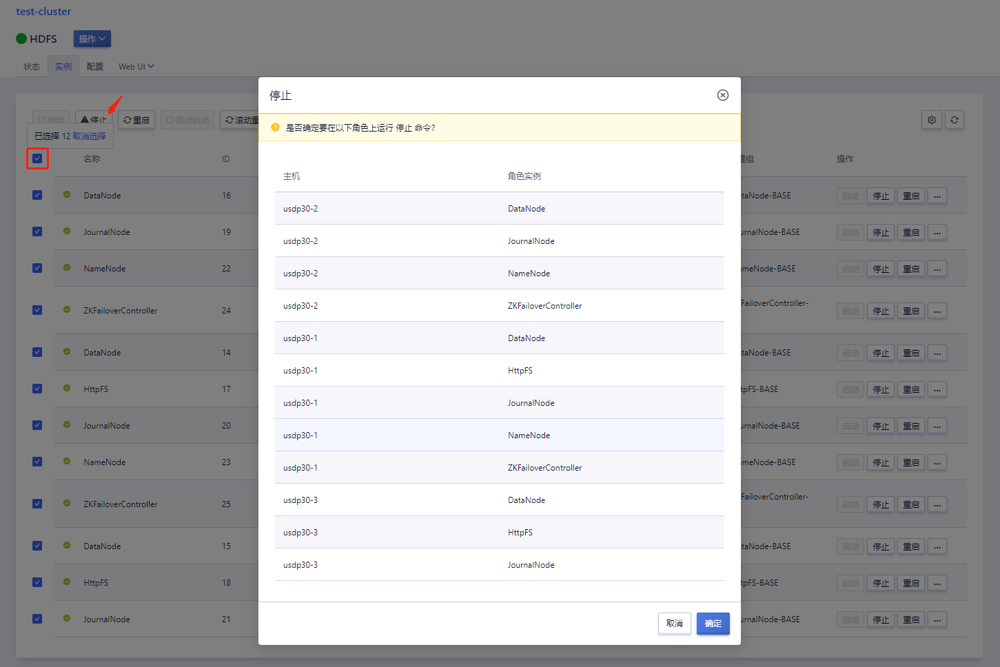
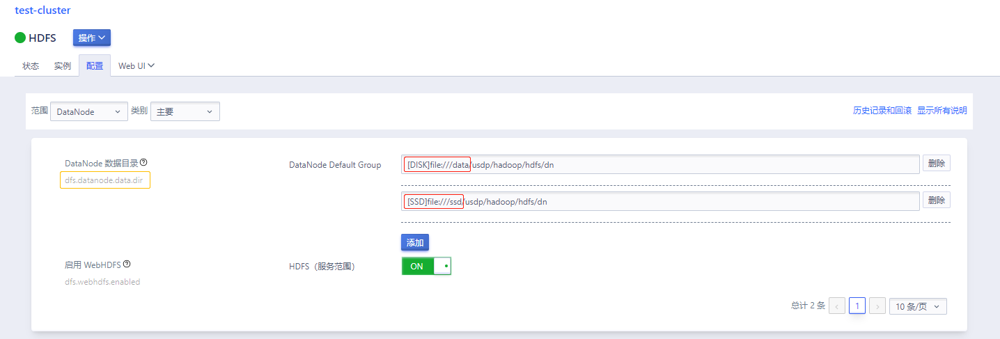

# 配置 HDFS 冷热数据分层存储

本篇指南，将介绍如何在 USDP3.0 创建的 Hadoop 集群中，为 HDFS 集群配置 SSD（固态硬盘）和 DISK（机械硬盘），使用 SSD 盘存储访问频率高且对分析查询时延有较苛刻要求的数据，使用 DISK 盘存储访问频率较低的数据。使用者可参考本篇介绍，合理规划和使用 HDFS 的这一特性。

## 配置场景

USDP3.0 中，HDFS 支持了异构存储模式，该模式从可能对应于多个物理存储介质的单个存储器转，向对应于一个物理存储介质的多个存储器的集合进行转变，增加了 DISK、SSD 等存储类型的概念。用户可根据该模式，对数据按使用频率及查询效率实现友好的规划，便于用户根据数据使用情况，优化存储成本。


DataNode 存储模式（HDFS-2832）

- RAM_DISK：内存存储，支持在内存中写入单个副本文件；
- SSD：固态硬盘；
- DISK：机械硬盘（HDFS 默认使用）；
- ARCHIVE：归档类存储介质，它具备较高存储密度，但计算效率很低；


HDFS 存储策略

- LAZY_PERSIST：在 RAM_DISK 存储介质中存放一个 block。block 首先用 RAM_DISK 吸入，之后异步的将内存中的数据刷新至 DISK 类型的存储介质中；
- ALL_SSD：所有的 block 均存储至 SSD 类型的存储介质中；
- ONE_SSD：只有一个 block 存储至 SDD 类型存储介质中，其余的副本存储至 DISK 类型的存储介质中；
- HOT：所有的 block 存储至 DISK 类型的存储介质中；
- WARM：只有一个 block 存储至 DISK 类型存储介质中，其余的副本存储至 ARCHIVE 类型的存储介质中；
- COLD：所有的数据存储至 ARCHIVE 类型的存储介质中；

当各类存储类型的储存空间充足时，数据块副本会根据存储策略的约定进行存储。当有些存储类型的储存空间不足时，各策略将按照应急存储类型及复制应急存储类型替换文件创建和复制的空间不足的问题。参考如下存储策略表。


| Policy ID | Policy Name  | Block Placement（N replicas） | Fallback storage for creation | Fallback storage for replication |
| --------- | ------------ | ----------------------------- | ----------------------------- | -------------------------------- |
| 15        | LAZY_PERSIST | RAM_DISK: 1, DISK: n-1        | DISK                          | DISK                             |
| 12        | ALL_SSD      | SSD: n                        | DISK                          | DISK                             |
| 10        | ONE_SSD      | SSD: 1, DISK: n-1             | SSD, DISK                     | SSD, DISK                        |
| 7         | HOT          | DISK: n                       |                               | ARCHIVE                          |
| 5         | WARM         | DISK: 1, ARCHIVE: n-1         | ARCHIVE, DISK                 | ARCHIVE, DISK                    |
| 2         | COLD         | ARCHIVE: n                    |                               |                                  |


其中，LAZY_PERSIST 策略只对单个 block 有用。对于具有多个 block，所有 block 都将写入到 DISK 中，因为仅将一个 block 写入RAM_DISK 中时总体性能并不会得到提高。

对于 Erasure Coded 文件，适合的存储策略是 ALL_SSD、HOT、COLD。因此，若用户为 Erasure Coded 文件设置策略并不是上方合适的策略，那么在创建或移动块时就不会遵循该策略。


## 配置描述

前置条件，HDFS 集群 DataNode 的各个主机已挂载 1 块 SSD 盘、1 块 SATA 盘。测试环境已为各主机添加 SSD 盘并挂载至 /ssd 目录，已添加 SATA 盘并挂载至 /data 目录。

### Step1：停止 HDFS 服务



如上图所示，在 USDP 控制台中操作 HDFS 集群，选中 HDFS 的所有服务实例，点击“停止”按钮，在弹出的对话框中确认停止。

!> - 为避免其他依赖 HDFS 的大数据服务不出现异常，可提前这类服务。

### Step2：修改 HDFS 配置

更改前如下图所示：


?> - “`/data/usdp/hadoop/hdfs/dn`”目录，是 USDP 默认的 HDFS DataNode 数据存储路径。添加磁盘时，注意各层级路径、用户及所属组、权限，与默认路径保持一致。

更改后如下图所示：



HDFS 并不具备自动检测所在主机存储设备的能力，因此，需要用户主动申明各存储设备的属性。

如上图所示，在 HDFS 服务“配置”管理页面中，找到“`dfs.datanode.data.dir`”，为其配置数据存储路径，此处添加了“`[DISK]file:///data/usdp/hadoop/hdfs/dn`”和“`[SSD]file:///ssd/usdp/hadoop/hdfs/dn`”参数。

### Step3：重启 HDFS


如上图所示，在 USDP 控制台中操作 HDFS 集群，选中 HDFS 的所有服务实例，点击“滚动启动”按钮，在弹出的对话框中确认启动，等待 HDFS 服务启动完成，状态变为“可用”。

### Step4：创建两个测试 HDFS 的目录

- 创建 hot 数据目录，该目录存放常规的热数据。

```shell
hdfs dfs -mkdir -p /tmp/test/hot
```

- 创建 all_ssd 数据目录，该目录存放访问频次很高，且数据查询效率很高的数据文件。

```shell
hdfs dfs -mkdir -p /tmp/test/all_ssd
```

### Step5：分别设置目录存储策略

```shell
hdfs storagepolicies -setStoragePolicy -path /tmp/test/hot -policy HOT
hdfs storagepolicies -setStoragePolicy -path /tmp/test/all_ssd -policy ALL_SSD
```

#### **结果验证**

### Step6：分别上传数据到 HOT、ALL_SSD 类型的目录

随意找一个较大文件，这里以 `ucloud.tar` 文件为例。

```shell
[root@usdp30-3 ~] ll -h
total 758M
-rw-r--r-- 1 root root 758M Jan 11 20:18 ucloud.tar
[root@usdp30-3 ~]
[root@usdp30-3 ~] hdfs dfs -put /root/ucloud.tar /tmp/test/hot
[root@usdp30-3 ~] hdfs dfs -put /root/ucloud.tar /tmp/test/all_ssd
```

### Step7：查看不同存储策略文件的 block 位置

```shell
[root@usdp30-3 ~] hdfs fsck /tmp/test/hot/ucloud.tar -files -blocks -locations
Connecting to namenode via http://usdp30-2:50070/fsck?ugi=root&files=1&blocks=1&locations=1&path=%2Ftmp%2Ftest%2Fhot%2Fucloud.tar
FSCK started by root (auth:SIMPLE) from /10.0.8.11 for path /tmp/test/hot/ucloud.tar at Wed Jan 11 10:28:27 EST 2023

/tmp/test/hot/ucloud.tar 793989120 bytes, replicated: replication=3, 6 block(s):  OK
0. BP-1260726538-10.0.8.10-1673275380146:blk_1073742326_1507 len=134217728 Live_repl=3  [DatanodeInfoWithStorage[10.0.8.14:9866,DS-048b088d-54ca-45be-9293-53b02ea55a23,DISK], DatanodeInfoWithStorage[10.0.8.10:9866,DS-4b63dcc4-9f36-49a6-92ba-6ca18dc07cff,DISK], DatanodeInfoWithStorage[10.0.8.11:9866,DS-e633d7ad-9a20-4a30-9b87-bbfe55130563,DISK]]
1. BP-1260726538-10.0.8.10-1673275380146:blk_1073742327_1508 len=134217728 Live_repl=3  [DatanodeInfoWithStorage[10.0.8.14:9866,DS-048b088d-54ca-45be-9293-53b02ea55a23,DISK], DatanodeInfoWithStorage[10.0.8.10:9866,DS-4b63dcc4-9f36-49a6-92ba-6ca18dc07cff,DISK], DatanodeInfoWithStorage[10.0.8.11:9866,DS-e633d7ad-9a20-4a30-9b87-bbfe55130563,DISK]]
2. BP-1260726538-10.0.8.10-1673275380146:blk_1073742328_1509 len=134217728 Live_repl=3  [DatanodeInfoWithStorage[10.0.8.10:9866,DS-4b63dcc4-9f36-49a6-92ba-6ca18dc07cff,DISK], DatanodeInfoWithStorage[10.0.8.14:9866,DS-048b088d-54ca-45be-9293-53b02ea55a23,DISK], DatanodeInfoWithStorage[10.0.8.11:9866,DS-e633d7ad-9a20-4a30-9b87-bbfe55130563,DISK]]
3. BP-1260726538-10.0.8.10-1673275380146:blk_1073742329_1510 len=134217728 Live_repl=3  [DatanodeInfoWithStorage[10.0.8.10:9866,DS-4b63dcc4-9f36-49a6-92ba-6ca18dc07cff,DISK], DatanodeInfoWithStorage[10.0.8.14:9866,DS-048b088d-54ca-45be-9293-53b02ea55a23,DISK], DatanodeInfoWithStorage[10.0.8.11:9866,DS-e633d7ad-9a20-4a30-9b87-bbfe55130563,DISK]]
4. BP-1260726538-10.0.8.10-1673275380146:blk_1073742330_1511 len=134217728 Live_repl=3  [DatanodeInfoWithStorage[10.0.8.10:9866,DS-4b63dcc4-9f36-49a6-92ba-6ca18dc07cff,DISK], DatanodeInfoWithStorage[10.0.8.14:9866,DS-048b088d-54ca-45be-9293-53b02ea55a23,DISK], DatanodeInfoWithStorage[10.0.8.11:9866,DS-e633d7ad-9a20-4a30-9b87-bbfe55130563,DISK]]
5. BP-1260726538-10.0.8.10-1673275380146:blk_1073742331_1512 len=122900480 Live_repl=3  [DatanodeInfoWithStorage[10.0.8.14:9866,DS-048b088d-54ca-45be-9293-53b02ea55a23,DISK], DatanodeInfoWithStorage[10.0.8.10:9866,DS-4b63dcc4-9f36-49a6-92ba-6ca18dc07cff,DISK], DatanodeInfoWithStorage[10.0.8.11:9866,DS-e633d7ad-9a20-4a30-9b87-bbfe55130563,DISK]]
…
```

如上说明，HDFS 的 `/tmp/test/hot` 目录中的 `ucloud.tar` 文件被切分成了 6 个 block，每个 block 及两个副本分别存储在集群三台主机（10.0.8.10、10.0.8.11、10.0.8.14）的 **DISK 类型**的磁盘上。

```shell
[root@usdp30-3 ~] hdfs fsck /tmp/test/all_ssd/ucloud.tar -files -blocks -locations
Connecting to namenode via http://usdp30-2:50070/fsck?ugi=root&files=1&blocks=1&locations=1&path=%2Ftmp%2Ftest%2Fall_ssd%2Fucloud.tar
FSCK started by root (auth:SIMPLE) from /10.0.8.11 for path /tmp/test/all_ssd/ucloud.tar at Wed Jan 11 10:25:22 EST 2023

/tmp/test/all_ssd/ucloud.tar 793989120 bytes, replicated: replication=3, 6 block(s):  OK
0. BP-1260726538-10.0.8.10-1673275380146:blk_1073742320_1501 len=134217728 Live_repl=3  [DatanodeInfoWithStorage[10.0.8.10:9866,DS-fa3bbe99-0ff8-4532-8453-3052bc04649b,SSD], DatanodeInfoWithStorage[10.0.8.14:9866,DS-a125942f-05c0-4ac5-9718-8c9f61f4a688,SSD], DatanodeInfoWithStorage[10.0.8.11:9866,DS-82620561-8b6e-4c2d-a27c-0d98f0835edf,SSD]]
1. BP-1260726538-10.0.8.10-1673275380146:blk_1073742321_1502 len=134217728 Live_repl=3  [DatanodeInfoWithStorage[10.0.8.14:9866,DS-a125942f-05c0-4ac5-9718-8c9f61f4a688,SSD], DatanodeInfoWithStorage[10.0.8.10:9866,DS-fa3bbe99-0ff8-4532-8453-3052bc04649b,SSD], DatanodeInfoWithStorage[10.0.8.11:9866,DS-82620561-8b6e-4c2d-a27c-0d98f0835edf,SSD]]
2. BP-1260726538-10.0.8.10-1673275380146:blk_1073742322_1503 len=134217728 Live_repl=3  [DatanodeInfoWithStorage[10.0.8.10:9866,DS-fa3bbe99-0ff8-4532-8453-3052bc04649b,SSD], DatanodeInfoWithStorage[10.0.8.14:9866,DS-a125942f-05c0-4ac5-9718-8c9f61f4a688,SSD], DatanodeInfoWithStorage[10.0.8.11:9866,DS-82620561-8b6e-4c2d-a27c-0d98f0835edf,SSD]]
3. BP-1260726538-10.0.8.10-1673275380146:blk_1073742323_1504 len=134217728 Live_repl=3  [DatanodeInfoWithStorage[10.0.8.10:9866,DS-fa3bbe99-0ff8-4532-8453-3052bc04649b,SSD], DatanodeInfoWithStorage[10.0.8.14:9866,DS-a125942f-05c0-4ac5-9718-8c9f61f4a688,SSD], DatanodeInfoWithStorage[10.0.8.11:9866,DS-82620561-8b6e-4c2d-a27c-0d98f0835edf,SSD]]
4. BP-1260726538-10.0.8.10-1673275380146:blk_1073742324_1505 len=134217728 Live_repl=3  [DatanodeInfoWithStorage[10.0.8.14:9866,DS-a125942f-05c0-4ac5-9718-8c9f61f4a688,SSD], DatanodeInfoWithStorage[10.0.8.10:9866,DS-fa3bbe99-0ff8-4532-8453-3052bc04649b,SSD], DatanodeInfoWithStorage[10.0.8.11:9866,DS-82620561-8b6e-4c2d-a27c-0d98f0835edf,SSD]]
5. BP-1260726538-10.0.8.10-1673275380146:blk_1073742325_1506 len=122900480 Live_repl=3  [DatanodeInfoWithStorage[10.0.8.14:9866,DS-a125942f-05c0-4ac5-9718-8c9f61f4a688,SSD], DatanodeInfoWithStorage[10.0.8.10:9866,DS-fa3bbe99-0ff8-4532-8453-3052bc04649b,SSD], DatanodeInfoWithStorage[10.0.8.11:9866,DS-82620561-8b6e-4c2d-a27c-0d98f0835edf,SSD]]
…
```

如上说明，HDFS 的 `/tmp/test/all_ssd` 目录中的 `ucloud.tar` 文件被切分成了 6 个 block，每个 block 及两个副本分别存储在集群三台主机（10.0.8.10、10.0.8.11、10.0.8.14）的 **SSD 类型**的磁盘上。

### Step8：为数据降温

此步骤中，将会把 ALL_SSD 的数据文件降温处理到 DISK 中，即将所有 block 全部在 SSD 存储介质中的文件数据，迁移至 SATA 机械盘的存储介质中。

移动文件：

```shell
[root@usdp30-1 ~] hdfs dfs -mv /tmp/test/all_ssd/ucloud.tar /tmp/test/hot/ucloud1.tar
```

查看文件 block 是否已真实搬迁：

```shell
[root@usdp30-1 ~] hdfs fsck /tmp/test/hot/ucloud1.tar -files -blocks -locations
Connecting to namenode via http://usdp30-2:50070/fsck?ugi=root&files=1&blocks=1&locations=1&path=%2Ftmp%2Ftest%2Fhot%2Fucloud1.tar
FSCK started by root (auth:SIMPLE) from /10.0.8.10 for path /tmp/test/hot/ucloud1.tar at Thu Jan 12 01:03:30 EST 2023

/tmp/test/hot/ucloud1.tar 793989120 bytes, replicated: replication=3, 6 block(s):  OK
0. BP-1260726538-10.0.8.10-1673275380146:blk_1073742326_1507 len=134217728 Live_repl=3  [DatanodeInfoWithStorage[10.0.8.11:9866,DS-82620561-8b6e-4c2d-a27c-0d98f0835edf,SSD], DatanodeInfoWithStorage[10.0.8.10:9866,DS-fa3bbe99-0ff8-4532-8453-3052bc04649b,SSD], DatanodeInfoWithStorage[10.0.8.14:9866,DS-a125942f-05c0-4ac5-9718-8c9f61f4a688,SSD]]
1. BP-1260726538-10.0.8.10-1673275380146:blk_1073742327_1508 len=134217728 Live_repl=3  [DatanodeInfoWithStorage[10.0.8.14:9866,DS-a125942f-05c0-4ac5-9718-8c9f61f4a688,SSD], DatanodeInfoWithStorage[10.0.8.10:9866,DS-fa3bbe99-0ff8-4532-8453-3052bc04649b,SSD], DatanodeInfoWithStorage[10.0.8.11:9866,DS-82620561-8b6e-4c2d-a27c-0d98f0835edf,SSD]]
2. BP-1260726538-10.0.8.10-1673275380146:blk_1073742328_1509 len=134217728 Live_repl=3  [DatanodeInfoWithStorage[10.0.8.11:9866,DS-82620561-8b6e-4c2d-a27c-0d98f0835edf,SSD], DatanodeInfoWithStorage[10.0.8.10:9866,DS-fa3bbe99-0ff8-4532-8453-3052bc04649b,SSD], DatanodeInfoWithStorage[10.0.8.14:9866,DS-a125942f-05c0-4ac5-9718-8c9f61f4a688,SSD]]
3. BP-1260726538-10.0.8.10-1673275380146:blk_1073742329_1510 len=134217728 Live_repl=3  [DatanodeInfoWithStorage[10.0.8.11:9866,DS-82620561-8b6e-4c2d-a27c-0d98f0835edf,SSD], DatanodeInfoWithStorage[10.0.8.10:9866,DS-fa3bbe99-0ff8-4532-8453-3052bc04649b,SSD], DatanodeInfoWithStorage[10.0.8.14:9866,DS-a125942f-05c0-4ac5-9718-8c9f61f4a688,SSD]]
4. BP-1260726538-10.0.8.10-1673275380146:blk_1073742330_1511 len=134217728 Live_repl=3  [DatanodeInfoWithStorage[10.0.8.14:9866,DS-a125942f-05c0-4ac5-9718-8c9f61f4a688,SSD], DatanodeInfoWithStorage[10.0.8.10:9866,DS-fa3bbe99-0ff8-4532-8453-3052bc04649b,SSD], DatanodeInfoWithStorage[10.0.8.11:9866,DS-82620561-8b6e-4c2d-a27c-0d98f0835edf,SSD]]
5. BP-1260726538-10.0.8.10-1673275380146:blk_1073742331_1512 len=122900480 Live_repl=3  [DatanodeInfoWithStorage[10.0.8.11:9866,DS-82620561-8b6e-4c2d-a27c-0d98f0835edf,SSD], DatanodeInfoWithStorage[10.0.8.10:9866,DS-fa3bbe99-0ff8-4532-8453-3052bc04649b,SSD], DatanodeInfoWithStorage[10.0.8.14:9866,DS-a125942f-05c0-4ac5-9718-8c9f61f4a688,SSD]]
```

此时，文件的所有 block，仍然还存储在 SSD 类型的存储介质中。

数据搬迁降温：

```shell
[root@usdp30-1 ~] hdfs mover /tmp/test/hot/ucloud1.tar
```

待命令执行完成。

```shell
[root@usdp30-1 ~] hdfs fsck /tmp/test/hot/ucloud1.tar -files -blocks -locations
Connecting to namenode via http://usdp30-2:50070/fsck?ugi=root&files=1&blocks=1&locations=1&path=%2Ftmp%2Ftest%2Fhot%2Fucloud1.tar
FSCK started by root (auth:SIMPLE) from /10.0.8.10 for path /tmp/test/hot/ucloud1.tar at Thu Jan 12 01:09:37 EST 2023

/tmp/test/hot/ucloud1.tar 793989120 bytes, replicated: replication=3, 6 block(s):  OK
0. BP-1260726538-10.0.8.10-1673275380146:blk_1073742326_1507 len=134217728 Live_repl=3  [DatanodeInfoWithStorage[10.0.8.10:9866,DS-4b63dcc4-9f36-49a6-92ba-6ca18dc07cff,DISK], DatanodeInfoWithStorage[10.0.8.11:9866,DS-e633d7ad-9a20-4a30-9b87-bbfe55130563,DISK], DatanodeInfoWithStorage[10.0.8.14:9866,DS-048b088d-54ca-45be-9293-53b02ea55a23,DISK]]
1. BP-1260726538-10.0.8.10-1673275380146:blk_1073742327_1508 len=134217728 Live_repl=3  [DatanodeInfoWithStorage[10.0.8.10:9866,DS-4b63dcc4-9f36-49a6-92ba-6ca18dc07cff,DISK], DatanodeInfoWithStorage[10.0.8.14:9866,DS-048b088d-54ca-45be-9293-53b02ea55a23,DISK], DatanodeInfoWithStorage[10.0.8.11:9866,DS-e633d7ad-9a20-4a30-9b87-bbfe55130563,DISK]]
2. BP-1260726538-10.0.8.10-1673275380146:blk_1073742328_1509 len=134217728 Live_repl=3  [DatanodeInfoWithStorage[10.0.8.10:9866,DS-4b63dcc4-9f36-49a6-92ba-6ca18dc07cff,DISK], DatanodeInfoWithStorage[10.0.8.14:9866,DS-048b088d-54ca-45be-9293-53b02ea55a23,DISK], DatanodeInfoWithStorage[10.0.8.11:9866,DS-e633d7ad-9a20-4a30-9b87-bbfe55130563,DISK]]
3. BP-1260726538-10.0.8.10-1673275380146:blk_1073742329_1510 len=134217728 Live_repl=3  [DatanodeInfoWithStorage[10.0.8.11:9866,DS-e633d7ad-9a20-4a30-9b87-bbfe55130563,DISK], DatanodeInfoWithStorage[10.0.8.14:9866,DS-048b088d-54ca-45be-9293-53b02ea55a23,DISK], DatanodeInfoWithStorage[10.0.8.10:9866,DS-4b63dcc4-9f36-49a6-92ba-6ca18dc07cff,DISK]]
4. BP-1260726538-10.0.8.10-1673275380146:blk_1073742330_1511 len=134217728 Live_repl=3  [DatanodeInfoWithStorage[10.0.8.10:9866,DS-4b63dcc4-9f36-49a6-92ba-6ca18dc07cff,DISK], DatanodeInfoWithStorage[10.0.8.11:9866,DS-e633d7ad-9a20-4a30-9b87-bbfe55130563,DISK], DatanodeInfoWithStorage[10.0.8.14:9866,DS-048b088d-54ca-45be-9293-53b02ea55a23,DISK]]
5. BP-1260726538-10.0.8.10-1673275380146:blk_1073742331_1512 len=122900480 Live_repl=3  [DatanodeInfoWithStorage[10.0.8.14:9866,DS-048b088d-54ca-45be-9293-53b02ea55a23,DISK], DatanodeInfoWithStorage[10.0.8.11:9866,DS-e633d7ad-9a20-4a30-9b87-bbfe55130563,DISK], DatanodeInfoWithStorage[10.0.8.10:9866,DS-4b63dcc4-9f36-49a6-92ba-6ca18dc07cff,DISK]]
```

此时，该文件的所有数据块，已全部从 SSD 介质中搬迁至 DISK 介质中，达到数据降温的目的。