# 4 大数据集群创建向导

参考本章节指南，即可快速规划并创建一个 USDP 智能大数据集群。

?> 登录 USDP 控制台后，页面将会跳转至“授权管理”页面，需上传授权证书后方可继续操作。请参考本文档《授权管理》章节说明，获取并上传授权。

为了便于用户快速创建大数据集群，USDP 管理服务已将大数据集群创建过程中的众多服务、配置整合成向导的形式，用户可通过向导中的指引快速搭建出一个全新的大数据集群。

## 4.1 配置 UDH 源

在开始向导化方式部署大数据集群之前，首先需在 USDP Web 控制台中配置 UDH 源，点击控制台顶部的菜单栏“系统管理”-“UDH 源”，进入 UDH 源配置页面。配置方法如下：

- 在“生效范围”处选择“大版本”，并在下方的下拉框中选择“3”版本段；
- 在“仓库地址”栏中填写 http 协议的 UDH 源地址，例如：“`http://usdp_server_ip/udh3`”（若自定义配置 UDH 源，请填写相应的 URL）

之后，“保存” 配置信息。

### 4.1.1 集群创建向导

首次安装 USDP，系统会提示“新建集群”，点击“新建集群向导”按钮，即可快速搭建一个全新的大数据集群。

若在正常使用 USDP 过程中，需要创建新的大数据集群时，可点击 USDP Web 控制台顶部的“集群”菜单，在弹出的下拉菜单列表中，点击“新建集群”按钮，即可进入创建向导中。

#### Setp1：选择软件版本

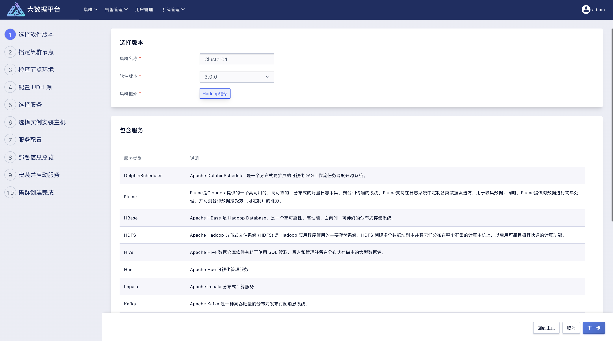

进入向导第一步，此时用户需要定义即将新创建的集群的基本信息，主要包括 “集群名称”、集群创建需要依赖的USDP “软件版本”、以及集群框架类型。

创建集群，填写集群名称，选择软件版本：“3.0.0”，集群框架：Hadoop框架 (v3.0.0 暂时不支持其他模式框架)，如上图所示，USDP 会展示出“3.0.0”中都包含哪些服务及服务的简要描述信息供参考。

#### Setp2：指定集群节点

参考《部署 USDP》章节中 hosts.yml 文件的“work_node”列表中已配置的主机信息，用户仅需输入相应节点的完全限定域名（hostname）即可，若无节点的 hostname 修改，根据 hosts.yml 文件填写默认 hostname。

为了方便批量录入，USDP 支持用户按照表达的方式录入。

?> **节点的完全限定域名填写规则说明：** - 可单行输入每一个节点的完全限定域名； - 可通过“[]”辅助输入有数字规律的节点完全限定域名；例如 usdp3-[1-3] 表示包含“usdp3-1”、“usdp3-2”、“usdp3-3”共三个节点。

USDP 需要通过“root”用户以及“22”端口，进行管理所有主机服务器。暂不支持对端口号进行更改。

集群节点信息填写完成后，点击右下角的向导“下一步”按钮继续。

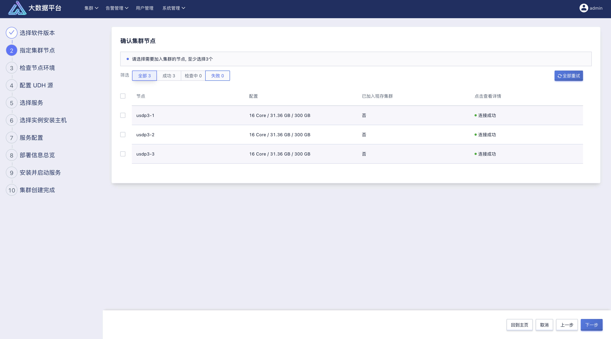

USDP 需要对上一步中指定的主机进行环境检测，例如节点间的网络互通性；所有节点检测通过的状态，如上图图所示。

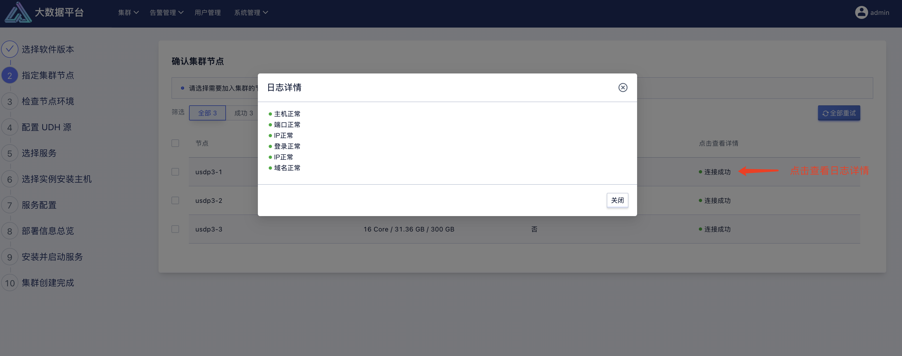

如上图所示，点击节点列表中“点击查看详情”栏的相应字样，即可查看该主机上的已检测以及正在检测的日志详情。

#### Setp3：检查节点环境

USDP 需要检查对应节点是否已经初始化完成，比如：JDK、MySQL、时间服务器等是否已经正确安装及配置。

检查过程中，可点击列表 “详情” 栏的 “检查中” 按钮，可以查看对应节点的任务详情。如下图所示：

待所有检查工作完成后，点击右下角的向导“下一步”按钮继续。

#### Setp4：配置 UDH 源

USDP 需要通过 http 协议的源地址，为创建集群的各个主机提供安装包的支持，建议在创建集群前，前往 USDP Web 控制台“系统管理”-“UDH 源”中进行配置。此处参见本文档《UDH 源》章节内容。

#### Setp5：选择服务

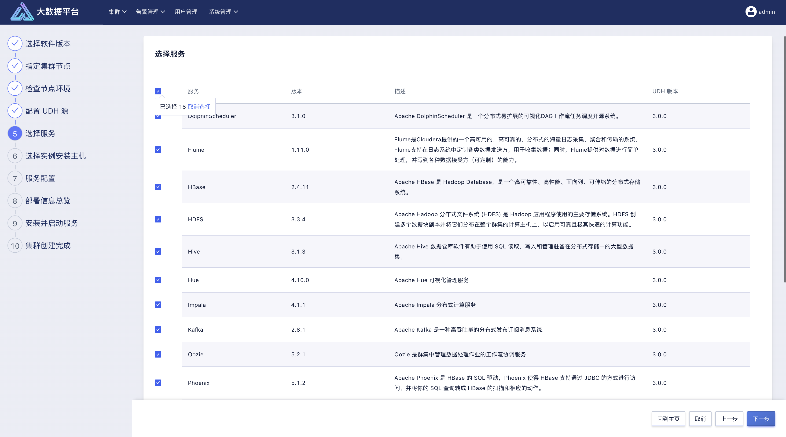

如上图所示，UDH 源中支持的大数据生态服务较多，在集群安装时，使用者可根据实际业务需要，灵活选择所需安装的组件。

当勾选需要的大数据服务并点击“下一步”按钮时，USDP 将自动检测使用者已选择的服务所需要与其他服务存在依赖的关系，并在页面中进行提示，使用者根据提示，勾选需要依赖的服务后，继续执行向导流程。

#### Setp6：选择实例安装主机

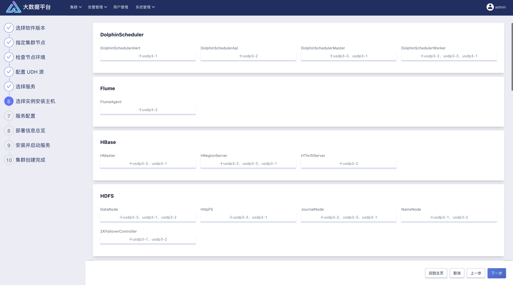

UDH 中支持的大数据生态服务，均由不同的实例构成，安装集群时，使用者可根据业务需求做好服务在集群主机中的分布规划，将不同的服务及实例分别安装到集群的哪些主机上去。

USDP 会根据使用者在上一步中选择的大数据服务，自动计算各服务在当前集群规模中如何分部和部署，如上图所示，以推荐方案的形式选择好分部，并呈现给使用者。此时，使用者可在推荐方案的基础上，进行部分调整。

如上图所示，可自主的调整如 FlumeAgent 到三个节点上进行安装。调整后，点击向导“下一步”按钮。

#### Setp7：服务配置

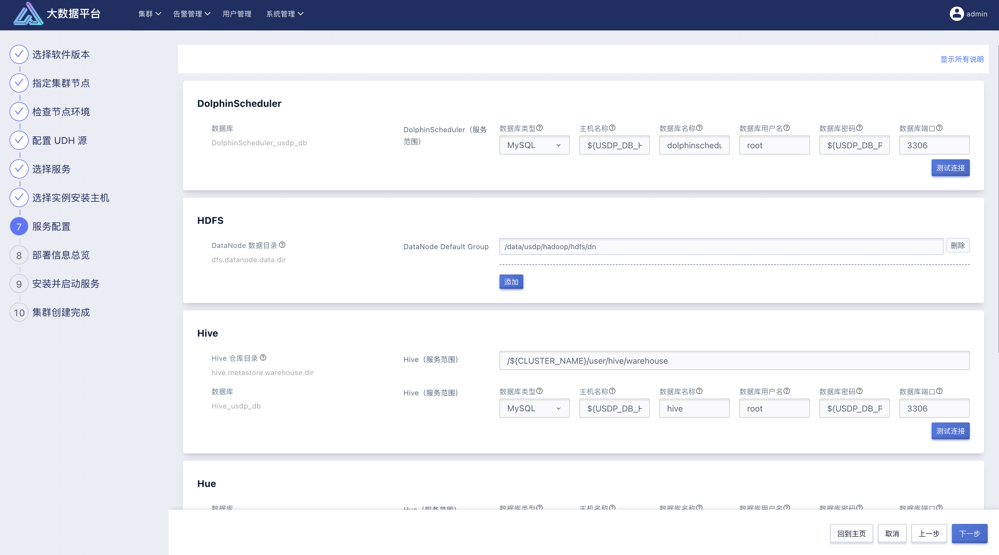

进入到服务配置页面时，如上图所示，需使用者自行根据选择的服务进行部分配置项设置，如某服务的数据存储路径、需要的数据库信息填写等等信息。

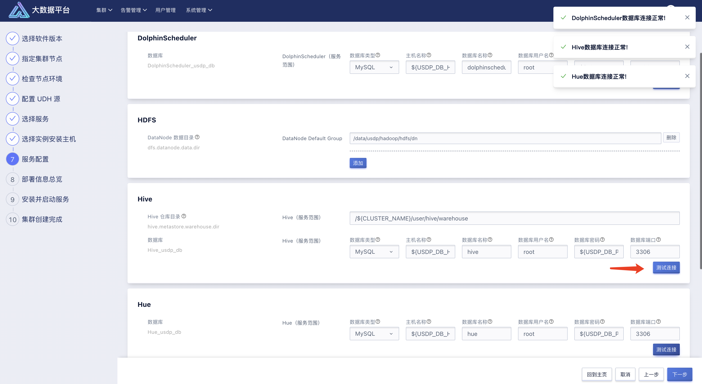

使用者自行配置之前，可参考 USDP 默认根据集群环境、服务配置要求等信息补充在页面中的各配置项信息，如服务管理元数据信息、默认填充 USDP 初始化时已部署的 MySQL 的相关连接信息，使用者仅需要点击“测试连接”按钮即可测试是否正常，如上图所示。

?> **提示：** - *USDP* *允许使用者将服务元数据存储的数据库更改为使用者已使用并维护的其他* *MySQL* *数据库；仅需要在此处配置该库的连接信息并测试连接成功即可。*

如上图所示，如 HDFS 数据存储目录的设置中，若集群各主机存在多块数据盘，可根据实际规划及需求，手动“添加”HDFS 数据存储至主机的多块数据盘的文件路径。

#### Setp8：配置信息总览

完成前几个向导步骤中的信息配置后，USDP 会将所有选择及配置信息汇总展示，如上图所示。

使用者浏览检查无误后，点击向导“下一步”按钮继续执行。

#### Setp9：安装并启动服务

向导到达此步骤，USDP 会根据使用者的配置信息，自动生成部署任务计划，并开始逐项执行服务安装工作。

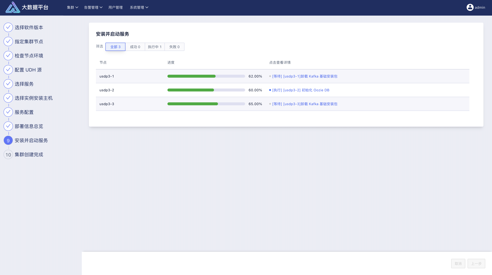

当服务安装发生错误时，使用者可以点击查看报错节点“失败”详情，参考详情提示信息，进行手动修复错误操作，或点击“全部重试”按钮，重新进行服务组件部署工作。

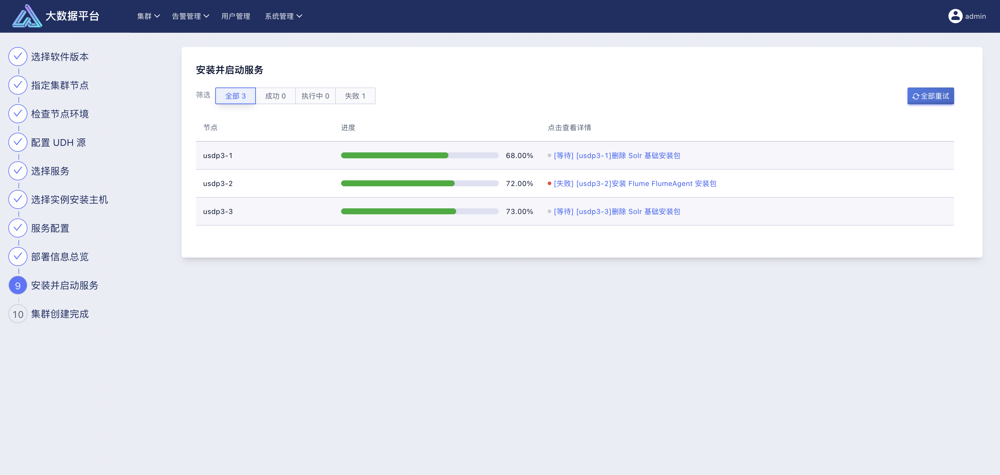

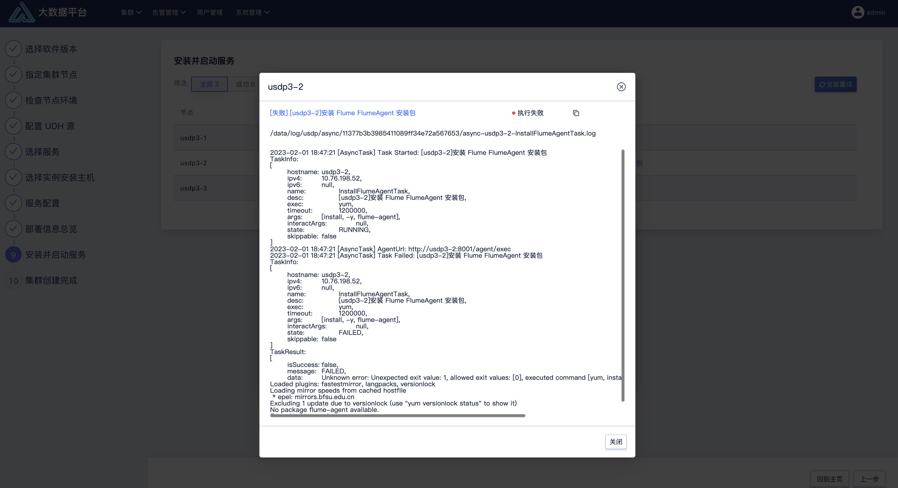

在部署过程中，各主机中正在进行的部署进展，均可通过进度条实时展示，便于使用了解执行进展。可在“点击查看详情” 栏中的各个链接中，查看当前执行步骤的详细情况，如下图所示。

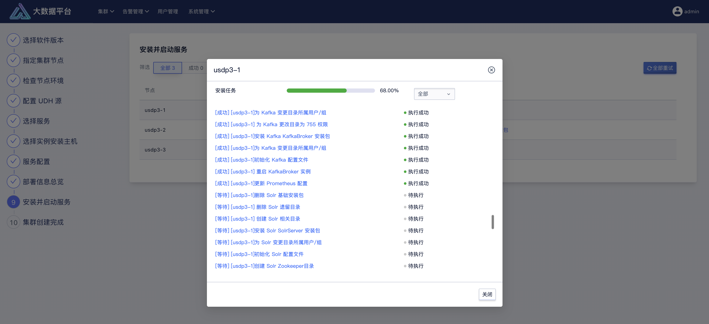

安装任务执行日志，可点击执行成功/执行中的各任务名称进行查看，如下图所示。

#### Setp10：集群创建完成

待所有任务执行完成，主机进度条显示 100% 时，即表示集群已创建完毕，点击“下一步”按钮，便会看到集群创建成功的欢迎页面。此时，退出安装向导，即可进入该集群的管理首页。

