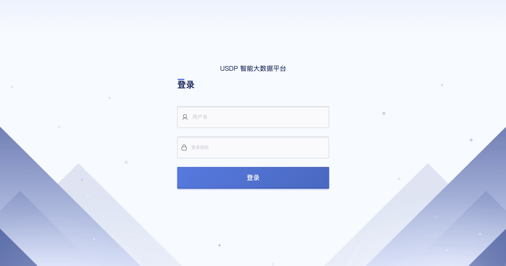

# 4 部署流程

接下来，我们将通过几个简单的步骤，完成 USDP v3.0.0 管理服务的部署流程，从而能够通过 Web 页面的方式，快速部署各类大数据服务与组件。

在开始安装之前，请至少准备如下节点资源，以供后续创建大数据集群。

!> 私有化部署 USDP 需满足如下环境：</br>**节点数量：**3 台及以上；</br>**网络：**集群节点间内网通畅；建议节点间网络 10Gbps 及以上；</br>**节点内存：**推荐 32G 以上；</br>**节点CPU：**推荐 16 核以上；</br>**节点磁盘：**系统盘 60G 以上，数据盘根据业务需要调整；</br>**操作系统：**CentOS 7.4；

下面的部署安装流程以 usdp-v3.0.0 版本为例进行说明。

## 4.1 主机环境准备

### 4.1.1 样例环境信息

| hostname | 内网IP     | 外网IP       | 系统版本                      | 内核版本                   | CPU核心 | 内存容量 | 磁盘容量           |
| -------- | ---------- | ------------ | ----------------------------- | -------------------------- | ------- | -------- | ------------------ |
| usdp3-1  | 172.16.0.3 | 10.76.198.51 | CentOS Linux release 7.4.1708 | 4.1.0-25.el7.ucloud.x86_64 | 16      | 32       | sys: 100Gdata:500G |
| usdp3-2  | 172.16.0.4 | 10.76.198.52 | CentOS Linux release 7.4.1708 | 4.1.0-25.el7.ucloud.x86_64 | 16      | 32       | sys: 100Gdata:500G |
| usdp3-3  | 172.16.0.5 | 10.76.198.53 | CentOS Linux release 7.4.1708 | 4.1.0-25.el7.ucloud.x86_64 | 16      | 32       | sys: 100Gdata:500G |

如上表所示，本教程将以上表的环境信息规划情况进行部署，使用者亦可参考本文档《资源规划》章节的信息，进行部署前的规划后部署。

### 4.1.2 配置各主机 hostname（所有节点）

- 自动配置模式

修改 env-prepare/inventories/hosts.yml 配置文件中相应主机的 NODE_NAME 变量值（并打开注释）

```yaml
work_node:
  hosts:
    10.76.198.51:
      NODE_NAME: usdp3-1
    10.76.198.52:
      NODE_NAME: usdp3-2
    10.76.198.53:
      NODE_NAME: usdp3-3
```

!>通过此方式配置各 hostname 并初始化后，将覆盖原有 hostname

- 手动配置模式

```shell
hostnamectl set-hostname HOSTNAME
```

请参考《样例环境信息》表中的主机名规划，为集群各主机配置主机名，替换合适的主机名后在相应节点执行该命令。

!>主机被添加进集群并且部署服务后，不允许修改主机名（服务配置中的主机名无法同步修改，将会造成大数据服务出现异常）

### 4.1.3 配置节点 ssh key （所有节点）

- 自动配置模式

修改 env-prepare/inventories/hosts.yml 配置文件中相应主机的 ansible_password 变量值

```yaml
all:
  vars:
    # SSH root 密码，按实际情况修改，如果已经配置了 ssh key 免密登录，则该变量无效
    ansible_password: ssh_password_of_root_default

work_node:
  hosts:
    10.76.198.19:
      # 非默认密码的主机，需要单独配置该主机 root 密码
      ansible_password: ssh_password_of_root_1
    10.76.198.20:
      # 非默认密码的主机，需要单独配置该主机 root 密码
      ansible_password: ssh_password_of_root_2
    10.76.198.24:
      # ansible_password: ssh_password_of_root_default
    10.76.198.25:
      # ansible_password: ssh_password_of_root_default

```

- 手动配置模式

```shell
ssh-keygen -t rsa
ssh-copy-id -i ~/.ssh/id_rsa.pub root@10.76.198.52
```

拷贝各节点的公钥至其他节点，使集群各个节点之间免密登录。

## 4.2 部署USDP

### 4.2.1 下载安装包

通过给定地址，下载以下文件：

| 安装包                 | 描述           | 文件大小 |
| ---------------------- | -------------- | -------- |
| ansible-xxx.tar.gz     | Ansible 安装包 | 约25MB   |
| env-prepare-xxx.tar.gz | USDP 安装包    | 约500MB  |
| udh-xxx.tar.gz         | UDH 资源包     | 约7GB    |

### 4.2.2 解压安装包

```shell
mkdir -p /data/usdp-srv/
tar -zxvf ansible-xxx.tar.gz -C /data/usdp-srv/
tar -zxvf env-prepare-xxx.tar.gz -C /data/usdp-srv/
```

### 4.2.3 安装ansbile

```shell
cd /data/usdp-srv/
yum install -y ansible/*.rpm
```

### 4.2.4 修改 hosts.yml 文件，将 IP 改成需要部署的节点

编辑 /data/usdp-srv/env-prepare/inventories/hosts.yml 文件

```yaml
all:
  vars:
    # 如果下面指定的 3 个 ntp_server 不能访问互联网，请设置 with_internet_ntp: false
    # 并且打开 internal_ntp_servers 的注释设置至少一个内部可访问的 ntp server
    with_internet_ntp: true
    #internal_ntp_servers:
    #  - 10.0.1.11
    #  - 10.0.1.12
 
    # SSH root 密码，按实际情况修改，如果已经配置了 ssh key 免密登录，则该变量无效
    ansible_password: ssh_password_of_root
    # MySQL root 密码，按实际情况修改
    mysql_root_password: xxx_mysql_root_password
    # usdp server 监听端口，按实际情况修改
    usdp_server_port: 80
 
#######################################################################################
# Groups
#######################################################################################
# ntp server 选 3 个节点
ntp_server:
  hosts:
    10.76.198.51:
    10.76.198.52:
    10.76.198.53:
 
# usdp server 和 mysql server 单节点
usdp_server:
  hosts:
    10.76.198.51:
 
# work node(s)
# 根据需要放开下面的 NODE_NAME 变量注释，并分别修改成需要的 hostname 值，来设置主机的 hostname
# 如果不放开 NODE_NAME 变量，且 hostname != localhost ，则不设置 hostname ，保留当前主机名
# 如果不放开 NODE_NAME 变量，且 hostname == localhost ，则设置 hostname 为 IP 字符串（替换 IP 中的 '.' 为 '_'），例如：10_76_198_19
#
# 主机名(NODE_NAME)-命名规则：
# 1、主机名只允许包含 ascii 字符里的数字 0-9、字母 a-zA-Z、连字符-、其他都不允许。例如，不允许出现其他标点符号，不允许空格，不允许下划线，不允许中文字符
# 2、主机名的开头和结尾字符不允许是连字符
# 3、主机名命名不允许出现 “数字-数字” 这种模式
#
# 主机被添加进集群并且部署服务后，不允许修改主机名
#
work_node:
  hosts:
    10.76.198.51:
      NODE_NAME: usdp3-1
    10.76.198.52:
      NODE_NAME: usdp3-2
    10.76.198.53:
      NODE_NAME: usdp3-3
```

**主机名（NODE_NAME）-命名规则**（若手动已为各节点设置主机名，此处可以不必再配置！）：

1、主机名只允许包含ascii字符里的数字0-9、字母a-zA-Z、连字符-、其他都不允许。例如，不允许出现其他标点符号，不允许空格，不允许下划线，不允许中文字符。

2、主机名的开头和结尾字符不允许是连字符。

3、主机名命名不允许出现 “数字-数字” 这种模式

!> 主机被添加进集群并且部署服务后，不允许修改主机名（服务配置中的主机名无法同步修改）

### 4.2.5 执行操作，初始化节点和部署 USDP 管理服务

```shell
cd /data/usdp-srv/env-prepare
make prepare
```

### 4.2.6 准备 UDH 资源包 HTTP 访问方式

- 精简模式（直接复用 usdp-server 上的 nginx）

```shell
tar -zxvf udh-3.x.tar.gz -C /opt/usdp/console/
```

此时 udh-3.x 对应 http 访问方式为 http://<usdp_server_ip>:<usdp_server_port>/udh3

!> 所有被 USDP 管理的服务器，在参与集群创建或安装大数据服务时，均需通过USDP Server 节点提供的 http 协议的 yum 源来获取大数据服务安装包，这会使得USDP Server 瞬时网络出向带宽压力增大。

- 自定义模式

使用者解压 udh-xxx.tar.gz 包中的资源至自定义 http server 下，后面在 usdp-server 控制台中配置 UDH 源时指向该自定义 udh 资源 URL。

## 4.3 访问USDP控制台

### 4.3.1 查看 usdp-server 是否运行中

环境初始化步骤包含数据库初始化、 usdp-server 配置、usdp-server 启动，执行 systemctl status usdp-server 查看 usdp-server 服务状态，运行中状态例如：

```shell
Active: active (running)
```

或者（以 <usdp_server_port> 默认 80 为例）执行 ss -tlnp src :80 查看 nginx 服务端口监听情况，端口监听中示例：

```shell
State      Recv-Q Send-Q      Local Address:Port      Peer Address:Port
LISTEN     0      510                    *:80                  *:*          users:(("nginx",pid=11200,fd=11)
```

执行 ss -tlnp src :2023 查看 usdp-server 服务端口监听情况，端口监听中示例：

```shell
State       Recv-Q Send-Q                     Local Address:Port                                    Peer Address:Port
LISTEN      0      100                                   :::2023                                              :::*                   users:(("java",pid=82914,fd=34))
```

### 4.3.2 在浏览器中访问 USDP 控制台

在浏览器中访问 USDP 控制台：

```shell
http://<usdp_server_ip>:<usdp_server_port>
```

?> **提示：**</br>- “usdp_server_ip” 为启动 USDP-Server 的节点 IP 地址。如果浏览器所在节点与 USDP 不在同一网络环境，则需要自行搭建 VPN，或通过与 USDP 部署节点网络互通的 Windows 机器的浏览器来访问该 IP。</br>- “usdp_server_port”为 inventories/hosts.yml 配置文件中 usdp_server_port 的取值。</br>- 默认用户名和密码为 admin / admin （登录后建议修改默认密码）

进入 USDP 管理控制台时，登录界面如下图所示：



登录后可在 USDP 控制台中，更改 admin 管理员的密码。

### 4.3.3 导入 License

若初始部署 USDP 服务，首次登陆后，需要上传环境相对应的授权许可证书后，方可使用 USDP 控制台。

请参考本文档《授权管理》章节的介绍，进行许可证的上传验证。