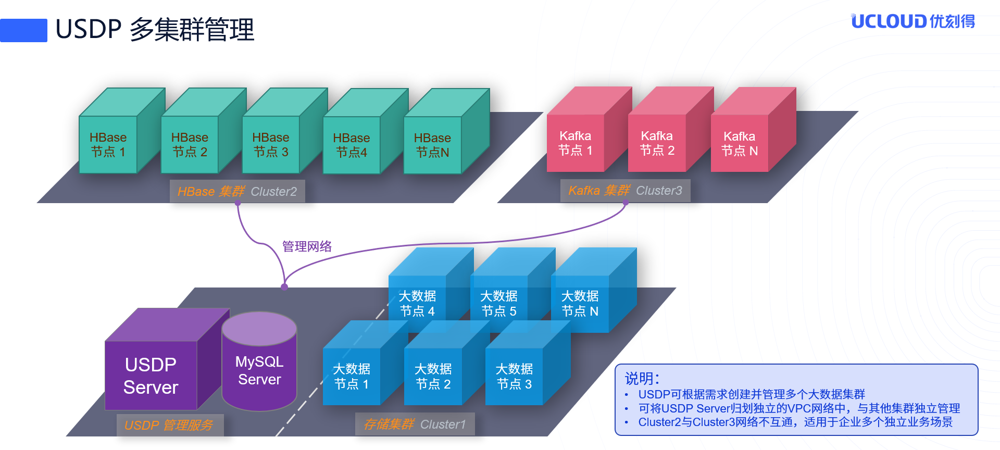
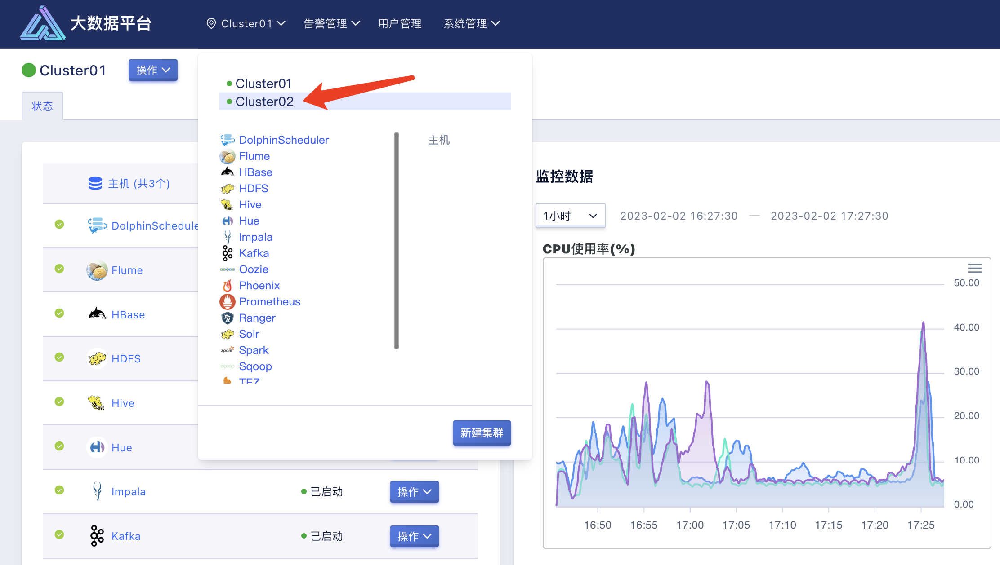
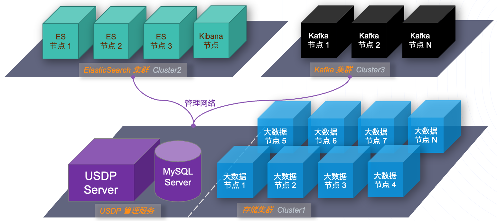
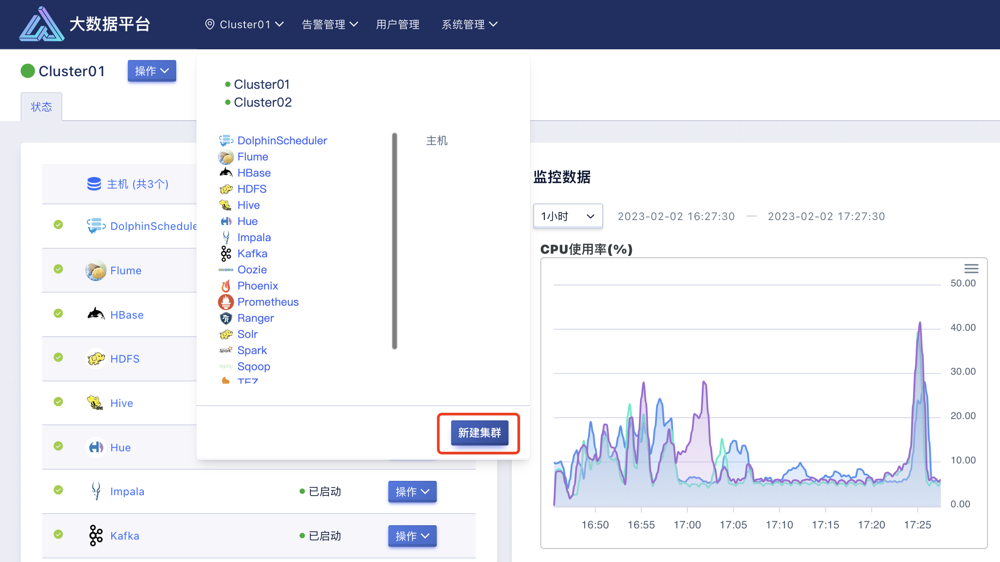

# 5 多集群管理

## 5.1 管理多个大数据集群

如上图所示，可结合网络 VPC（vlan等）技术实现 VPC 间的互通管理，大数据集群 Cluster1 与 Cluster2 可能承载的是不同且不相关的大数据处理业务，因此无法互相访问和共享数据。

基于此类场景，在使用 USDP 管理大数据业务系统时，使用者可根据业务需求，来规划所需的大数据集群数量及单集群的规模和服务；根据业务形态，决策集群间的隔离性；对集群层面进行管理操作。

### 5.1.1 新增大数据集群

当使用者搭建好 USDP 服务时，实际上已经在流程中创建了第一个大数据集群。本章节将从使用者创建其余的更多个大数据集群时给用户参考。

登陆 USDP 控制台，默认会选择集群 ID 号靠前的集群，并显示该集群的首页，此时点击顶部菜单栏“当前集群”菜单，会弹出下拉菜单中展示以创建并管理的集群列表，以及当前集群内已部署使用的大数据服务列表，在下拉菜单底部点击“新建集群” 按钮。如下图所示：

此时，即可进入创建新集群的向导流程中，接下来，可参考 [大数据集群创建向导](usdpdc/3.0.0-unopened/userguide/1st_cluster) 章节的内容。

### 5.1.2 集群切换

如上图所示，点击顶部菜单栏“当前集群”菜单，会弹出下拉菜单中展示以创建并管理的集群列表，在其中点击已经创建的其他大数据集群的“集群名称”，即可切换至该集群的首页。

## 5.2 非 Hadoop 生态数据集群

USDP 支持对非依赖 Hadoop 的部分其他数据处理集群的管理，例如 Kafka 集群等。

### 5.2.1 适用场景

- 统一一套大数据管理服务，即可管理 Hadoop 大数据集群，有可管理其他数据处理集群的场景；

- 统一的集群监控服务；

- 统一的集群服务异常告警服务；

?> **提示：** - USDP 允许非依赖 Hadoop 相关服务的数据服务与 Hadoop 集群共享节点，但在使用者的实际使用中，建议使用者严格根据不同服务集群的不同使用场景和资源消耗，合理规划集群节点即配置，以达到最优的服务性能表现。

### 5.2.2 参考架构图

### 5.2.3 资源规划

可参考本文档 [多集群多节点规划](usdpdc/3.0.0-unopened/userguide/deploy_plan?id=_23-多集群多节点规划) 的方案完成本次规划。

?> **提示：** \- 多个集群无法公用同一台设备，不可重复使用！请合理规划节点用途；

### 5.2.4 示例-创建Kafka集群

登陆 USDP 控制台，默认会选择集群 ID 号靠前的集群，并显示该集群的首页，此时点击顶部菜单栏“当前集群”菜单，会弹出下拉菜单中展示以创建并管理的集群列表，以及当前集群内已部署使用的大数据服务列表，在下拉菜单底部点击“新建集群” 按钮。如下图所示：

此时，即可进入创建新集群的向导流程中后，请注意在 “集群框架” 表单处，选择“Hadoop 框架”，并继续向导流程。

接下来，请注意在向导 “选择服务” 页面处，可仅选择 Kafka 相关服务即可，此处可严格参照使用者对这部分的规划。其他向导内的操作步骤，可参考本文档 [大数据集群创建向导](usdpdc/3.0.0-unopened/userguide/1st_cluster) 章节，流程一致，此处就不在赘述了。
