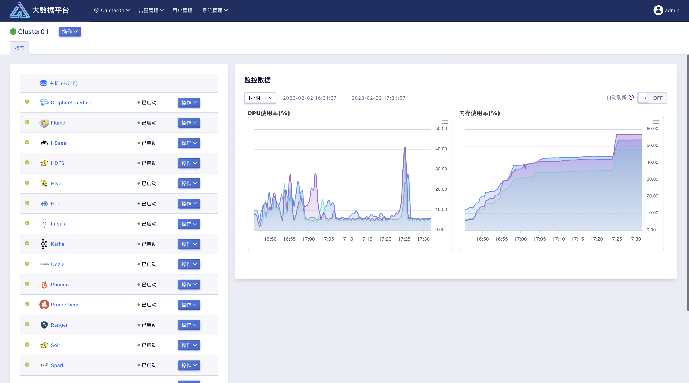
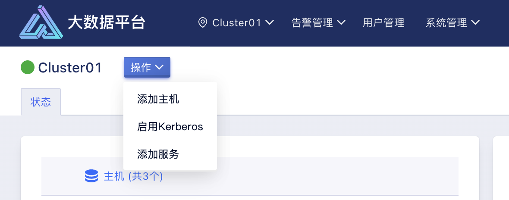
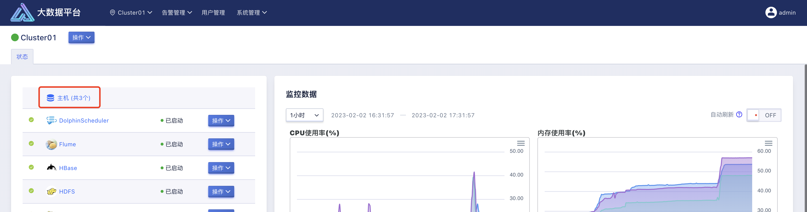
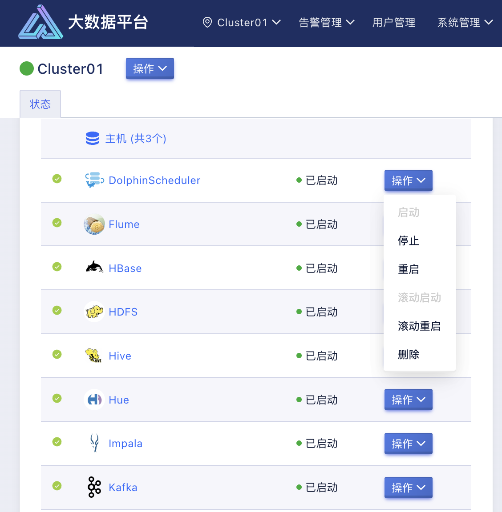
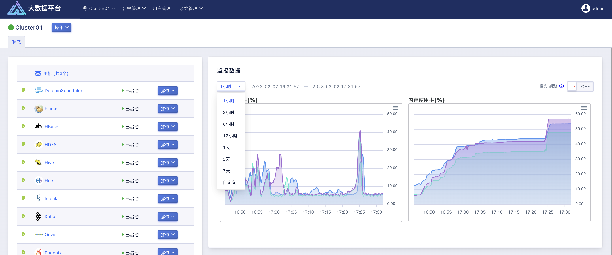

# 6 单集群管理

在本章节中，将介绍如何通过 USDP 管理单个独立的大数据集群，其中将涉及到对集群的节点管理、集群内运行的大数据生态服务的管理、服务的状态及分布管理、服务的配置管理、服务原生 Web UIS 的集成、服务的监控管理等。

## 6.1 集群管理

切换至某个集群时，首先将会看到整个集群的首页面，如下图所示：

在该页面中，主要包含集群级控制、集群主机管理、集群大数据服务预览、集群监控数据概览四方面的管理内容。

### 6.1.1 集群级控制

如上图所示的部分，会展示集群的状态（绿色圆点表示运行中），集群名称，针对集群的操作等。

关于集群的状态，主要有：

| **状态**                                                     | **说明**   |
| ------------------------------------------------------------ | ---------- |
|  | 运行中     |
|  | 集群新建中 |
|  | 集群部署中 |
|  | 集群维护中 |
|  | 集群变更中 |

目前支持对集群进行“添加主机”、“添加服务”的操作，这些将在后续章节中具体介绍。

### 6.1.2 集群主机管理

在此处，统计展示了当前集群所管理的所有的主机节点数量，点击此处，即可进入集群主机统一管理页面，这些将在后续章节中具体介绍。

### 6.1.3 集群大数据服务预览

集群首页的左侧部分，展示了当前集群中已安装部署的大数据生态服务列表，并逐一展示了各服务的状态、服务 Logo 及名称、操作状态、服务级便捷操作按钮等。

关于服务的状态，包括：

| **状态**                                                     | **说明** |
| ------------------------------------------------------------ | -------- |
|  | 可用     |
|  | 部分可用 |
|  | 不可用   |
|  | 未知状态 |

目前支持对大数据服务进行“启动”、“停止”、“重启”、“滚动启动”、“滚动重启”、“删除”的操作，这些将在后续章节中具体介绍。

### 6.1.4 集群监控数据概览

集群首页的左侧部分，展示了当前集群整体的监控数据，如各节点 CPU 使用率情况、各节点内存使用率情况等。

监控图表支持手动设置时间粒度并画图，包括最近的1小时、3 小时、6 小时、12 小时、1 天、3 天、7 天、自定义时间粒度；支持图表自动刷新展示。
