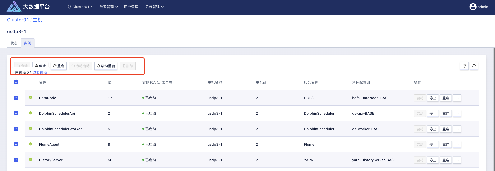
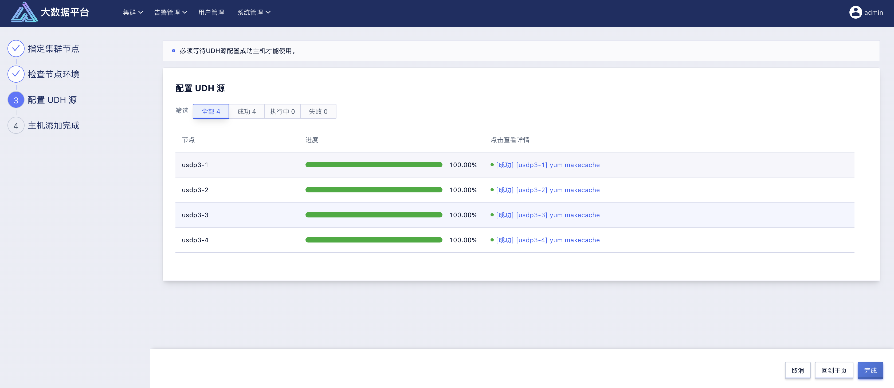
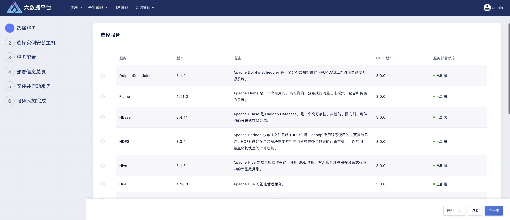

## 6.2 主机管理

在集群首页服务列表上方点击 “主机” 按钮，即会进入该集群的主机管理界面，如下图所示：


在该页面中，将集中对当前集群所管理的所有主机进行统一管理，包括对主机层面的操作、主机的资源使用情况概览及详细监控、大数据服务的分布查看，以及大数据服务组件的管理操作等；

如上图所示，主机管理页面中，可以查看到各台主机的关键信息，便于日常维护和使用，含主机名、主机的状态、主机的 IP 地址；还可查看各主机的资源情况，含主机 CPU 的核数、CPU 使用情 况、主机的内存使用情况、主机的磁盘使用情况。

### 6.2.1 主机控制

对于集群主机的控制层面，支持主机的扩展添加、删除操作。删除时，为避免误操作，系统会自动判断待删除主机上是否还有运行大数据实例，并提醒使用者，需要删除主机上的所有实例后才可以删除该主机。

### 6.2.2 主机控制及监控

除了在主机管理页面中可以查看到主机的部分关键信息外，点击 “主机名” 可进一步查看该主机的详细信息及监控信息。


如上图所示，主机“状态”页面中，左侧显示了该主机的详细信息，右侧显示该主机的监控指标信息；

监控图表支持手动设置时间粒度并画图，包括最近的 1 小时、3 小时、6 小时、12 小时、1 天、3 天、7 天的；支持自定义时间粒度；支持图表自动刷新展示。

### 6.2.3 主机中运行的大数据服务实例管理


在主机管理页面中，看概览到各主机上正在运行的大数据服务实例情况，如上图所示。点击实例统计数字，可进一步查看实例详情。


主机 “实例” 详情页面，可清楚查看到，运行在当前主机中的实例列表，如上图所示，可查看到实例的 监控“状态”、“名称”、“实例的运行状态”、实例所在的 “主机名”、实例归属的 “服务名称”、实例所属的 “角色配置组”。



主机 “实例” 详情页面，支持使用者对该主机上运行的大数据服务实例进行逐一/批量管理操作，如上图所示，可逐一/批量的进行“启动”、“停止”、“重启”、“滚动启动”、“滚动重启”、“删除”等操作。

值得注意的是，在对某个实例进行“删除”操作时，为避免误操作，需使该实例处于“停止”状态时，才可执行“删除”操作。

#### 6.2.4 为集群扩展主机

为达到集群资源可分布式线性扩展目的，使用者可通过 USDP 提供的简单的环境修复及初始化工具，以及可视化的向导化方式，便捷的为集群批量扩展新的主机节点。

#### 6.2.4.1 主机环境修复与初始化

- 为待添加的主机配置 hostname

```shell
hostnamectl set-hostname HOSTNAME
```

!> - 主机被添加进集群并且部署服务后，不允许修改主机名（服务配置中的主机名无法同步修改）

- 为待添加的主机配置 ssh key 

```shell
ssh-keygen -t rsa
ssh-copy-id -i ~/.ssh/id_rsa.pub root@10.76.198.54
```

!> - 需使用 ssh-copy-id 命令为该新节点所要进集群的其他所有节点免密，对 USDP-server 主机节点免密。

- 将待添加主机的信息添加至 usdp-server 主机的 hosts.yml 文件

!> - 请将待添加的主机信息追加至 hosts.yml 文件中 work_node.hosts 最下方（需要保留之前已经初始化完成机器信息）。

USDP 提供的修复及初始化工具，支持分布式环境的幂等性，因此，新增节点配置至 hosts.yml 中并执行时，保证了对原有集群以及管理服务节点的不受到影响。

找到 usdp-server 所在主机，编辑该主机的 /data/usdp-srv/env-prepare/inventories/hosts.yml 文件，在“work_node”中追加待添加主机的 hosts（IP 地址）和 Node_name（主机名，若在前面未配置主机名，则需要在此处配置该节点主机名），注意保持格式无误。

```yaml
all:
  vars:
    # 如果下面指定的 3 个 ntp_server 不能访问互联网，请设置 with_internet_ntp: false
    # 并且打开 internal_ntp_servers 的注释设置至少一个内部可访问的 ntp server
    with_internet_ntp: true
    #internal_ntp_servers:
    #  - 10.0.1.11
    #  - 10.0.1.12
 
    # SSH root 密码，按实际情况修改，如果已经配置了 ssh key 免密登录，则该变量无效
    ansible_password: ssh_password_of_root
    # MySQL root 密码，按实际情况修改
    mysql_root_password: xxx_mysql_root_password
    # usdp server 监听端口，按实际情况修改
    usdp_server_port: 80
 
################################################################
# Groups
################################################################
# ntp server 选 3 个节点
ntp_server:
  hosts:
    10.76.198.51:
    10.76.198.52:
    10.76.198.53:
 
# usdp server 和 mysql server 单节点
usdp_server:
  hosts:
    10.76.198.51:
 
# work node(s)
# 根据需要放开下面的 NODE_NAME 变量注释，并分别修改成需要的 hostname 值，来设置主机的 hostname
# 如果不放开 NODE_NAME 变量，且 hostname != localhost ，则不设置 hostname ，保留当前主机名
# 如果不放开 NODE_NAME 变量，且 hostname == localhost ，则设置 hostname 为 IP 字符串（替换 IP 中的 '.' 为 '_'），例如：10_76_198_19
#
# 主机名(NODE_NAME)-命名规则：
# 1、主机名只允许包含ascii字符里的数字0-9、字母a-zA-Z、连字符-、其他都不允许。例如，不允许出现其他标点符号，不允许空格，不允许下划线，不允许中文字符
# 2、主机名的开头和结尾字符不允许是连字符
# 3、主机名命名不允许出现 “数字-数字” 这种模式
#
# 主机被添加进集群并且部署服务后，不允许修改主机名
#
work_node:
  hosts:
    10.76.198.51:
      NODE_NAME: usdp3-1
    10.76.198.52:
      NODE_NAME: usdp3-2
    10.76.198.53:
      NODE_NAME: usdp3-3
    10.76.198.54:
      NODE_NAME: usdp3-4
```

**主机名（NODE_NAME）-命名规则（若手动已为各节点设置主机名，此处可以不必配置）：**

1、主机名只允许包含 ascii 字符里的数字 0-9、字母 a-zA-Z、连字符-、其他都不允许。例如，不允许出现其他标点符号，不允许空格，不允许下划线，不允许中文字符。

2、主机名的开头和结尾字符不允许是连字符。

3、主机名命名不允许出现 “数字-数字” 这种模式

!> - 主机被添加进集群并且部署服务后，不允许修改主机名（服务配置中的主机名无法同步修改）

- 执行修复和部署

在 usdp-server 主机上，执行下方命令。

```shell
cd /data/usdp-srv/env-prepare
make prepare
```

待执行完成，待新增节点即已完成初始化及环境修复，接下来，便可通过 USDP Web 控制台进一步可视化的操作集群主机扩展任务。

#### 6.2.4.2 主机扩展-向导


在集群首页的顶部操作菜单中，选择“添加主机”，进入添加服务向导。或在主机管理页面顶部点击“添加主机”按钮，便会进入扩展主机的向导。

##### Setp1：指定集群节点


如上图所示，用户仅需输入这些服务器的完全限定域名（hostname）即可。

为了方便批量录入，USDP 支持用户按照表达的方式录入，如上图所示。

?> **节点的完全限定域名填写规则说明：**</br>- 可单行输入每一个节点的完全限定域名；</br>- 可通过“[]”辅助输入有数字规律的主机完全限定域名；例如 usdp3-[1-3] 表示包含“usdp3-1”、“usdp3-2”、“usdp3-3”共三个节点。

USDP 需要通过“root”用户以及“22”端口，进行管理所有主机服务器。暂不支持对端口号进行更改。

补充好表单信息后，点击右下角的向导“下一步”按钮继续。


USDP 需要对上一步中指定的主机进行环境检测，例如节点间的网络互通性；所有节点检测通过的状态，如上图图所示。点击节点列表中“点击查看详情”栏的相应字样，即可查看该主机上的已检测以及正在检测的日志详情。

##### Setp2：检查节点环境


USDP 需要检查对应节点是否已经初始化完成，比如：JDK、MySQL、时间服务器等是否已经正确安装及配置。如上图所示。

检查过程共，可点击列表 “详情” 栏的 “检查中” 按钮，来查看 USDP 在各个节点上在做哪些事情。

待所有检查工作完成后，点击右下角的向导“下一步”按钮继续。


若碰到未经授权的报错提示时，可检查 USDP“授权管理”中的主机授权的授权数量是否充足，不足时，可扩展更新 License 后再次操作本向导流程。

##### Setp3：配置 UDH 源



USDP 需要通过 http 协议的源地址，为创建集群的各个主机提供安装包的支持，建议在创建集群前，前往 USDP Web 控制台“系统管理”-“UDH 源”中进行配置。此处参见本文档《UDH 源》章节内容。

##### Setp4：集群主机扩展完成

完成上述步骤的执行后，即已成功为集群添加新主机。

一般情况下，新添加的主机节点，使用者会为其规划用作存储或计算服务的水平扩展，若需要稍后再操作，可点击“稍后安装”按钮，退出扩展主机向导。



若需要快速为新节点添加服务或服务实例，可点击“立即安装”按钮，即会进入服务添加向导。此处，可参考本文档《为集群扩展服务-向导》章节的内容继续操作，在此不做赘述。