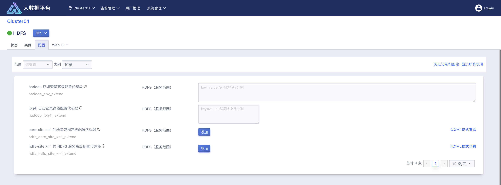
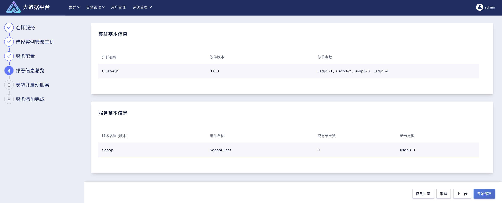

## 6.3 服务管理

在智能大数据平台 USDP 中，为集群中各个大数据服务，提供了统一的管理方式，譬如在集群管理首页，就能直观的查看到该集群中已部署使用的各大数据服务的基本健康状态、服务的启停状态，以及针对单个服务的便捷操作；若需要查看各个服务详细的信息，服务的监控信息，服务所需实例的分布情况，管理服务配置，服务原生 Web UI 访问等，辅助使用者更好的管理和使用大数据服务。

本章节，就以 HDFS 服务为例，说明 USDP 提供的服务管理能力，仅供使用者参考。其他服务管理方式相同。

### 6.3.1 服务控制及监控

在浏览器中打开 USDP Web 控制台并登陆，切换至需要管理和操控的集群。此时，在集群管理首页左侧，找到“HDFS”并点击，即可跳转进入HDFS的详情页。

#### 6.3.1.1 服务级控制

如上图所示的部分，会展示当前服务 HDFS 的状态（绿色圆点表示服务运行状态），服务名称，针对该服务的操作等。

关于服务的运行状态，主要有：

| 状态                                                         | 说明                                                    |
| ------------------------------------------------------------ | ------------------------------------------------------- |
|  | 已选择                                                  |
|  | 新增服务部署中                                          |
|  | 已有服务增量部署实例中                                  |
|  | 启动中                                                  |
|  | 重启中                                                  |
|  | 服务已部署，并且服务已启动                              |
|  | 服务已部署，但存在已选择的新增实例尚未执行/正在执行部署 |
|  | 停止中                                                  |
|  | 服务已部署，但服务已停止                                |
|  | 移除中                                                  |

目前支持对服务进行“启动”、“停止”、“重启”、“滚动启动”、“滚动重启”、删除等操作。

滚动启动，即为串行启动多个实例

滚动重启，即为串行重启多个实例

#### 6.3.1.2 服务状态详情

HDFS 服务详情状态页的顶部位置，展示了 HDFS 服务的相关详细信息，如“服务名称”、“版本号”、服务的运行“状态”、服务“描述”等信息。

#### 6.3.1.3 服务监控详情

如上图所示，HDFS 服务详情状态页面的下方“监控数据”模块中，为使用者展示了关于 HDFS 的部分核心监控指标信息，如与 GC、堆内存、NameNode、DateNode、ZK 等等相关的监控图表信息。

监控图表支持手动设置时间粒度并画图，包括最近的 1 小时、3 小时、6 小时、12 小时、1 天、3 天、7 天的；支持自定义时间粒度；支持图表自动刷新展示。

### 6.3.2 服务实例管理

在服务详情-“实例”页面中，可以看到该服务相关的所有实例的分布情况，对于各个实例，关键信息展示有实例的“监控状态”、实例本身的“名称”、实例的“实例状态”、实例所在主机的“主机名称”、实例所属的“服务名称”、实例所属的“角色配置组”。

实例状态：

| **状态**                                                     | **说明** |
| ------------------------------------------------------------ | -------- |
|  | 可用     |
|  | 不可用   |
|  | 未知状态 |

服务“实例”，支持对该服务中已运行的实例进行逐一/批量管理操作，如上图所示，可逐一/批量的进行“启动”、“停止”、“重启”、“滚动启动”、“滚动重启”、“删除”等操作。

需要注意的是，在对某个实例进行“删除”操作时，为避免误操作，需使该实例处于“停止”状态时，才可执行“删除”操作。

#### 6.3.2.1 服务实例添加-向导

在服务详情-“实例”页面中顶部的实例操作区域，找到“添加实例”按钮，即可进入添加向导。

本章节将以 HDFS 为示例，介绍如何为当前集群的 HDFS 服务扩展 DataNode 实例，其他服务实例的添加操作方式同理。

##### Setp1：选择实例安装节点

UDH 提供的大数据生态服务，均由不同的实例构成，安装集群时，使用者可根据业务需求做好服务在集群主机中的分布规划，将不同的服务及实例分别安装到分布式集群的哪些主机上去。

USDP 会以实例组的方式展示当前服务的各个实例在分布式集群中的分布情况并呈现给使用者，如上图所示。此时，使用者可在点击 DataNode 实例组按钮，为 DataNode 扩展新节点。

如上图所示，可看到当前集群有一台主机上暂未运行任何大数据服务和实例，以及其他主机上已运行的各服务的各个实例的分布情况。对于 DataNode 实例而言，扩展只能扩展还未部署 DataNode 实例的主机上。此时，勾选可部署 DataNode 实例的主机，点击“确定”按钮，并执行向导“下一步”。

?> **提示：** - 在为待添加的服务实例选择安装节点时，因在其使用过程中需依赖安装节点的计算、存储和网络资源，因此，建议使用者提前考虑该服务实例的业务场景和可能的资源消耗，**请根据当前集群所管理的各个主机硬件配置情况、该主机上已部署服务的使用情况和性能情况，合理规划，以免该服务的运行干扰到当前节点本身提供的服务性能。**

##### Setp2：服务配置

进入到服务配置页面时，如上图所示，需使用者自行对所选的实例进行部分配置项设置，如数据存储路径、需要的数据库信息填写等等信息。

如对 DataNode 数据存储目录的设置中，若所选择的主机存在多块数据盘，可根据实际规划及需求，手动“添加”HDFS 数据存储至主机的多块数据盘的文件路径。

##### Setp3：部署信息总览

完成前几个向导步骤中的信息配置后，USDP 会将当前“集群基本信息”、以及“服务基本信息”概览呈现给使用者进行校验，如上图所示。

使用者浏览检查无误后，点击向导“下一步”按钮继续执行。

##### Setp4：安装并启动服务

在此步骤中，USDP 将根据前几步的配置信息生成部署任务计划，并开始逐项执行服务安装工作，并展示任务执行的进展情况。若需了解执行进展细节。可在“点击查看详情” 栏中的各个链接中，查看当前执行步骤的详细情况，如上图所示。

当服务安装发生错误时，使用者可以点击查看报错节点“失败”详情，参考详情提示信息，进行手动修复错误操作，或点击“全部重试”按钮，重新进行服务组件部署工作。

待所有任务执行完成，主机进度条显示 100% 时，即表示已成功为当前服务完成实例添加。

##### Setp5：实例添加完成

退出实例添加向导后，即可在服务实例管理页面中查看新实例的分布和运行情况了，如下图所示。

### 6.3.3 服务配置管理

在智能大数据平台 USDP v3.x 中，无论 USDP 提供的哪种大数据生态技术服务，使用者均需通过 USDP Web 控制台进行服务配置管理。

!> **注意：** - 在 USDP v3.x 中，我们**不希望**使用者**自行登录集群服务器手动修改 USDP 提供的大数据生态服务组件的配置文件！**如若被自行更改，这将导致手动更改的内容不会被记录至该服务的“历史记录”中，更无法回滚生效；同时，手动操作配置内容可能会被管理服务覆盖，导致丢失的情况。- **建议使用者充分使用 USDP Web 控制台中提供的服务配置管理功能**，使用参见本手册《服务配置管理》章节内容。

进入服务详情-“配置”页面中，可以为当前大数据服务进行配置的管理操作。

此处，以 HDFS 的配置管理为例进行说明。

如上图所示，进入 HDFS 的配置页后，即可查看所有与当前服务 HDFS 相关的配置详情，使用者可翻页查找需要调整的配置项进行修改。

因部分大数据服务配置复杂，且配置项较多，USDP 控制台支持实例和配置类别过滤的策略，辅助使用者快速查找到需要调整的配置项，如上图所示，HDFS 配置可以按照“范围”、“类别”两个维度进行过滤筛选配置项。

#### 6.3.3.1 服务高级配置

当使用者需要调整的配置项并未被 USDP 所管理时，通过类别筛选“扩展”来找查对应配置项，以源文件的格式输入配置项值“key-value”。如：追加 HDFS 配置“`dfs.namenode.http-bind-host`”到hdfs-site.xml 配置文件中，如上图所示，编辑配置项“`hdfs_hdfs_site_xml_extend`”，点击添加按钮，输入相应 key-value，或者以 XML 格式输入：`<property><name>dfs.namenode.http-bind-host</name><value>0.0.0.0</value></property>`。

配置修改保存成功后，如上图所示：过期配置：需要重启。重启服务实例使其配置生效，应用至此服务中所有角色的配置（客户端配置除外）。

?> - 使用高级配置代码段进行配置时，支持“以 XML 格式查看”或“视图编辑器”两种方式设置配置信息；

#### 6.3.3.2 服务配置历史和回滚

USDP 支持服务级别的配置“历史记录和回滚”操作，每一次更改某服务的配置，则会被记录至该服务的“配置”管理页面“历史记录和回滚”中。

上图为“HDFS”的服务更改历史列表。

点击列表中某条消息，可查看该历史版本的更改明细；使用者也可根据需求判断，是否将当前配置文件“回滚”至该历史版本更改前的状态，如上图所示，若需要回滚，请点击“版本详细信息”对话框的“还原配置更改”按钮；

如上图所示，此时产生了一条“已还原”的配置更改历史；

#### 6.3.3.3 服务重启生效

如上图所示，当使用者对某项服务进行配置修改后，USDP 会自动判断，该配置的修改，是否需要对服务/实例进行重启才可以生效新配置信息。若需要，则会在服务实例列表中进行提示，使用者按提示的实例执行重启/滚动重启操作即可。

### 6.3.4 服务 Web UI 访问

为便于使用者对集群提供的各个大数据服务的高效便捷使用，USDP 已主动集成并支持了各个服务默认自带的所有 Web UI 的快捷打开方式。

此处，以 HDFS 的 Web UI 为例进行说明。

点击 HDFS 服务详情页面中“Web UI”选项卡时，会在弹出的下拉菜单中展开 HDFS 相关的原生 Web 页面链接，如下图所示：

点击“NameNode Web UI(usdp3-3)”，会自动在浏览器中打开新的标签页，并显示 usdp3-3 节点上的 dfshealth 管理页面，如下图所示：

此处，以 Ranger 的 Web UIs 为例进行说明。

?> - 打开部分大数据生态服务 Web UI 方式时，需要输入口令，默认口令可参见 **各服务 Web UIs 登录账号章节**。

若集群使用内网 IP 进行搭建，部分服务 Web UIs 即会只监听内网请求；还有一部分服务是监听所有 IP 的请求，（不区分内外网络）。

以下服务的部分 WebUI 默认监听具体 IP，需要用相应 IP 进行访问：

| **服务名称** | **端口号**        |
| ------------ | ----------------- |
| HDFS         | 50070             |
| YARN         | 8088、8188、19888 |

### 6.3.5 为集群扩展服务-向导

在使用 USDP 管理大数据业务集群时，使用者可根据需求灵活管理集群中需要的各类大数据服务及相关组件。本章节中，将介绍如何通过 USDP 来为集群添加部署大数据服务，并管理该服务对应的组件。

开始之前，使用者需要先在 USDP 控制台中，切换当前集群为待添加服务或组件的集群。

如上图所示，当前集群首页的操作菜单中，选择“添加服务”，进入添加服务向导。

本章节将以 Sqoop 为示例，介绍如何为当前集群添加 Sqoop 服务，其他服务添加的操作方式同理。

?> - Sqoop 是一个轻量级的数据采集与转储服务，主要以 Client 的方式运行于集群的某些节点上；

#### Setp1：选择服务

在本步骤中，需要选择当前集群未部署的大数据生态服务。浏览 USDP 支持的服务列表，找到未部署使用的 Sqoop 服务。

勾选 Sqoop 左侧的单选框，点击右下角的“下一步”按钮。如上图所示。

#### Setp2：选择组件安装主机

在“选择组件安装主机”的向导页中，请为 SqoopClient 选择计划安装的节点，如上图所示：

点击带“+”的按钮后，USDP 会以对话框的形式，展示当前集群所管理的主机，查找到计划部署新增加服务的主机后，勾选主机名左侧的复选框。

?> - 在为待添加的服务选择安装主机时，因在其使用过程中需依赖待安装主机的计算、存储和网络资源，因此，建议使用者提前考虑该服务的业务场景和可能的资源消耗，**请根据当前集群所管理的各个主机硬件配置情况、该主机上已部署服务的使用情况和性能情况，合理规划，以免该服务的运行干扰到当前主机本身提供的服务性能。**

选择好后点击向导“下一步”按钮。

#### Setp3：服务配置

在该步骤中，需要对服务做一些必要的初始配置。待配置信息设置完成，点击向导“下一步”按钮。

本案例中所添加的 Sqoop 服务，在该步骤中无需设置配置信息，因此可以直接进行下一步操作。

#### Setp4：部署信息总览

如上图所示，在本步骤中 USDP 管理服务将检测出，已被当前集群管理的主机，并展示当前添加的服务已选择部署的主机信息，经浏览确认无误后，点击“开始部署”按钮。

#### Setp5：安装并启动服务

进入本步骤是，USDP 将生成部署计划，并开始在已选择的主机上执行部署新增服务的进度。

待安装进度完成后，点击“完成”按钮，退出服务或组件安装向导。