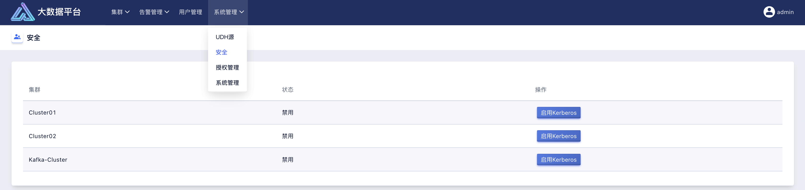
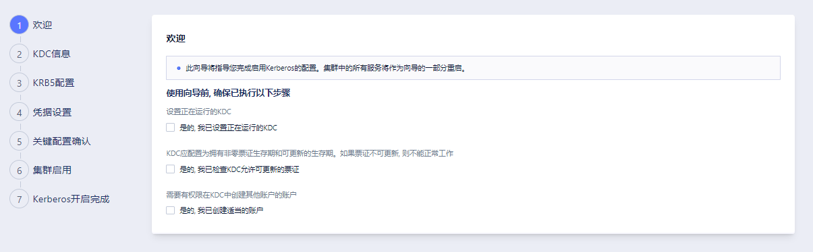
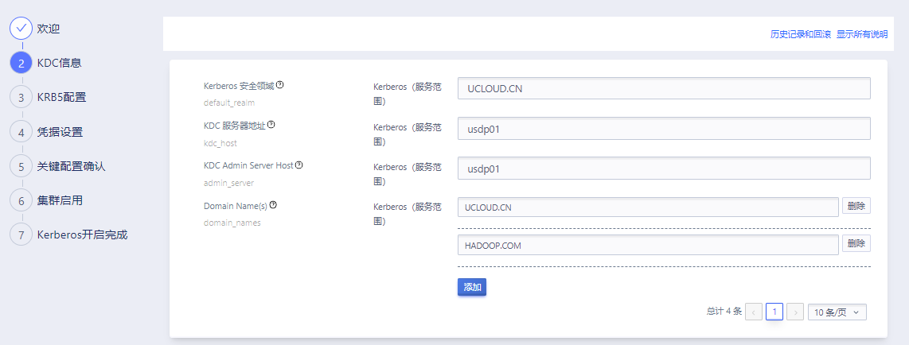
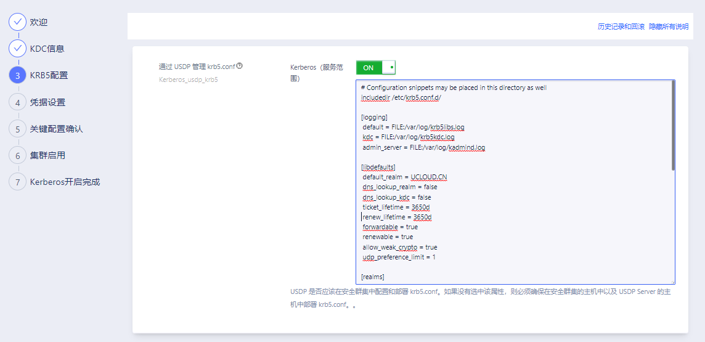
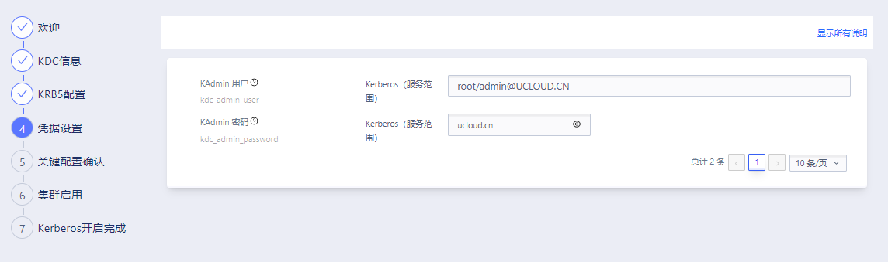
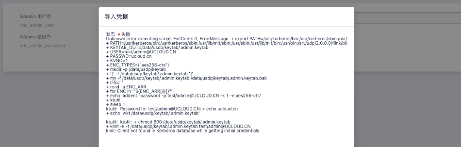
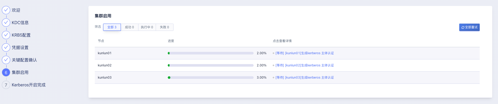
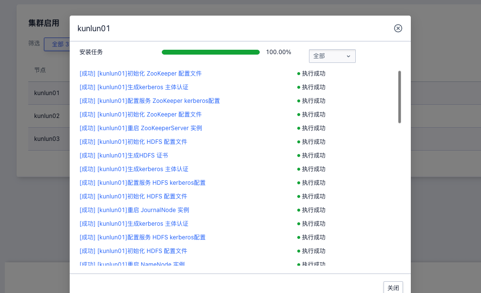

## 8.2 安全



USDP 支持通过控制台快速为单个集群进行安全状态管理，如“启用Kerberos”、“禁用Kerberos”。

使用 USDP 为集群启用并管理 Kerberos 安全认证前，需要使用者自行部署搭建 KDC 服务并确保其正常运行中，KDC 能正常允许更新票证。启用 kerberos 安全认证时，需要额外搭建 kerberos KDC 服务，并在客户端安装 Kerberos 相关的依赖包。

目前 Kerberos 支持的组件有：Zookeeper、HDFS、 YARN、 Hive、 HBase、 Spark、Impala、Hue、Kafka、 Ranger。

### 8.2.1 名词解释

- Kerberos：是一种网络认证协议，其设计目标是通过密钥系统为客户机 / 服务器应用程序提供强大的认证服务。
- KDC（Key Distribution Center）: 是一个网络服务，提供 ticket和临时会话密钥
- Principal：认证的主体 例如: `hadoop/kunlun01@UCLOUD.CN`
- realm name：包含 KDC 和许多客户端的 Kerberos 网络，类似于域，俗称为领域。例如：UCLOUD.CN
- keytab：keytab 是包含 principals 和加密 principal key 的文件

### 8.2.2 启用Kerberos向导

如上图所示，当要为某一集群启用 Kerberos 时，在安全管理页面的集群列表中，找到待启用 Kerberos 的集群右侧，点击“启用 Kerberos”按钮，进入启用向导。

!> - 在 Kerberos 开启配置向导执行中，该集群中的所有服务将作为向导的一部分重启，以便 Kerberos 能正常开启成功。再此之前，需要使用者确保待开启 Kerberos 的集群中的服务是处于可重启的状态，以免重启服务对业务带来影响。

此向导将指导使用者完成启用 Kerberos 的配置。集群中的所有服务将作为向导的一部分重启。

#### Setp1：启用前提信息确认



在该步骤中，需要使用者在开启 Kerberos 前，明确其列出的待确认项目，使用者确认无误后，勾选各项左侧的复选框，再进入向导下一步。

#### Setp2：KDC 信息



配置 KDC 信息，请正确填写相关信息，其中支持同时创建多个 Domain Name。

#### Setp3：KRB5 配置



开启“通过 USDP 管理 krb5.conf”后，USDP 会将右侧文本框中使用者调整后的配置信息分发到集群各个主机的 /etc/krb5.conf 中。

#### Setp4：凭证设置



请正确填写 KDC 的 KAdmin 用户名称及密码；在此向导中，会验证填写的信息是否正确。



若凭证导入失败，会有校验失败的报错提示，如上图所示。

#### Setp5：关键配置确认


启用生效前，确认配置信息是否有误。

#### Setp6：集群启用



执行至此步骤，USDP 将生成配置和安装任务进程，开始同步 keb5.conf 文件，并未支持 Kerberos 的发数据服务进行配置启用kerberos 及相关的操作，之后重启服务使其配置生效。



如上图所示，可以点击查看每个集群主机上的执行详情。

#### Setp7：Kerberos 开启完成

至此，则表示已为所选集群成功开启 kerberos 认证。

#### Setp8（可选）：验证 Kerberos

- 确认 Kerberos 配置信息

```shell
[root@kunlun01 tmp] ll /etc/krb5.conf
-rwxr-xr-x 1 root root 1031 12月  7 11:09 /etc/krb5.conf
[root@kunlun01 tmp] ll /data/usdp/keytab/hadoop.keytab
-rw-r--r-- 1 root root 1658 12月  2 11:58 /data/usdp/keytab/hadoop.keytab
```

- 节点机器上初始化 Kerberos 认证

```shell
[root@kunlun01 usdp] kinit -kt /data/usdp/keytab/hadoop.keytab hadoop/kunlun01@UCLOUD.CN
[root@kunlun01 tmp] ll /tmp/krb5cc_0
-rw------- 1 root root 750 12月  7 11:41 /tmp/krb5cc_0
```

- 组件 kerberos 确认

  **未获得 Kerberos 认证时操作 HDFS**

```shell
[root@kunlun02 ~] hadoop fs -ls /
2022-12-07 13:36:04,615 WARN org.apache.hadoop.ipc.Client: Exception encountered while connecting to the server
org.apache.hadoop.security.AccessControlException: Client cannot authenticate via:[TOKEN, KERBEROS]
    at org.apache.hadoop.security.SaslRpcClient.selectSaslClient(SaslRpcClient.java:179)
    at org.apache.hadoop.security.SaslRpcClient.saslConnect(SaslRpcClient.java:392)
    at org.apache.hadoop.ipc.Client$Connection.setupSaslConnection(Client.java:623)
    at org.apache.hadoop.ipc.Client$Connection.access$2300(Client.java:414)
    at org.apache.hadoop.ipc.Client$Connection$2.run(Client.java:843)
    at org.apache.hadoop.ipc.Client$Connection$2.run(Client.java:839)
    at java.security.AccessController.doPrivileged(Native Method)
    at javax.security.auth.Subject.doAs(Subject.java:422)
    at org.apache.hadoop.security.UserGroupInformation.doAs(UserGroupInformation.java:1878)
    at org.apache.hadoop.ipc.Client$Connection.setupIOstreams(Client.java:839)
    at org.apache.hadoop.ipc.Client$Connection.access$3800(Client.java:414)
    at org.apache.hadoop.ipc.Client.getConnection(Client.java:1677)
    at org.apache.hadoop.ipc.Client.call(Client.java:1502)
    at org.apache.hadoop.ipc.Client.call(Client.java:1455)
    at org.apache.hadoop.ipc.ProtobufRpcEngine2$Invoker.invoke(ProtobufRpcEngine2.java:242)
    at org.apache.hadoop.ipc.ProtobufRpcEngine2$Invoker.invoke(ProtobufRpcEngine2.java:129)
    at com.sun.proxy.$Proxy9.getFileInfo(Unknown Source)
    at org.apache.hadoop.hdfs.protocolPB.ClientNamenodeProtocolTranslatorPB.getFileInfo(ClientNamenodeProtocolTranslatorPB.java:965)
    at sun.reflect.NativeMethodAccessorImpl.invoke0(Native Method)
    at sun.reflect.NativeMethodAccessorImpl.invoke(NativeMethodAccessorImpl.java:62)
    at sun.reflect.DelegatingMethodAccessorImpl.invoke(DelegatingMethodAccessorImpl.java:43)
    at java.lang.reflect.Method.invoke(Method.java:498)
    at org.apache.hadoop.io.retry.RetryInvocationHandler.invokeMethod(RetryInvocationHandler.java:422)
    at org.apache.hadoop.io.retry.RetryInvocationHandler$Call.invokeMethod(RetryInvocationHandler.java:165)
    at org.apache.hadoop.io.retry.RetryInvocationHandler$Call.invoke(RetryInvocationHandler.java:157)
    at org.apache.hadoop.io.retry.RetryInvocationHandler$Call.invokeOnce(RetryInvocationHandler.java:95)
    at org.apache.hadoop.io.retry.RetryInvocationHandler.invoke(RetryInvocationHandler.java:359)
    at com.sun.proxy.$Proxy10.getFileInfo(Unknown Source)
    at org.apache.hadoop.hdfs.DFSClient.getFileInfo(DFSClient.java:1739)
    at org.apache.hadoop.hdfs.DistributedFileSystem$29.doCall(DistributedFileSystem.java:1753)
    at org.apache.hadoop.hdfs.DistributedFileSystem$29.doCall(DistributedFileSystem.java:1750)
    at org.apache.hadoop.fs.FileSystemLinkResolver.resolve(FileSystemLinkResolver.java:81)
    at org.apache.hadoop.hdfs.DistributedFileSystem.getFileStatus(DistributedFileSystem.java:1765)
    at org.apache.hadoop.fs.Globber.getFileStatus(Globber.java:115)
    at org.apache.hadoop.fs.Globber.doGlob(Globber.java:362)
    at org.apache.hadoop.fs.Globber.glob(Globber.java:202)
    at org.apache.hadoop.fs.FileSystem.globStatus(FileSystem.java:2124)
    at org.apache.hadoop.fs.shell.PathData.expandAsGlob(PathData.java:343)
    at org.apache.hadoop.fs.shell.Command.expandArgument(Command.java:252)
    at org.apache.hadoop.fs.shell.Command.expandArguments(Command.java:235)
    at org.apache.hadoop.fs.shell.FsCommand.processRawArguments(FsCommand.java:105)
    at org.apache.hadoop.fs.shell.Command.run(Command.java:179)
    at org.apache.hadoop.fs.FsShell.run(FsShell.java:327)
    at org.apache.hadoop.util.ToolRunner.run(ToolRunner.java:81)
    at org.apache.hadoop.util.ToolRunner.run(ToolRunner.java:95)
    at org.apache.hadoop.fs.FsShell.main(FsShell.java:390)
ls: DestHost:destPort kunlun01:8020 , LocalHost:localPort kunlun02/10.76.196.113:0. Failed on local exception: java.io.IOException: org.apache.hadoop.security.AccessControlException: Client cannot authenticate via:[TOKEN, KERBEROS]
```

​	**已取得认证时操作 HDFS**

```shell
[root@kunlun02 ~] kinit -kt /data/usdp/keytab/hadoop.keytab hadoop/kunlun02@UCLOUD.CN
[root@kunlun02 ~] hadoop fs -ls /
Found 4 items
drwxr-xr-x   - root   hadoop          0 2022-12-07 10:54 /kunlun123
-rw-r--r--   3 hdfs   hadoop   69406415 2022-12-07 10:54 /tez.tar.gz
drwxrwx---   - mapred hadoop          0 2022-12-07 10:55 /tmp
drwxr-xr-x   - hive   hadoop          0 2022-12-07 11:44 /user
[root@kunlun02 ~]
```

​	**未获得认证时操作 Hive**

```shell
[root@kunlun01 usdp] hive
SLF4J: Class path contains multiple SLF4J bindings.
SLF4J: Found binding in [jar:file:/usr/lib/hbase/lib/client-facing-thirdparty/slf4j-reload4j-1.7.33.jar!/org/slf4j/impl/StaticLoggerBinder.class]
SLF4J: Found binding in [jar:file:/usr/lib/tez/lib/slf4j-reload4j-1.7.36.jar!/org/slf4j/impl/StaticLoggerBinder.class]
SLF4J: Found binding in [jar:file:/usr/lib/hive/lib/log4j-slf4j-impl-2.17.1.jar!/org/slf4j/impl/StaticLoggerBinder.class]
SLF4J: Found binding in [jar:file:/usr/lib/hadoop/lib/slf4j-reload4j-1.7.36.jar!/org/slf4j/impl/StaticLoggerBinder.class]
SLF4J: See http://www.slf4j.org/codes.html#multiple_bindings for an explanation.
SLF4J: Actual binding is of type [org.slf4j.impl.Reload4jLoggerFactory]
Hive Session ID = 7a098aa6-7916-4265-a214-1a9e7898da67
 
Logging initialized using configuration in file:/etc/hive/conf.dist/hive-log4j2.properties Async: true
Exception in thread "main" java.lang.RuntimeException: java.io.IOException: DestHost:destPort kunlun01:8020 , LocalHost:localPort kunlun01/10.76.196.112:0. Failed on local exception: java.io.IOException: org.apache.hadoop.security.AccessControlException: Client cannot authenticate via:[TOKEN, KERBEROS]
    at org.apache.hadoop.hive.ql.session.SessionState.start(SessionState.java:651)
    at org.apache.hadoop.hive.ql.session.SessionState.beginStart(SessionState.java:591)
    at org.apache.hadoop.hive.cli.CliDriver.run(CliDriver.java:747)
    at org.apache.hadoop.hive.cli.CliDriver.main(CliDriver.java:683)
    at sun.reflect.NativeMethodAccessorImpl.invoke0(Native Method)
    at sun.reflect.NativeMethodAccessorImpl.invoke(NativeMethodAccessorImpl.java:62)
    at sun.reflect.DelegatingMethodAccessorImpl.invoke(DelegatingMethodAccessorImpl.java:43)
    at java.lang.reflect.Method.invoke(Method.java:498)
    at org.apache.hadoop.util.RunJar.run(RunJar.java:323)
    at org.apache.hadoop.util.RunJar.main(RunJar.java:236)
Caused by: java.io.IOException: DestHost:destPort kunlun01:8020 , LocalHost:localPort kunlun01/10.76.196.112:0. Failed on local exception: java.io.IOException: org.apache.hadoop.security.AccessControlException: Client cannot authenticate via:[TOKEN, KERBEROS]
```

​	**已取得认证时操作 Hive**

```shell
[root@kunlun01 tmp] hive
SLF4J: Class path contains multiple SLF4J bindings.
SLF4J: Found binding in [jar:file:/usr/lib/hbase/lib/client-facing-thirdparty/slf4j-reload4j-1.7.33.jar!/org/slf4j/impl/StaticLoggerBinder.class]
SLF4J: Found binding in [jar:file:/usr/lib/tez/lib/slf4j-reload4j-1.7.36.jar!/org/slf4j/impl/StaticLoggerBinder.class]
SLF4J: Found binding in [jar:file:/usr/lib/hive/lib/log4j-slf4j-impl-2.17.1.jar!/org/slf4j/impl/StaticLoggerBinder.class]
SLF4J: Found binding in [jar:file:/usr/lib/hadoop/lib/slf4j-reload4j-1.7.36.jar!/org/slf4j/impl/StaticLoggerBinder.class]
SLF4J: See http://www.slf4j.org/codes.html#multiple_bindings for an explanation.
SLF4J: Actual binding is of type [org.slf4j.impl.Reload4jLoggerFactory]
Hive Session ID = 022765f7-d0cf-47ea-9588-2ccb47e74337
 
Logging initialized using configuration in file:/etc/hive/conf.dist/hive-log4j2.properties Async: true
Hive Session ID = 05bc29a6-37fa-43dc-8a1c-0bc4d61f12b1
hive> show databases;
OK
default
test
Time taken: 0.876 seconds, Fetched: 2 row(s)
hive> use test;
OK
Time taken: 0.093 seconds
hive> show tables;
OK
employee
Time taken: 0.092 seconds, Fetched: 1 row(s)
```


