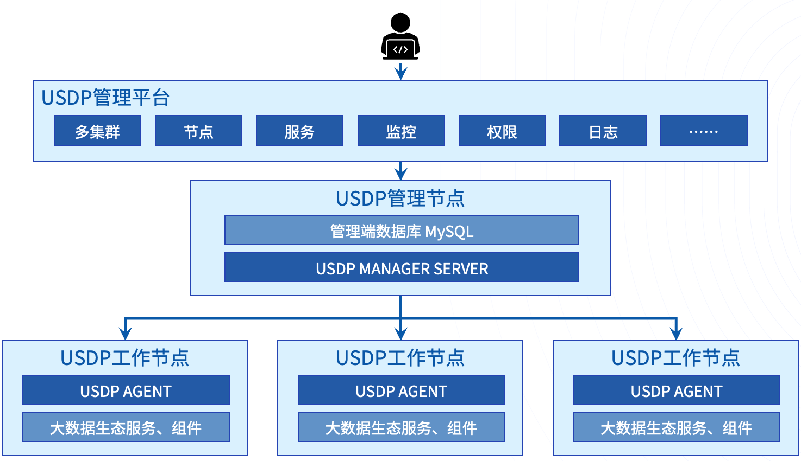

# USDP 专业版 V3.0.x 技术文档

## 产品概述

UCloud Smart Data Platform（简称 USDP）专业版，是 UCloud 推出的智能化、轻量级的大数据基础服务平台，能够帮用户快速构建起大数据的分析处理能力。

UCloud 基于多年大数据平台开发经验，发布了针对私有化部署场景下的一站式智能大数据平台 USDP 专业版。其具备构建于 IDC 物理服务器、云 IaaS 虚拟服务器的能力，其通过自研的 USDP Manager 管理工具，支持管理多套大数据集群，用户可创建资源独享的大数据集群。支持 HDFS 全生态，并在集群中管理 Hive、HBase、Spark 等开源的大数据组件，如进行集群节点、服务配置、监控告警、故障诊断等智能化的运维管理操作，从而协助用户轻松构建和管理大数据业务的分析处理能力。

## 自研管理组件，安全可靠性更高

USDP作为UCloud大数据团队自主研发的一站式智能大数据平台，其整体架构如下图所示：

​                         

Manager Server 为 USDP 管理端服务，需配备一个 MySQL 实例存储集群相关的元数据信息。Agent 为 USDP 工作节点控制端服务，用于管理、操作所在节点以及所在节点上的大数据服务。其中 BigData Service为各类大数据服务（例如：HDFS、YARN 等）。

Prometheus 作为监控服务，用于汇总并展示整个集群的监控数据。

USDP 支持最少3个节点，集群节点规模无上限限制，同时，允许Manager Server 与 Agent 等相关服务部署在相同的节点上，这样满足大型业务的同时，也尽可能帮助使用者使用较小的成本满足小型业务对数据分析的诉求。

## **USDP一站式智能大数据平台的核心优势**

### 无需担心业务绑定

USDP 中所包含的大数据服务、组件，均满足 Apache 2.0 开源协议，UCloud 大数据团队在做过大量兼容性测试后，积极回馈社区，并将编译后的兼容包全面公开发布。由于本身紧跟开源社区的步伐，使用者可以随时进行自主替换、自主建设、自主数据迁移、集群迁移等，因此无需担心大数据业务与闭源服务绑定。

基于开放式的管理架构，USDP 集成并适配了数十款开源的大数据生态开发组件，涵盖数据集成、数据存储、计算引擎、任务调度、权限管理等大数据处理的各个环节。用户可以根据自身业务特点和需求，从中选择相应的组件来搭建自己的大数据处理平台。

### 轻松部署方式

为了能让使用者体验到极简的大数据部署运维、管理方案，USDP 提供了丰富详细的部署、一键式环境修复工具及安装部署，并且使用者无需担心安装时准备众多内容，初始化环境只需要简单几步，即可自动完成配置。

USDP 管理服务中提供完善的集群控制及管理功能、提供向导式的操作流程、提供完善的场景创建案例推荐及组件分布推荐。

### 全面丰富的监控指标

USDP 预置的监控指标主要包含三部分内容：

- JMX 全量指标采集
- HTTP 常用指标采集
- 自定义指标采集

以上三部分监控数据最终将汇总于 USDP 的 Promethues 中，并在每个服务的概览页面中，展示最常用的监控指标。

### 灵活的交付模式

支持 USDP 纯软件部署交付模式；支持 USDP 超融合一体机的软硬一体化交付模式。

## 名词解释

- 实例：大数据组件服务允许实例，例如某主机上的启动的某个 DataNode。
- 角色配置组：某一类配置分组，例如 DataNode 配置都归属于默认 DataNode 角色配置组。支持自定义配置项（基于 defalut role group 默认角色组生成）。

- UDH：UCloud's Distribution Including Apache Hadoop （UCloud 大数据组件发行版）。

## 合作咨询

USDP专业版 [解决方案及合作咨询](usdpdc/consult)
