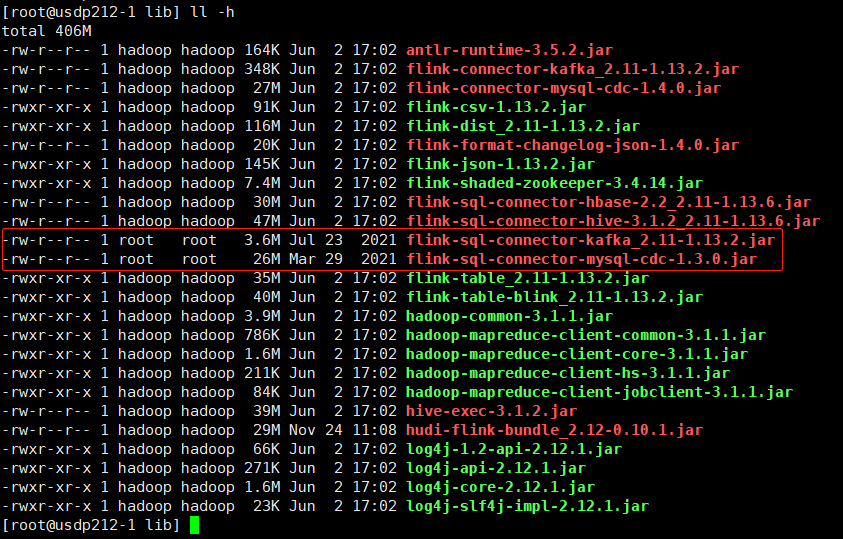
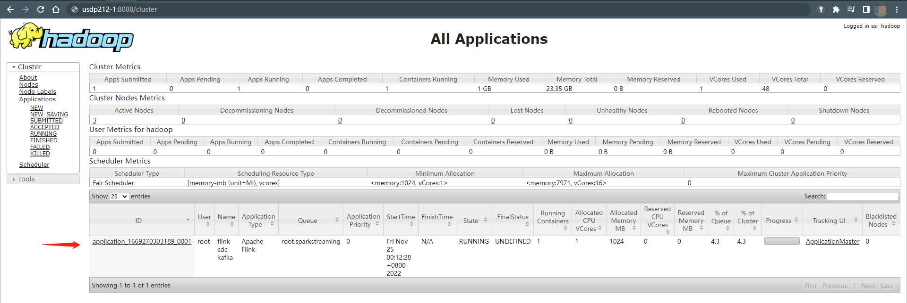
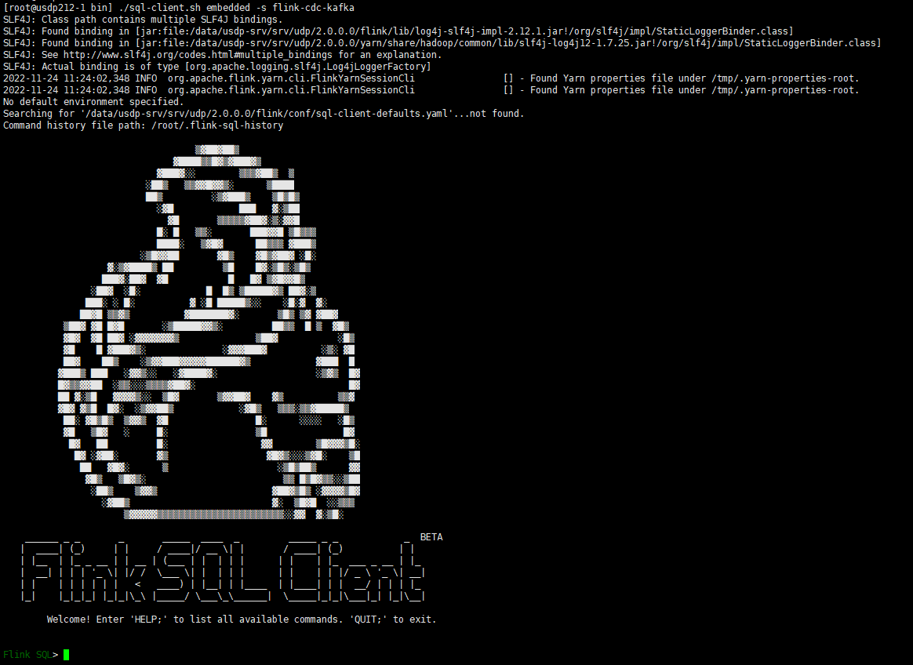
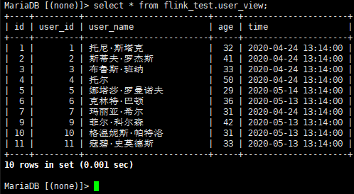
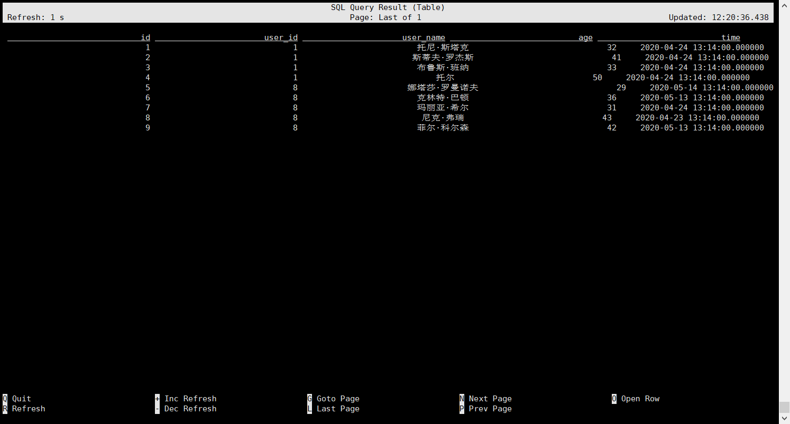
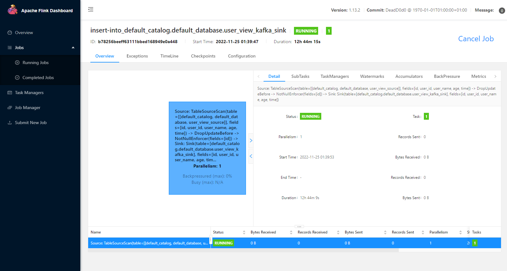
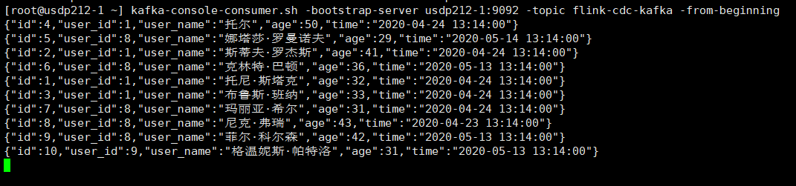

# Flink-CDC 同步 Mysql 数据到 Kafka

## 1. 环境准备

- USDP  v2.1.2

- Mysql  v15.1

- Kafka  v2.11-2.4.0

- Flink  v1.13.2 on Yarn

## 2. 下载依赖包

- [flink-sql-connector-kafka_2.11-1.13.2.jar](https://repo.maven.apache.org/maven2/org/apache/flink/flink-sql-connector-kafka_2.11/1.13.2/flink-sql-connector-kafka_2.11-1.13.2.jar)  若 Flink 为其他版本，点击[这里](https://repo.maven.apache.org/maven2/org/apache/flink/flink-sql-connector-kafka_2.11/)查找 jar 包；

- [flink-sql-connector-mysql-cdc-1.3.0.jar](https://repo.maven.apache.org/maven2/com/alibaba/ververica/flink-sql-connector-mysql-cdc/1.3.0/flink-sql-connector-mysql-cdc-1.3.0.jar)  若需要其他版本，点击[这里](https://repo.maven.apache.org/maven2/com/alibaba/ververica/flink-sql-connector-mysql-cdc/)查找 jar 包；

如果你是更高版本的 Flink，可以自行https://github.com/ververica/flink-cdc-connectors下载新版 `mvn clean install -DskipTests` 自己编译。   包下载好之后，放在 Flink lib 目录 `/srv/udp/2.0.0.0/flink/lib` 下：



## 3. 启动 Flink SQL Client

### 3.1 通过 Flink 启动 Yarn 的一个资源队列 application 

进入 flink bin 目录 `/srv/udp/2.0.0.0/flink/bin`，执行：

```shell
./yarn-session.sh -d -s 1 -jm 1024 -tm 2048 -qu root.sparkstreaming -nm flink-cdc-kafka
```



### 3.2 进入 Flink SQL 命令行

注意，需指定关联已创建的资源队列 `flink-cdc-kafka` 。

```shell
./sql-client.sh embedded -s flink-cdc-kafka
```



## 4. 测试数据准备

Mysql 数据准备

```shell
mysql> create database 'flink_test';
mysql> use flink_test;
```

测试表及样本数据

```sql
CREATE TABLE `user_view` (
`id` int(11) NOT NULL AUTO_INCREMENT,
`user_id` int(11) NOT NULL,
`user_name` varchar(10) NOT NULL,
`age` int(3) NOT NULL,
`time` datetime NOT NULL,
PRIMARY KEY (`id`),
KEY `time` (`time`),
KEY `users` (`user_id`,`user_name`) USING BTREE
) ENGINE=InnoDB DEFAULT CHARSET=utf8mb4;

--样本数据--
INSERT INTO `user_view` VALUES ('1', '1', '托尼·斯塔克', '32', '2020-04-24 13:14:00');
INSERT INTO `user_view` VALUES ('2', '1', '斯蒂夫·罗杰斯', '41', '2020-04-24 13:14:00');
INSERT INTO `user_view` VALUES ('3', '1', '布鲁斯·班纳', '33', '2020-04-24 13:14:00');
INSERT INTO `user_view` VALUES ('4', '1', '托尔', '50', '2020-04-24 13:14:00');
INSERT INTO `user_view` VALUES ('5', '8', '娜塔莎·罗曼诺夫', '29', '2020-05-14 13:14:00');
INSERT INTO `user_view` VALUES ('6', '8', '克林特·巴顿', '36', '2020-05-13 13:14:00');
INSERT INTO `user_view` VALUES ('7', '8', '玛丽亚·希尔', '31', '2020-04-24 13:14:00');
INSERT INTO `user_view` VALUES ('8', '8', '尼克·弗瑞', '43', '2020-04-23 13:14:00');
INSERT INTO `user_view` VALUES ('9', '8', '菲尔·科尔森', '42', '2020-05-13 13:14:00');
```

检查数据



## 5. 同步数据

### 5.1 创建关联 Mysql 表的 Flink 数据表

```sql
Flink SQL>
> show databases;
+------------------+
|    database name |
+------------------+
| default_database |
+------------------+
1 row in set


Flink SQL> use default_database;
[INFO] Execute statement succeed.
Flink SQL> show tables;
+------------------+
|       table name |
+------------------+
| user_view_source |
+------------------+
1 row in set

Flink SQL>
```

创建 Flink 表

```sql
CREATE TABLE user_view_source (
`id` int,
`user_id` int,
`user_name` varchar,
`age` int,
`time` timestamp,
PRIMARY KEY (`id`) NOT ENFORCED
) WITH (
'connector' = 'mysql-cdc',
'hostname' = 'usdp212-1',
'port' = '3306',
'username' = 'root',
'password' = 'S2sd9d8sjduss',
'database-name' = 'flink_test',
'table-name' = 'user_view'
);
```

查询源表数据

```sql
Flink SQL> select * from user_view_source;
```

若查询正常，则如下显示



此时，在 Flink SQL Client 中操作这张表，就相当于在操作 Mysql 里面对应的那张 `user_view` 表。

若执行中碰到如下报错，请更该 mysql 的 binlog 格式为 row，并重启 mysql；

```shell
……
[ERROR] Could not execute SQL statement. Reason:
org.apache.kafka.connect.errors.ConnectException: The MySQL server is not configured to use a ROW binlog_format, which is required f this connector to work properly. Change the MySQL configuration to use a binlog_format=ROW and restart the connector.
```

### 5.2 创建关联 kafka topic 的 Flink 数据表

```sql
CREATE TABLE user_view_kafka_sink(
`id` int,
`user_id` int,
`user_name` varchar,
`age` int,
`time` timestamp,
PRIMARY KEY (`id`) NOT ENFORCED
) WITH (
'connector' = 'upsert-kafka',
'topic' = 'flink-cdc-kafka',
'properties.bootstrap.servers' = 'usdp212-1:9092',
'properties.group.id' = 'flink-cdc-kafka-group',
'key.format' = 'json',
'value.format' = 'json'
);
```

通过 Flink 建表，kafka 里面的 `flink-cdc-kafka` 这个 topic 会被**自动创建**；如果想要给 topic 指定一些属性，可以在此之前手动创建好 topic；当操作 Flink 表 `user_view_kafka_sink` ，并往里面插入数据，可已看到 kafka 中已经有数据了。

### 5.3 同步数据

建立同步任务，可以执行如下 Flink SQL：

```sql
Flink SQL> insert into user_view_kafka_sink select * from user_view_source;
```

此时，可退出 flink sql-client，并进入 flink web-ui ，即可看到 mysql 表数据已经同步到 kafka topic 中了。



并且，对 mysql 表再次进行数据插入，kafka 仍会保持同步更新。



