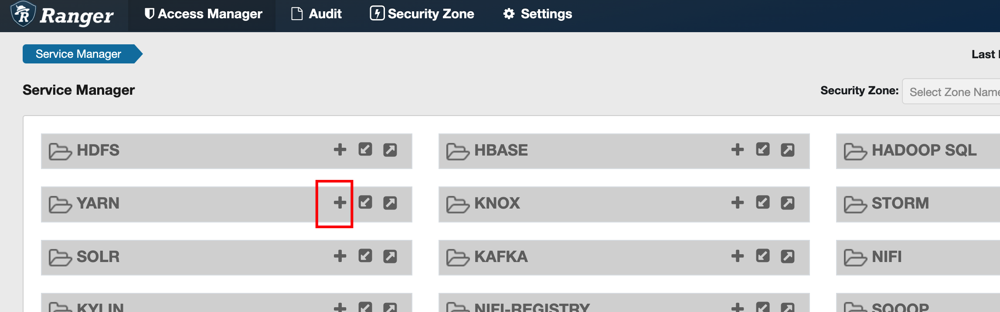
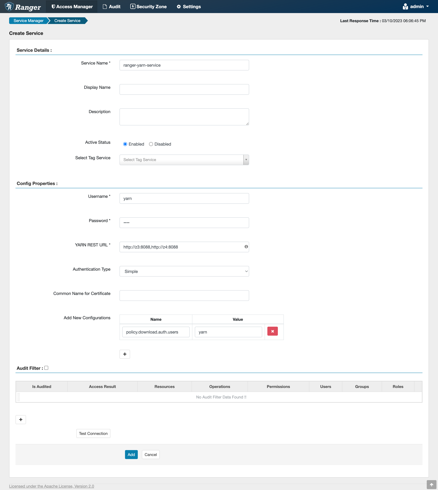
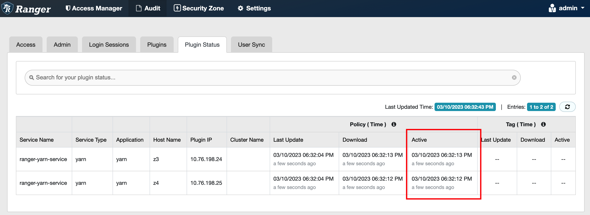

# 添加 YARN 的 Ranger 访问权限服务

## 操作场景

Ranger 管理员可通过 Ranger 为 YARN 用户配置 YARN 管理员权限以及 YARN 队列资源管理权限。

## 前提条件

- 已安装 Ranger 服务且服务运行正常。
- 已创建或通过 RangerUserSync 同步需要配置权限的用户、用户组或 Role。

## 操作步骤

1. 使用 Ranger 管理员用户登录 Ranger 管理页面。
2. 在“Service Manager”中的 YARN 处，单击“+”添加 YARN Service。
   图 1 添加 YARN Service
   
3. 请参考表 1 填写添加 YARN Service 的相关参数，未在表中列出的参数请保持默认值。
   表 1 参数说明
   | 参数 | 说明 | 示例值 |
   | -------------------- | ---------------------------------------------------------------------------------------------------------------------------------------------------------------------------------------------------------------------------------------------------------------------------------- | ------------------------------------------------------------------------------------------------------------------------------ |
   | Service Name | 创建的 service name 名称，固定填写：ranger-yarn-service。 | ranger-yarn-service |
   | Username | 可以任意填写。 | yarn |
   | Password | 可以任意填写。 | yarn |
   | YARN REST URL | 连接 YARN ResourceManager 的 URL。 | http://z3:8088,http://z4:8088 |
   | Add New Configurations | 增加额外配置。 | **Name**: policy.download.auth.users **Value**: yarn |

   图 2 添加 YARN Service
   

4. 单击“Add”添加服务。
5. 启动 Ranger YARN Plugin，授权 Ranger 管理 YARN。

   a. 在 USDP 控制台 YARN 服务的实例列表中找到所有 ResourceManager 所在主机，并分别登录这些主机使用 `yum install -y ranger-yarn-plugin` 命令安装 Ranger YARN 插件。

   b. `cd /usr/lib/ranger-yarn-plugin/`后，编辑 `install.properties` 配置文件，参考表 2 填写相关参数。

   表 2 ranger-yarn-plugin install.properties 参数说明
   | 参数 | 说明 | 示例值 |
   | -------------------- | ---------------------------------------------------------------------------------------------------------------------------------------------------------------------------------------------------------------------------------------------------------------------------------- | ------------------------------------------------------------------------------------------------------------------------------ |
   | POLICY_MGR_URL | RangerAdmin URL。 | http://z1:6080 |
   | REPOSITORY_NAME | Ranger YARN 策略的服务名称。 | ranger-yarn-service |
   | COMPONENT_INSTALL_DIR_NAME | Ranger YARN 插件安装地址。 | /usr/lib/hadoop-yarn |

   c. 执行 `./enable-yarn-plugin.sh` 启用 Ranger YARN 插件。

   d. 在 USDP 控制台 YARN 配置页面中，搜索 `yarn_yarn_site_xml_extend` 配置项，添加如下配置：

   - `yarn.authorization-provider` = `org.apache.ranger.authorization.yarn.authorizer.RangerYarnAuthorizer`

   e. 在 USDP 控制台 YARN 实例列表中重启 ResourceManager。

   f. 使用 Ranger 管理员用户登录 Ranger 管理页面，查看 “Audit” 菜单下的 “Plugin Status” 标签页，查看 Ranger YARN 插件状态。

   图 3 查看 Ranger YARN 插件状态
   

   !> 注意查看每个 Ranger YARN 插件的 Active 时间是否为最新时间
