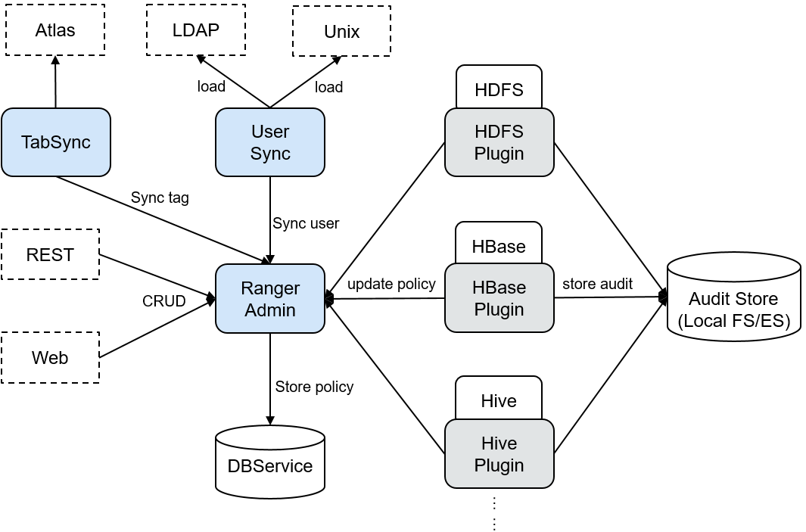

# Ranger 基本原理

[Apache Ranger](https://ranger.apache.org/) 提供一个集中式安全管理框架，提供统一授权和统一审计能力。它可以对整个 Hadoop 生态中如 HDFS、Hive、HBase、Kafka、Storm 等进行细粒度的数据访问控制。用户可以利用 Ranger 提供的前端 WebUI 控制台通过配置相关策略来控制用户对这些组件的访问权限。

Ranger 架构如图 1 所示

图 1 Ranger 架构

表 1 架构图说明

| 名称           | 描述                                                                                    |
| -------------- | --------------------------------------------------------------------------------------- |
| RangerAdmin    | Ranger 的管理角色，拥有策略管理、用户管理、审计管理等功能，提供 WebUI 和 RestFul 接口。 |
| RangerUserSync | 负责周期从外部同步用户和用户组信息并写入 RangerAdmin 中。                               |
| RangerTagSync  | 负责周期从外部 Atlas 服务同步标签信息并写入 RangerAdmin 中。                            |

#### Ranger 原理

- 组件 Ranger 插件

  Ranger 为各组件提供了基于 PBAC（Policy-Based Access Control）的权限管理插件，用于替换组件自身原本的鉴权插件。Ranger 插件都是由组件侧自身的鉴权接口扩展而来，用户在 Ranger WebUI 上对指定 service 设置权限策略，Ranger 插件会定期从 RangerAdmin 处更新策略并缓存在组件本地文件，当有客户端请求需要进行鉴权时，Ranger 插件会对请求中携带的用户在策略中进行匹配，随后返回接受或拒绝。

- UserSync 用户同步

  UserSync 周期性从 LDAP/Unix 中同步数据到 RangerAdmin 中，其中安全模式向从 LDAP 中同步，非安全模式从 Unix 中同步。同步模式默认采取增量模式，每次同步周期 UserSync 只会更新新增或者变更的用户和用户组，当用户或者用户组被删除时，UserSync 不会同步该变更到 RangerAdmin，即 RangerAdmin 中不会同步删除。为了提高性能，UserSync 也不会同步没有所属用户的用户组到 RangerAdmin 中。

- 统一审计

  Ranger 插件支持记录审计日志，当前审计日志存储介质支持本地文件。

- 高可靠性

  Ranger 支持 RangerAdmin 双主，两个 RangerAdmin 同时提供服务，任意一个 RangerAdmin 故障不会影响 Ranger 的功能。

- 高性能

  Ranger 提供 Load-Balance 能力，通过浏览器访问 Ranger WebUI 时 Load-Balance 会自动选择当前负载较小的 RangerAdmin 来提供服务。
