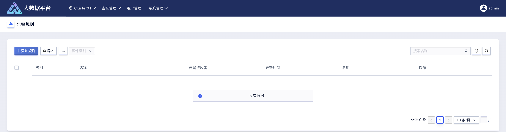
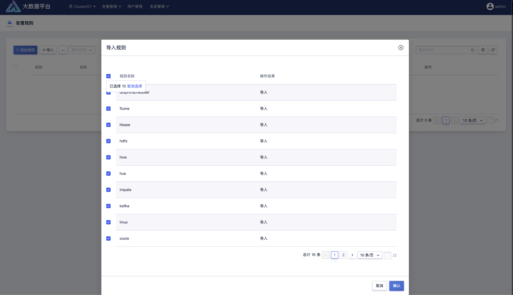
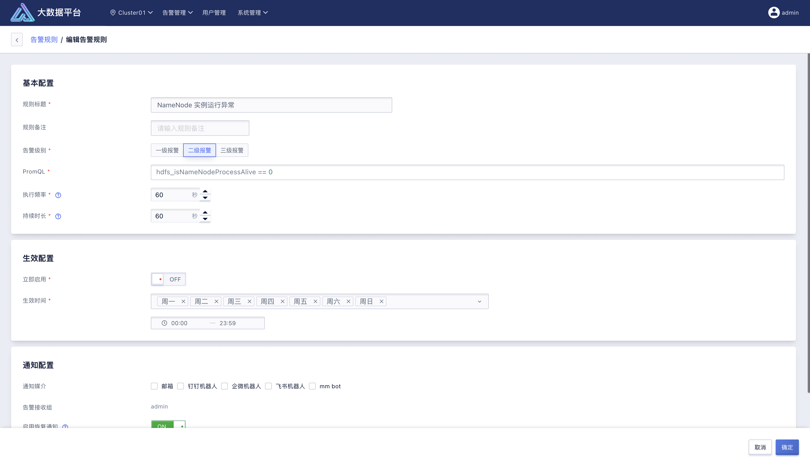
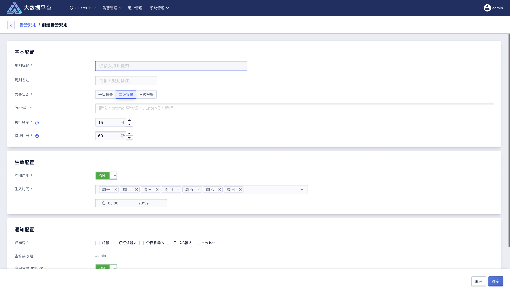
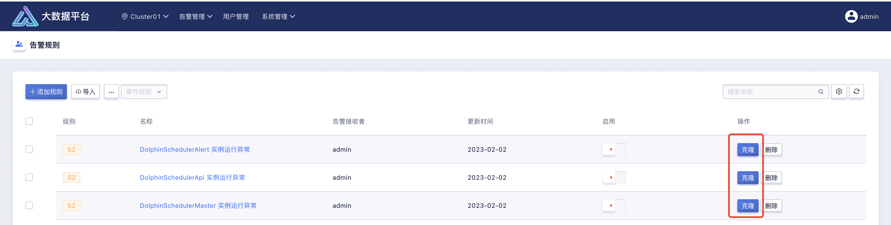
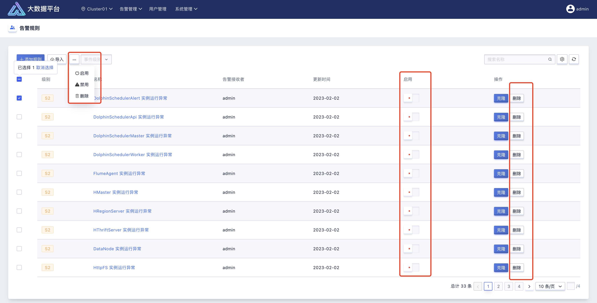
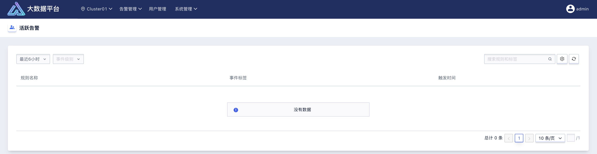
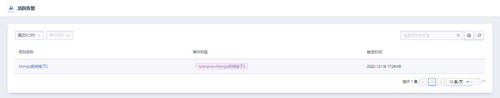
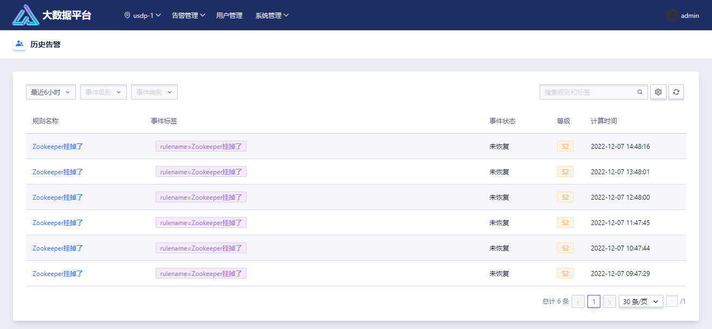

## 6.4 告警管理

在使用 USDP 构建并管理大数据平台过程中，当发生或者可能将要发生某种异常状况时，使用者更希望能非常及时的、随时随地的，全面的感知到平台以及集群的运行情况，这对于维护并提供一套稳定的大数据服务至关重要。

USDP 提供了非常丰富的告警规则和指标，使用者可直接导入使用，或自行添加告警规则，来完成对已使用大数据服务状态的监测。USDP 支持用户自定义告警规则，可以灵活的根据需求编写 PromQL。

本章节中，将介绍，如果使用 USDP，为使用者维护的大数据集群进行告警的管理工作。

### 6.4.1 告警规则

点击 USDP Web 控制台集群首页顶部的菜单栏 “告警管理”，在下拉菜单中选择 “告警规则”，即可进入上图所示的告警规则管理页面。

使用者将通过该页面中查看到所有已对当前集群配置的告警规则；支持翻页、按规则名称检索等辅助浏览的功能；支持按告警的级别，进行分类查找。

#### 6.4.1.1 导入告警规则

点击告警规则页面顶部的“导入”按钮，可以打开“导入规则”对话框。

通过该功能，可将 USDP 提供的诸多告警规则复制到当前集群。在导入时，使用者需选择所需要的告警规则进行导入，勾选规则名称左侧的复选框，点击对话框右下角的“确认”按钮，即可完成导入动作。

导入完成后，使用者可根据实际告警需求进行适当调整，如告警频率、告警生效周期、通知媒介等，若无需修改，可直接对导入的告警规则开启“启用”生效。

当点击告警规则列表中的某条规则名称时，可以查看到该规则的配置详情。

如上图所示，展示了“NameNode 实例运行异常”规则的详细信息。对告警规则而言，均包括“基本配置”、“生效配置”、“通知配置”三个配置部分。

“基本配置”模块，主要配置了告警规则的触发条件。其中核心配置项为“PromQL”、“执行频率”、“持续时长”三项。允许用户自定义PromQL，需依赖的指标项，可查找相关PromQL资料进行配置。

#### 6.4.1.2 添加告警规则

在当前集群的“告警规则”管理页面中，点击左上角的“添加规则”按钮，即可进入告警规则添加页面。

如上图所示，添加告警规则页面由三部组成：

- 基本配置。在该模块中，需要为待添加的告警规则填写“规则标题”、“告警级别”、“PromQL”、“执行频率”、“持续时长”等关键信息；

- 生效配置。在该模块中，需要为待添加的告警规则填写是否“立即启用”、“生效时间”周期。

- 通知配置。在该模块中，需要为待添加的告警规则填写“通知媒介”、“告警接收组”、“启用恢复通知”、“留观时长”、“重复发送频率”、“最大发送次数”等关键信息。

**告警规则项说明：**

| 规则项       | 说明                                                         |
| ------------ | ------------------------------------------------------------ |
| 规则标题     | 告警规则在规则管理页面显示的名称                             |
| 规则备注     | 可为该告警添加自定义的使用用途等说明                         |
| 告警级别     | 默认有 3 个级别，可使用该级别为告警规则进行归类，便于查找及管理 |
| PromQL       | 可自定义对监控指标进行触发条件的设置，遵循 PromQL 语法规则即可，所需要的监控指标，可在 Prometheus-Graph-Metrics Explorer 中查找 |
| 执行频率     | 默认每隔 15 秒，按 PromQL 执行告警查询，查得数据即表示当次有监控数据触发了规则 |
| 持续时长     | 通常持续时长大于等于执行频率，在持续时长内按照执行频率多次执行 PromQL 查询，每次都触发才生成告警；如果持续时长置为 0，表示只要有一次 PromQL 查询触发阈值，就生成告警 |
| 立即启用     | 默认“启用”，即确认添加本规则后，同时将该规则在当前集群中生效 |
| 生效时间     | 默认按 7*24 小时不间断对本规则进行长期生效                   |
| 通知媒介     | 可配置按“邮件”、“钉钉”、“企业微信”、“飞书”、“mm bot”等方式进行告警信息接收 |
| 告警接收组   | 配置并按“平台用户组”进行告警信息推送                         |
| 启用恢复通知 | 默认“启用”，即该告警状态已恢复时也会发送恢复通知             |
| 留观时长     | 告警恢复的观察时长，在未达到最大时长时间内若无新告警产生，则发送告警恢复通知。该时长应大于“执行频率”； |
| 重复发送频率 | 默认间隔 60 分钟；如果告警持续未恢复，再间隔时间之后重复提醒告警接收组的成员 |
| 最大发送次数 | 如果值为 0，则不做最大发送次数的限制                         |

#### 6.4.1.3 克隆告警规则

当前集群若已添加过告警规则，为了更方便快捷的添加新的告警规则，使用者可选择从已有的告警规则基础上进行克隆，在克隆出的告警规则中根据需求做出配置调整后，点击确认即可完成克隆。

告警规则编辑页面的操作，可参考本手册“添加告警规则”章节的内容。

#### 6.4.1.4 告警规则管理

随着集群在业务中的使用，渐渐地，大数据服务和集群主机规模也会随之增加，此时，需要进行监听的服务状态也会越来越多。在 USDP 控制台中，提供了诸多便于使用者管理告警规则的一些功能。

如上图所示，告警规则管理页面中，支持逐条/批量的操作控制已添加的告警规则，如是否“启用”、“禁用”规则。

左上角处，支持按照告警规则的级别（3 个级别）进行过滤查找规则；或在右上角的检索框中按告警规则标题进行模糊查找。

若某项/某些告警规则已不再使用，可在控制台中逐条/批量的对不再使用的告警规则进行“删除”操作。

### 6.4.2 活跃告警

如上图所示，对于集群已配置并已“启用”的告警规则，会根据规则中的 PromQL 条件按执行频率执行监听，当被监听的服务产生了某种异常情况，并且该异常有告警规则可以匹配到，即会触发告警规则，产生一条告警信息。所有未处理的告警，即会进入到活跃告警管理页面中来。

#### 6.4.2.1 活跃告警查找

活跃告警管理页面中，支持按照时间段、事件等级辅助使用者过滤查找，还可按照规则名称和标签进行模糊查询。

时间段支持“最近 6 小时”、“最近 12 小时”、“最近 1 天”、“最近 2 天”、“最近 3 天”、“最近 7 天”、“最近 14 天”、“最近 30 天”、“最近 60 天”、“最近 90 天”供使用者选择。

### 6.4.3 历史告警

如上图所示，若使用者对当前集群所有已产生的告警信息进行处理，解除告警状态了，或系统自动恢复正常状态后，相关的告警信息将从“活跃告警”列表中转存至“历史告警”管理页面中，便于使用者对集群及服务的历史状况进行查阅。

#### 6.4.3.1 历史告警查找

历史告警管理页面中，支持按照时间段、事件等级、事件类别几个维度辅助使用者过滤查找，还可按照规则名称和标签进行模糊查询。

时间段支持“最近 6 小时”、“最近 12 小时”、“最近 1 天”、“最近 2 天”、“最近 3 天”、“最近 7 天”、“最近 14 天”、“最近 30 天”、“最近 60 天”、“最近 90 天”供使用者选择。

事件类别包括“Triggered”（已恢复的告警）、“Recovered”（已触发的告警）两种状态辅助过滤查找。