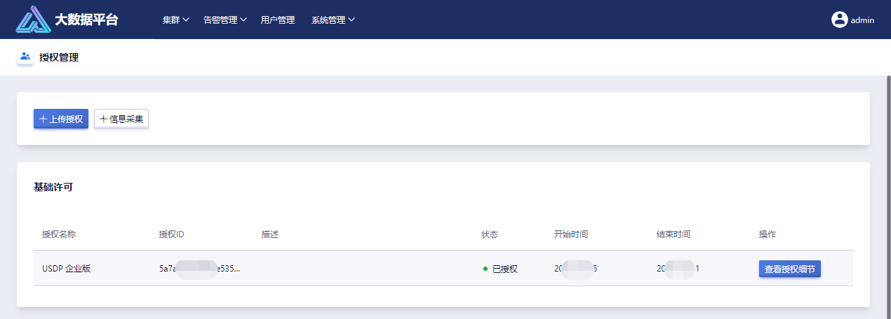

## 8.3 授权管理

智能大数据平台 USDP，目前已支持完善的“授权许可”相关管理功能，如下图所示，授权许可分为“基础许可”、“拓展许可”、“服务许可”三类。本章节将介绍使用者在正常使用过程中有关“授权许可”的相关问题和处理方法。

### 8.3.1 名词解释

- 基础许可: 平台基础许可，授权后可使用平台基础功能
- 拓展许可: 平台拓展许可，授权后可使用平台增值功能
- 服务许可: 平台服务许可，为购买产品的客户打造的维护保障服务解决方案

### 8.3.2 上传或更换授权

当未上传基础许可证书或基础授权证书过期时，使用者登录 USDP 控制台时，系统将检查授权是否有效，若无效，则跳转至“授权管理”页面，提示使用者上传新的授权许可证书。成功上传新的许可证书后，方可正常使用和操作 USDP Web 控制台。

如上图所示，点击“信息采集”按钮，此时将下载一份文件，请联系客户经理并提供该文件来获取授权证书。

授权证书获取后，请点击“授权管理”页面顶部的“上传授权”按钮进行上传许可证文件并完成导入，USDP 系统验证证书文件有效后，使用者可正常进行控制台的其他操作。

如上图所示，导入基础许可证书时的状态，显示已授权字样。此时点击右侧的“查看授权细节”按钮，可查看到该授权的详细信息。