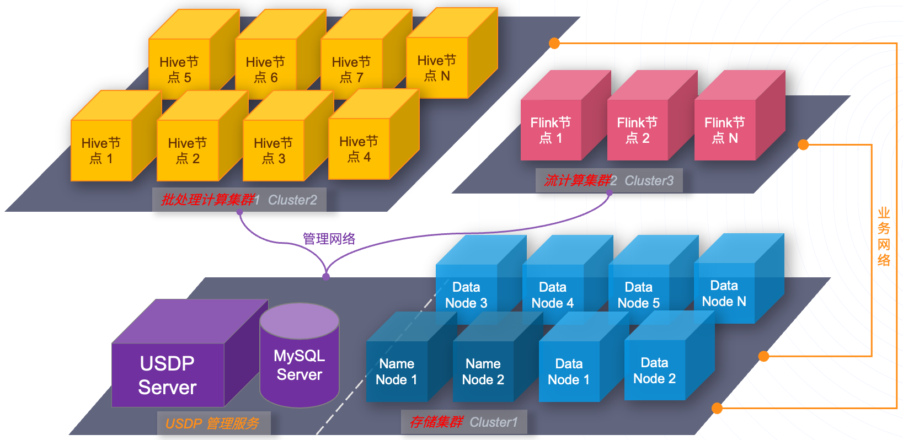

# 存储与计算分离

### 存储与计算分离的适用场景：

- 当期望统一管理业务数据，数据共享使用时；
- 当期望多个数据业务组织间任务的执行完全不发生相互影响时；
- 当期望很好的优化底层平台及设备配置和性能，并按不同业务场景维护优化时；

若有以上集中或类似的需求场景时，可能 “存储与计算分离” 的平台架构，将是一个不错的选择。希望本篇内容能给用户带来一些可行性参考。

### 名词解释：

- Hadoop框架：适用于数据计算和数据存储在同一集群的情况；
- 计算框架：适用于数据计算的集群，但该集群不做数据存储服务；
- 存储集群：只包含HDFS及相关分布式协调服务的USDP大数据集群，或包含HDFS服务的USDP大数据集群；
- 元数据共享：USDP采用MySQL作为其大数据的业务元数据共享服务；

!> **提示：** - 当用户有多套USDP管理服务时，USDP允许其他USDP管理服务中含的HDFS的集群作为本集群的存储集群。

### 参考架构图

### 架构优势

### 部署指南

在使用USDP管理大数据业务系统时，用户可根据业务需求，来规划所需的大数据集群数量及单集群的规模和服务；根据业务形态，决策集群间的隔离性。

如上图所示，可结合网络VPC（vlan等）技术实现VPC间的互通管理，大数据集群Cluster1与Cluster2可能承载的是不同且不相关的大数据处理业务，因此无法互相访问和共享数据。

## 1. 新增大数据集群

当用户搭建好USDP服务时，实际上已经在流程中创建了第一个大数据集群。本章节将从您创建其余的更多个大数据集群时给您参考。

登陆USDP控制台，点击顶部 <kbd>当前集群</kbd> 的集群名称，会弹出下拉列表，在列表中选择 <kbd>添加集群</kbd> 按钮。如下图所示：

此时，即可进入创建新集群的向导流程中，接下来，您可参考 [通过向导创建大数据集群](/usdpdc/1.0.x/plan&create/first_create?id=_31-向导-选择软件版本) 章节，流程一致，此处就不在赘述了。

## 2. 集群切换

如下图所示，点击顶部 <kbd>当前集群</kbd> 的集群名称，会弹出下拉列表，并在其中点击已经创建的各个“集群名称”选项即可切换至该集群的管理控制台中。如下图所示：

后续针对该集群的管理和使用，可参考如下章节进行操作：

* [集群节点管理](usdpdc/1.0.x/webconsole/node)
* [集群服务管理](usdpdc/1.0.x/webconsole/service)
* [集群监控管理](usdpdc/1.0.x/webconsole/monitor)
* [集群告警管理](usdpdc/1.0.x/webconsole/alarm)