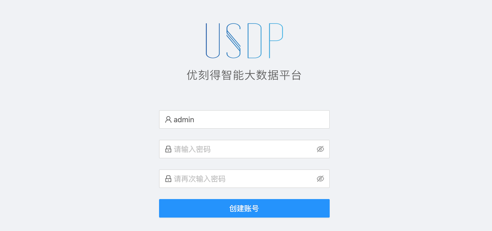
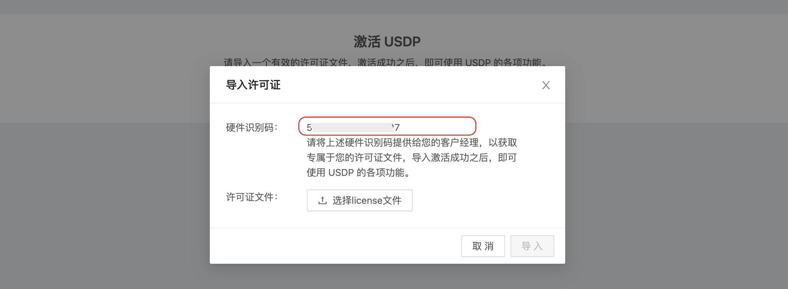

# USDP私有化部署流程

!> v2.1.0 之前的版本参考[部署流程 v1](usdpdc/plan&create/install)

欢迎使用 USDP 构建大数据平台，接下来，我们将通过几个简单的步骤，完成 USDP 管理服务的部署流程，从而能够通过 Web 页面的方式，快速部署各类大数据服务与组件。

在开始安装之前，请至少准备如下节点资源，以供后续创建大数据集群。

!> 私有化部署 USDP 需满足如下环境：</br>- **节点数量**：3 台及以上；</br>- **网络**：集群节点间内网通畅；建议节点间网络10Gbps及以上；</br>- **节点内存**：推荐 32G 以上；</br>- **节点CPU**：推荐 8 核以上；</br>- **节点磁盘**：系统盘 60G 以上，数据盘根据业务需要调整；</br>- **操作系统**：CentOS 7.6； </br>- **数据库**：MySQL 5.7；

下面的部署安装流程以 usdp-v2.1.0-pro 版本为例进行说明。


## 1. 创建安装目录

创建 `/data/usdp-srv/` 目录，并将压缩包解压至该目录下。


## 2. 下载安装包

通过给定地址，下载以下文件：

- ansible 安装包，例如 `ansible-2.9.25.tar.gz`（文件大小约 25M）
- USDP 安装包，例如 `usdp-v2.1.0-pro-47c5bcdb2de168ef014b884c9d30eeef.tar.gz`（文件大小约 10G）
- CentOS 7.6 离线 yum 源（如果主机能访问互联网，则不需要下载），例如 `mirror-9e3f190742bf13e8367ffa56a5695862.tar.gz`（文件大小约 35G）

?> **提示：**</br>- 建议将安装包存储至数据盘中，避免该安装包占用过多系统盘空间</br>- **解压** ansible 安装包，并 `yum install -y ansible/*.rpm`</br>- 将 USDP 安装包**解压**到 `/data/usdp-srv/` 目录</br>- 如果下载了 CentOS 离线 yum 源，**解压**到 `/data/` 目录下


## 3. 目录结构说明

解压后的子目录（`/data/usdp-srv/usdp/`）说明信息，如下所示：

| 子目录       | 说明                                                                                    |
| ------------ | --------------------------------------------------------------------------------------- |
| agent        | USDP Agent 程序所在目录，为每个节点的作业端，无需手动启动、无需手动管理，无需手动管理； |
| bin          | 启动 udp-server 与 udp-agent 程序的脚本目录，无需手动管理；                             |
| config       | 配置文件目录，主要用于配置 MySQL 的地址，其他无需修改；                                 |
| env-prepare  | 主机环境初始化脚本                                                                      |
| jmx_exporter | 监控的相关插件，无需手动管理；                                                          |
| recommend    | 部署服务时的默认勾选清单，无需修改；                                                    |
| repository   | 服务组件资源目录，无需手动管理；                                                        |
| scripts      | 工具脚本目录，无需手动管理；                                                            |
| server       | USDP Server 程序所在目录，无需手动管理；                                                |
| sql          | 初始化 SQL 所在目录，无需手动管理；                                                     |
| templated    | 服务组件配置文件模板目录，无需手动管理；                                                |
| verify       | USDP 私有化证书存储目录，无需手动管理；                                                 |
| versions     | USDP 版本目录，无需手动管理；                                                           |


## 4. 执行环境初始化

在运行 USDP 之前，需要对所有节点进行必要的配置，为了简化用户操作，USDP 提供了环境初始化脚本（`env-prepare`），包括自动安装 JDK，自动安装 MySQL，并初始化 USDP 数据，以及初始化系统软件环境等。

### 4.1 配置修复

在运行环境初始化脚本之前，您需要提前配置 `/data/usdp-srv/usdp/env-prepare` 目录下的相关文件如下：

* **inventories/hosts.yml**

  示例如下：

```yaml
all:
  vars:
    # 如果下面指定的 3 个 ntp_server 不能访问互联网，请设置 with_internet_ntp: false
    # 并且打开 internal_ntp_servers 的注释设置至少一个内部可访问的 ntp server
    with_internet_ntp: true
    #internal_ntp_servers:
    #  - 10.0.1.11
    #  - 10.0.1.12

    # SSH root 密码，按实际情况修改，如果已经配置了 ssh key 免密登录，则该变量无效
    ansible_password: ssh_password_of_root
    # MySQL root 密码，按实际情况修改
    mysql_root_password: mysql_root_password
    # usdp server 监听端口，按实际情况修改
    usdp_server_port: 80

################################################################################################################
# Groups
################################################################################################################
# ntp server 选 3 个节点
ntp_server:
  hosts:
    10.10.1.32:
    10.10.1.33:
    10.10.1.34:

# usdp server 和 mysql server 单节点
usdp_server:
  hosts:
    10.10.1.32:

# work node(s)
# 根据需要放开下面的 NODE_NAME 变量注释，并分别修改成需要的 hostname 值，来设置主机的 hostname
# 如果不放开 NODE_NAME 变量，且 hostname != localhost ，则不设置 hostname ，保留当前主机名
# 如果不放开 NODE_NAME 变量，且 hostname == localhost ，则设置 hostname 为 IP 字符串（替换 IP 中的 '.' 为 '_'），例如：10.10.1.32
work_node:
  hosts:
    10.10.1.32:
      # NODE_NAME: hostname_a
    10.10.1.33:
      # NODE_NAME: hostname_b
    10.10.1.34:
      # NODE_NAME: hostname_c
```

  > **主机名(NODE_NAME)-命名规则：**
  >
  > 1、主机名只允许包含ascii字符里的数字0-9、字母a-zA-Z、连字符-、其他都不允许。例如，不允许出现其他标点符号，不允许空格，不允许下划线，不允许中文字符。
  >
  > 2、主机名的开头和结尾字符不允许是连字符。
  >
  > 3、主机名命名不允许出现 “数字-数字” 这种模式


!> 主机被添加进集群并且部署服务后，不允许修改主机名（服务配置中的主机名无法同步修改）


### 4.2 执行环境初始化

完成上述步骤后，执行如下命令即可开始环境初始化任务：
```bash
cd /data/usdp-srv/usdp/env-prepare
ansible-playbook -i inventories/hosts.yml prepare.yml
```

等待一段时间后，即可将所有对应节点的环境准备完毕。


## 5. 访问 USDP 控制台

### 5.1 查看 usdp-server 是否运行中

环境初始化步骤会完成数据库初始化和 usdp-server 配置和启动，执行 `systemctl status usdp-server` 查看 usdp-server 服务状态，运行中状态例如：

```
Active: active (running)
```

或者执行 `ss -tlnp src :80` 查看 usdp-server 服务端口监听情况，端口监听中示例：

```
State      Recv-Q Send-Q      Local Address:Port      Peer Address:Port
LISTEN     0      100                    :::80                  :::*          users:(("java",pid=912791,fd=35))
```

### 5.2 在浏览器中访问 USDP 控制台

在浏览器中访问 USDP 控制台：

```
http://<usdp_server_ip>:<port>
```

?> **提示：**</br>- “usdp_server_ip” 为启动 USDP-Server 的节点 IP 地址。如果浏览器所在节点与USDP不在同一网络环境，则需要自行搭建 VPN，或通过与USDP部署节点网络互通的Windows机器的浏览器来访问该IP。</br>- “port”为 `inventories/hosts.yml` 配置文件中 `usdp_server_port` 的取值。

进入USDP管理控制台时，首次登录需要设置admin用户名的登录密码。如下图所示：



?> **提示：**</br>- 集群部署完成后，可在USDP控制台中，更改admin管理员的密码。

### 5.5 获取并导入LICENSE


点击 <kbd>导入许可证</kbd> 按钮，USDP将自动是被服务器的硬件识别码，并显示在弹出的对话框中，如下图所示：



请将对话框中的 `硬件识别码` 字符串，及您计划通过USDP管理的`服务器节点数量`，联系并告知UCloud客户经理，其会协助您获得license许可文件。

获得license文件后，点击 <kbd>选择license文件</kbd> 按钮，选择你们的license文件，点击对话框 <kbd>导入</kbd> 按钮，完成license验证。验证通过后，即可开始创建集群。

?> **提示：**</br>- license 是一个 `xxx.tar.gz` 的文件，无需解压，直接导入即可。</br></br>关于更多 “许可证” 的内容，请前往 [USDP许可证管理](usdpdc/license/license) 查看。

若license文件有效，此时，USDP管理控制台中即会显示 ”新建集群“ 的向导入口，如下图所示：


至此，环境初始化及USDP管理服务的安装已完成，接下来将 [通过USDP创建第一个大数据集群](usdpdc/plan&create/first_create)。
