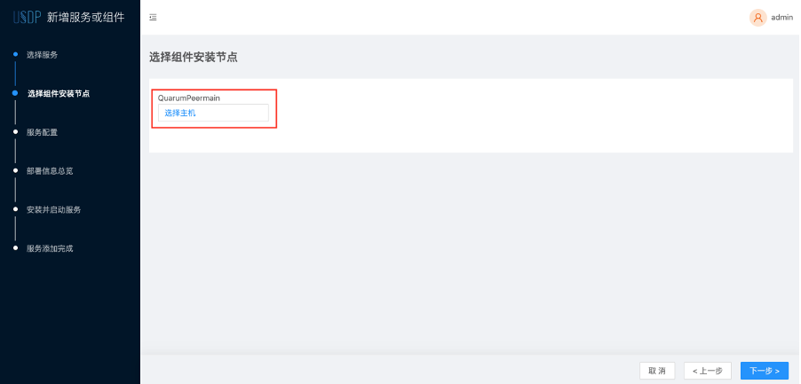
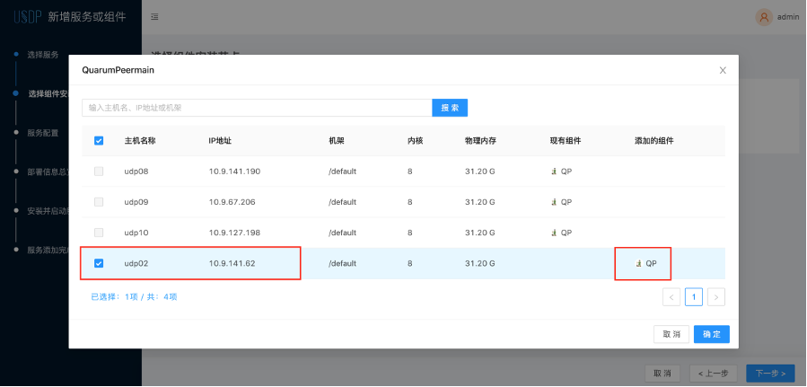
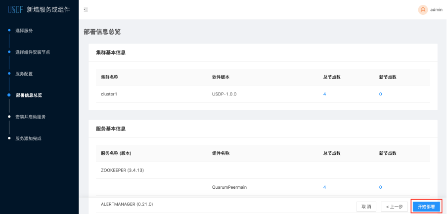
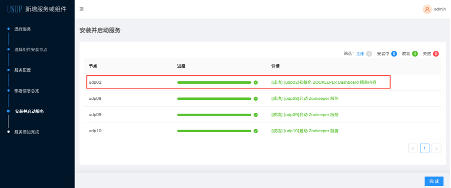

# 添加服务或组件

在使用USDP管理大数据业务集群时，用户可根据需求灵活管理集群中需要的各类大数据服务及相关组件。本篇指南，将介绍如何通过USDP来为集群添加大数据服务、添加服务组件，并管理该服务对应的组件。

- [添加大数据服务](usdpdc/webconsole/service_extension?id=_1-为当前集群添加大数据服务)
- [为已使用的大数据服务添加组件](usdpdc/webconsole/service_extension?id=_2-为当前集群已使用的大数据服务扩展组件)

在开始之前，用户需要先在USDP控制台中，切换集群到待添加服务或组件的集群，我们称之为“当前集群”。

- 切换方式，可参考 [集群切换](usdpdc/clusters/clusters?id=_2-集群切换) 操作。

## 1. 为当前集群添加大数据服务

本章节将以Sqoop为示例，介绍如何为当前集群添加Sqoop服务，其他服务添加的操作方式同理。

如下图所示，在USDP控制台中，找到“当前集群”的集群名称，点击展开集群列表，在当前集群集群的右侧，找到“添加服务或组件”，点击前往“添加服务或组件”向导。

进入“添加服务或组件”向导后，在页面右侧的“计算服务”中，找到还未部署使用的Sqoop服务，勾选其左侧的单选框，点击右下角的“下一步”按钮。如下图所示：

Sqoop是一个轻量级的数据采集与转储服务，主要已Client的方式运行于集群的某些节点上；

在“选择组件安装节点”的向导页中，请为SqoopClient选择计划安装的节点，如下图所示：

点击“选择主机”按钮后，USDP会以对话框的形式，展示当前集群所管理的所有节点，若当前集群节点较多，翻阅不便，可通过对话框中提供的“搜索”按`主机名`、`IP地址`、`机架`等关键字进行检索。如下图所示：

!> **提示：** - 在为待添加的服务选择安装节点时，因在其使用过程中需依赖安装节点的计算、存储和网络资源，因此，建议用户提前考虑该服务的业务场景和可能的资源消耗，`请根据当前集群所管理的各个节点硬件配置情况、该节点上已部署服务的使用情况和性能情况，合理规划，以免该服务的运行干扰到当前节点本身以及节点所在机架的网络性能`。

选择好后“确认”，并进入向导“下一步”。

此时USDP管理服务会检测出，已加入该平台的所有节点主机中，已安装的所有大数据服务在当前集群节点中的分部情况，经浏览确认无误，点击“开始部署”按钮，如下图所示：

USDP管理服务将自动生成Sqoop服务部署任务，将在被选择的节点上安装SqoopClient组件，如下图所示：

安装进度完成后，点击“完成”按钮，退出服务或组件安装向导。

## 2. 为当前集群已使用的大数据服务扩展组件

本章节将以Zookeeper为示例，介绍如何为Zookeeper添加服务组件，其他服务组件的操作方式同理。

USDP管理控制台支持对当前集群中的Zookeeper服务扩展更多节点。如下图所示：

点击“新增组件”按钮，进入“新增组件或服务”向导，如下图所示：

选择QuarumPeermain组件需要扩展的节点主机，如下对话框截图所示：

!> **提示：** - 在为待添加的服务组件选择安装节点时，因在其使用过程中需依赖安装节点的计算、存储和网络资源，因此，建议用户提前考虑该服务组件的业务场景和可能的资源消耗，`请根据当前集群所管理的各个节点硬件配置情况、该节点上已部署服务的使用情况和性能情况，合理规划，以免该服务的运行干扰到当前节点本身以及节点所在机架的网络性能`。

此时USDP管理服务会检测出，已加入该平台的所有节点主机中，udp02节点上暂未运行QuarumPeermain组件，“勾选”udp02左侧的复选框，点击“确定”按钮，进入“部署信息总览”向导页，如下图所示：

经浏览确认无误，点击“开始部署”按钮，管理平台将为udp02节点安装QuarumPeermain组件，安装无误，将显示安装成功状态，平台会自动启动该组件，如下图所示：

安装进度完成后，点击“完成”按钮。如下图所示：

