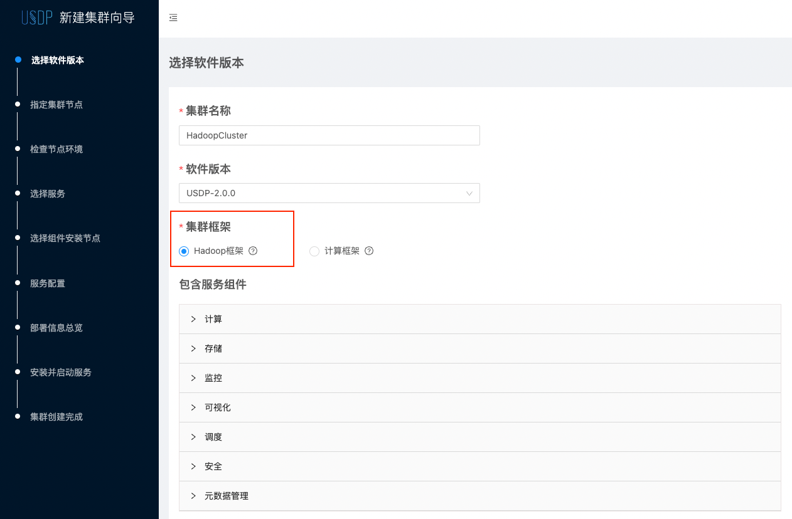

# 存储与计算分离

## 存储与计算分离的适用场景：

- 当期望统一管理业务数据，数据共享使用时；
- 当期望多个数据业务组织间任务的执行完全不发生相互影响时；
- 当期望很好的优化底层平台及设备配置和性能，并按不同业务场景维护优化时；

若有以上集中或类似的需求场景时，可能 “存储与计算分离” 的平台架构，将是一个不错的选择。希望本篇内容能给用户带来一些可行性参考。

## 名词解释：

- Hadoop框架：适用于数据计算和数据存储在同一集群的情况；
- 计算框架：适用于数据计算的集群，但该集群不做数据存储服务；
- 存储集群：只包含HDFS及相关分布式协调服务的USDP大数据集群，或包含HDFS服务的USDP大数据集群；
- 元数据共享：USDP采用MySQL作为其大数据的业务元数据共享服务；

?> **提示：** - 当用户有多套USDP管理服务时，USDP允许其他USDP管理服务中含的HDFS的集群作为本集群的存储集群。

## 参考架构图

## 架构优势

- MySQL元数据库可独立管理，建议配置数据库高可用方案；
- 在超大规模大数据业务场景中，易于实现精细化规划和控制；
- 易于对各类大数据服务实现高可用架构；
- 易于针对不同业务进行独立集群的资源及性能优化；
- 易于管理大数据业务网络规划并实现隔离；
- 易于统一管理数据，并可对数据和服务实现精细化权限控制，提升大数据业务安全性；
- 可结合混合云/云+托管IDC场景中，结合存储计算分离架构实现大数据业务规划；
- 其他优势；

## 资源规划

可参考 资源规划-[多集群多节点规划](usdpdc/xc_aarch64_2.0.x/plan&create/deploy_plan?id=_3-多集群多节点规划) 的方案完成本次规划。

!>**提示：** 多个集群无法公用同一台设备，不可重复使用！请合理规划节点用途；

## 部署指南

### 1. 创建Hadoop框架/存储集群

登陆USDP控制台，点击顶部 <kbd>当前集群</kbd> 的集群名称，会弹出下拉列表，在列表中选择 <kbd>添加集群</kbd> 按钮。如下图所示：

此时，即可进入创建新集群的向导流程中后，请注意在 “集群框架” 表单处，勾选`Hadoop框架`单选框，并继续向导流程。如下图所示：

接下来，您可参考 [通过向导创建大数据集群](/usdpdc/xc_aarch64_2.0.x/plan&create/first_create?id=_1-向导-选择软件版本) 章节，流程一致，此处就不在赘述了。

### 2. 创建计算集群

?> **提示：** - 在创建计算集群之前，用户需先拥有一个USDP管理的“Hadoop框架”集群，该集群可以是即做HDFS存储又做计算的集群，亦可以只做HDFS存储的集群，请参考  完成创建后，再进行`计算框架`集群的创建安装。

进入创建新集群的向导流程中后，请注意在 “集群框架” 表单处，勾选`计算框架`单选框，如下图所示：

此时，可通过在 “存储集群” 表单处，选择已有的USDP存储集群。之后，继续创建向导完成后续操作，您可参考 [通过向导创建大数据集群](/usdpdc/xc_aarch64_2.0.x/plan&create/first_create?id=_1-向导-选择软件版本) 章节。

### 3. 基于其他USDP的存储集群来创建计算集群

若用户已有其他的USDP服务和集群，那么，原有的集群是可以作为存储集群，并按照规划，在其基础上创建 `计算框架` 的计算集群。操作方法如下图所示：

完成此处配置之后，继续创建向导完成后续操作，您可参考 [通过向导创建大数据集群](/usdpdc/xc_aarch64_2.0.x/plan&create/first_create?id=_1-向导-选择软件版本) 章节。