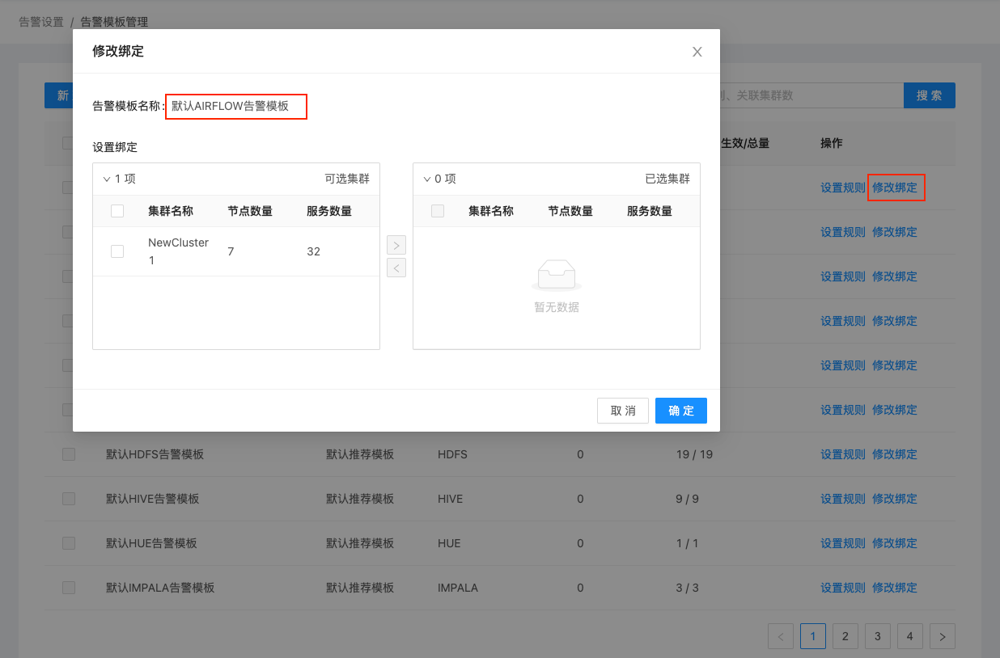
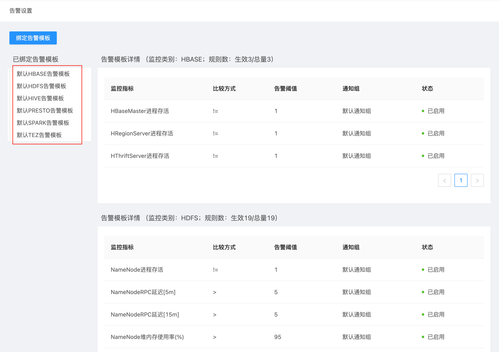

# 告警生效

通过本篇指南，可指导用户完成将已有的 [告警模板](usdpdc/xc_x86_2.1.x/guide/alarmTemplate) 应用至当前集群并按 “告警模板” 中的 “监控指标” 及 “监控规则” 对所集群实施监控并生效。当集群出现被检测的某种异常时，USDP会主动通过 “监控指标” 绑定的 [通知组](usdpdc/xc_x86_2.1.x/guide/alarmInform_group) 为组内的各个 [通知对象](usdpdc/xc_x86_2.1.x/guide/alarmInform_object) 发送告警信息。

## 方式1. 告警模板管理-快速绑定集群并生效

默认告警模板内容，是UCloud依据多年大数据产品维护经验的沉淀，用户可以快速使用默认告警模板对欲监控告警的集群生效使用。

点击 “告警模板管理” 页面用户指定的模板条目右侧的 <kbd>修改绑定</kbd> 按钮，这里以 “默认AIRFLOW告警模板” 为例，如下图所示：

在弹出的 “修改绑定” 对话框中 “设置绑定” 处左侧 “可选集群” 部分，列出来可以绑定该模板的集群信息，用户仅需勾选对应的集群复选框，点击 <kbd>></kbd> 按钮，即可将已选集群添加到右侧 “已选集群” 栏，此后，点击对话框 <kbd>确定</kbd> 按钮，即可完成当前告警模板与所选集群的绑定操作。

用户亦可在您自己的集群上来设置绑定哪些告警模板，相关操作请参考 [集群告警设置](usdpdc/xc_x86_2.1.x/guide/alarmTemplate_work?id=方式2-集群告警设置) 章节。

> 为告警模板绑定集群后，即代表此集群已使用该模板中的所有监控指标，对该集群中的相应服务实施监控，当集群一但发生相关告警规则设置的条件时，即会触发告警，USDP将会通过该模板中事先设置好的 [通知组](usdpdc/xc_x86_2.1.x/guide/alarmInform_group) 来发送告警详细信息。

## 方式2. 集群告警设置

登陆USDP控制台后，点击左侧导航栏 “监控管理” - “告警设置”，进入开始为集群配置 告警设置 的页面，如下图所示：

?> 初始状态下，新创建的集群并未绑定任何告警模板。

点击 <kbd>绑定告警模板</kbd> 按钮，在弹出的 “绑定告警模板” 对话框中进行绑定操作，如下图所示：

对话框中 “设置绑定” 处左侧 “可选模板” 部分，列出来可以绑定到当前集群的所有模板列表，用户仅需 “勾选” 对应的 告警模板左侧的复选框，点击 <kbd>></kbd> 按钮，即可将已选 告警模板 添加到右侧 “已选模板” 栏，此后，点击对话框 <kbd>确定</kbd> 按钮，即可完成当前告警模板与所选集群的绑定操作。

?> 为集群绑定告警模板后，即代表此集群已使用这些模板中的所有监控指标，对该集群中的相应服务实施监控，当集群一但发生相关告警规则设置的条件时，即会触发告警，USDP将会通过这些模板中事先设置好的 [通知组](usdpdc/xc_x86_2.1.x/guide/alarmInform_group) 来发送告警详细信息。

完成绑定操作后，如下图所示：

此时，已将上图中的六项告警模板应用于当前集群。若需调整，再次点击左上角的 <kbd>绑定告警模板</kbd> 按钮即开始调整即可。