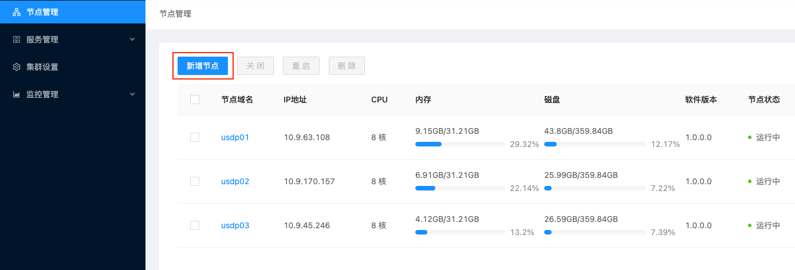

# 为USDP新增服务器节点

在使用USDP服务过程中，可能随着用户业务需求增长，或业务调整，现有的大数据集群资源已不足以满足需求时，可能需要为USDP服务扩展可管理的服务器节点，在准备好服务器并安装操作系统，仍需要通过USDP提供的一键初始化工具，对新增节点进行初始化，USDP支持批量节点扩展。


## 1. 新增服务器节点的初始化

### 1.1 配置 repair.properties 文件

修改 repair.properties 文件中的以下变量（同时检查该文件中其他变量是否正确）：

```shell
# The total number of machines needed to be repaired.
repair.host.num=n(The total number of machines needed to be repaired)
# The total number of added machines needed to be repaired.
repair.add.host.num=m(The total number of added machines needed to be repaired)
```

### 1.2 配置 repair-host-info-add.properties 文件

修改 repair-host-info-add.properties 文件，具体示例如下：

~~~shell
# 1.Please provide the information of added hosts needed to be repaired in the format specified below
# 2.usdp.ip.i(eg:i=1,2,3.....):
# 3.usdp.password.i:
# 4.usdp.ssh.port.i:
# 5.usdp.ssh.port.hostname.i:
usdp.ip.1=127.0.0.1(need to change)
usdp.password.1=your-node-root-password(need to change)
usdp.ssh.port.1=22
usdp.ssh.port.hostname.1=your-node-hostname(need to change)
usdp.ip.2=127.0.0.1(need to change)
usdp.password.2=your-node-root-password(need to change)
usdp.ssh.port.2=22
usdp.ssh.port.hostname.2=your-node-hostname(need to change)
usdp.ip.3=127.0.0.1(need to change)
usdp.password.3=your-node-root-password(need to change)
usdp.ssh.port.3=22
usdp.ssh.port.hostname.3=your-node-hostname(need to change)
~~~

### 1.3 执行新增节点初始化脚本

修改完上述配置文件，即可进入 sbin 目录执行如下初始化命令

```shell
cd /opt/usdp-srv/usdp/repair/sbin
bash repair.sh initSingle
```

待初始化命令执行完成，后续操作均可在USDP管理控制台进行操作，用户可为已有集群添加新节点，亦可在USDP中创建新集群。

## 2. 用新增服务节点创建新集群

USDP支持多集群管理，可前往参考 [新增大数据集群](usdpdc/xc_x86_2.1.x/plan&create/first_create)。


## 3. 为已有集群添加节点

登陆USDP管理控制台，为当前集群添加新节点，需在控制台左侧导航菜单点击 <kbd>节点管理</kbd> 进入节点管理页面，点击左上角 <kbd>新增节点</kbd> 按钮，即可进入新增节点向导。如下图所示：




进入向导，用户可根据计划，将需要添加到当前集群的新节点的完全限定域名进行补充填写，并确认SSH的用户名及端口号。如下图所示：


> **节点的完全限定域名填写规则说明：**
>
> 1. 可单行输入每一个节点的完全限定域名；
> 2. 可通过“[]”辅助输入有数字规律的节点完全限定域名；例如pusdp-core[1-3]表示包含“pusdp-core1”、“pusdp-core2”、“pusdp-core3”共三个节点。

?> **提示：**</br>- 节点的完全限定域名及对应的ip信息，需添加到Master1节点的hosts文件中。</br>- 可参考host_single_info.txt文件配置的节点完全限定域名名称来填写。

向导后续步骤，用户可按照向导指引来完成新增节点的检查，直至添加完成。


