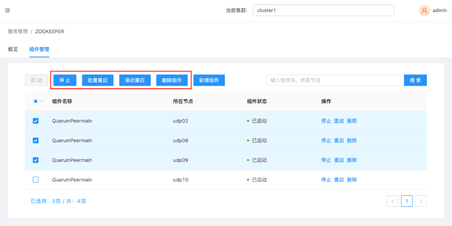

# 集群服务组件管理

在智能大数据平台USDP中，为便于用户对集群及相关服务的管理，USDP提供较为友好的服务管理功能，譬如对某个服务的组件启停及组件扩展等管理功能，辅助用户更好的管理和使用USDP。

下文以Zookeeper服务的组件管理为示例，本篇将涉及到：

- [Zookeeper服务相关组件管理](usdpdc/guide_v2/service_component?id=zookeeper服务相关组件管理)
- [Zookeeper服务组件扩展](usdpdc/guide_v2/service_component?id=zookeeper服务组件扩展)

## Zookeeper服务相关组件管理

在Zookeeper组件管理页面种，点击“组件管理”选项卡，打开Zookeeper相关组件管理列表，如下图所示：

在该管理页面中，支持对Zookeeper分布的多台节点上的QuarumPeermain组件进行单一/批量节点操作（服务的启动、停止、重启、删除等），如下图所示：

例如，对所有节点上的QuarumPeermain组件进行“停止”运行状态操作时，管理平台将自动检测所选组件当前的工作状态，如下图所示：

例如，对所有节点上的QuarumPeermain组件进行“删除”操作时，管理平台将给您做出警示提醒，请您仔细阅读提示信息，确保此次操作不是误操作。如下图所示：

点击“确认”删除按钮，管理平台将自动检测所选组件当前的工作状态，QuarumPeermain组件正在运行（“已启动”状态）时，是不允许直接删除的。如下图所示：

若确认需要删除所选QuarumPeermain组件，请先“停止”运行，并再次执行“删除”操作。

## Zookeeper服务组件扩展

该操作请参考 [为当前集群已使用的大数据服务扩展组件](usdpdc/guide_v2/service_extension?id=_2-为当前集群已使用的大数据服务扩展组件) 操作。

